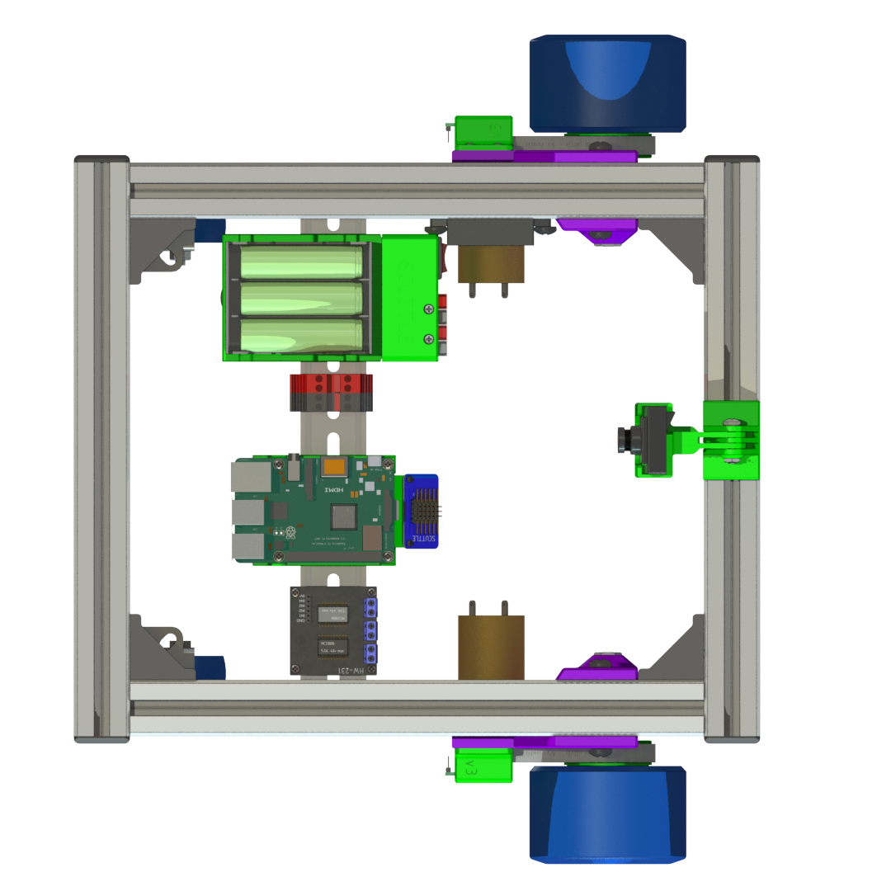

# SCUTTLE Tech Guide
SCUTTLE Technical Guide

**| COMPONENTS | WIRING | SENSORS | POWER | 3D PRINTING |**

[Github Repo](https://github.com/dmalawey/ScuttleTechGuide ':class=button')
[Website](https://docsify-this.net/?basePath=https://raw.githubusercontent.com/dmalawey/ScuttleTechGuide/main&sidebar=true#/?show-page-options=true ':class=button')

> :warning: This document is in draft form as of 2023.06

Now, diving in...

# Wiring Guide

> **This section covers the wiring of signals and power.**

Here's a preview of the wiring for the Pi and TI configurations.  Proceed to the subsections for details.

| Pi Wiring Thumbnail | TI wiring thumbnail |
| ------------------- | ------------------- | 
|  |  |

## Signals

All signals on SCUTTLE can be made with regular off-the-shelf Dupont-style terminals, all female.  Lengths are 10cm and 20cm as shown.

> ⚠️Please do not peel the wires apart! Keep them connected for strong connections.

> Colors Selection

We chose the colors to make good use of any pack of wires.  When you add sensors and actuators, try to stay consistent.

| Function | Preferred Color |
| ------ | ----------------- |
| Ground | Black, Brown, Green |
| Power, 3.3v | Red, Purple |
| PWM signals | Orange, Yellow |
| CLOCK (i2C | Gray |
| SIGNAL (i2C) | White |

### Cables

This section shows the cables you can DIY.

  
Cable Diagrams

To build signal cables, use these diagrams.

_Figure: cables for left encoder_

  

_Figure: cables for right encoder_

  

_Figure: cables for motor_

  

_Figure: cables for i2c_

## Power

### Power Routing

The overview for power cables on SCUTTLE v3

_Figure: power overview_

Here are the cables to power the motors from the motor driver.

_Figure: motor leads_

### Actuator: Motor Driver

The cables to power the motor driver from 12v.

_Figure: motor driver wiring_

The motor wires to communicate from CPU to the motor driver.

_Figure: motor signal cable_

### Source: Battery

_Figure: battery components_

## Addons

> This section to include popular addons such as RPLIDAR, ultrasonic sensor, and more.
> It will contain circuitry-related information for planning power and signals to your actuators.

---

# Power Budget
> A dedicated section for budgeting power. This contains details the power system onboard SCUTTLE.  With extensibility as a central goal for SCUTTLE, we aim to offer sufficient detail to let you engineer any new function or actuator you can dream of.

This chart indicates the power loads of each component on your power supply.

This table describes the estimated duty cycles for key components in a typical operating scenario.

The raspberry pi and any loads that source power from it, ultimately source power from the 5v DC adapter.  This adapter has an efficiency curve as shown.  Note that the adapter has a constant power draw when the 12v source (battery) is powered on and hooked up.

---

# Computing

This section covers the differences in wiring for various SBCs (single board computers).

---

| Pi | TI | Intel |
| -- | -- | ----- |
|  |  |  |
| [Pi 4 Datasheet](https://datasheets.raspberrypi.com/rpi4/raspberry-pi-4-datasheet.pdf) | [TDA4VM Datasheet](https://www.ti.com/lit/pdf/spruj21) | [SBC Datasheet](https://www.axiomtek.com/Download/Spec/en-US/capa55r.pdf) |
| [Pi 4 Home](https://www.raspberrypi.com/products/raspberry-pi-4-model-b/) | [TDA4VM SK Product Page](https://www.ti.com/tool/SK-TDA4VM) | [CAPA55R Product Page](https://www.axiomtek.com/Default.aspx?MenuId=Products&FunctionId=ProductView&ItemId=26529&upcat=270) |

## Pi 4

**Raspberry Pi 4B with Broadcom ARM processor**

Overview of wiring SCUTTLE with Pi:

_Figure: Pi wiring overview_

## TI

**Texas Instruments "Edge AI" class single-board-computer with TDA4VM ARM processor**

Overview of wiring SCUTTLE with TDA4VM:

_Figure: Edge AI wiring overview_

  
Edge AI Pinout

 _Edge AI Pinout_
| Function  | PIN |    |  Function |
| --------- | --- | -- | ----- |
| Power_3.3 | 1   | 2  | Power_5.0 |
| I2C_SDA   | 3   | 4  | Power |
| I2C_SCL   | 5   | 6  | GND |
| GPIO      | 7   | 8  | UART_TXD |
| GND       | 9   | 10 | UART_RXD |
| GPIO      | 11  | 12 | I2S_SCLK |
| GPIO      | 13  | 14 | GND |
| GPIO      | 15  | 16 | GPIO |
| Power_3.3 | 17  | 18 | GPIO |
| SPI_MOSI  | 19  | 20 | GND |
| SPI_MISO  | 21  | 22 | GPIO |
| SPI_SCLK  | 23  | 24 | SPI_CS0 |
| GND       | 25  | 26 | SPI_CS1 |
| ID_SDA    | 27  | 28 | ID_SCL |
| GPIO      | 29  | 30 | GND |
| GPIO      | 31  | 32 | PWM0 |
| PWM1      | 33  | 34 | GND |
| I2S_FS    | 35  | 36 | GPIO |
| GPIO      | 37  | 38 | I2S_DIN |
| GND       | 39  | 40 | I2S_DOUT |

## Intel

**Axiomtek CAPA55R single-board industrial computer with Intel i7 X86 processor**

Axiomtek's CAPA55R Intel-based computer for industrial robotics:

_Figure: Axiomtek / Intel CAPA55R SBC_

---

# 3D Printing

---

> Standard SCUTTLE v3.0 requires about 330g of 3D printed parts.  Everything is designed for manufacturing in FFF with no supports.

_Figure: All 3D Printed Parts for a SCUTTLE kit_

  
3D Model - Wheel Assembly

  See our 3D model for the wheel assembly
  
  _We've uploaded the model to sketchfab to embed this viewer - let us know if this is helpful!_

 
 

 
  <iframe title="Drivetrain_L" frameborder="0" allowfullscreen mozallowfullscreen="true" webkitallowfullscreen="true" allow="autoplay; fullscreen; xr-spatial-tracking" xr-spatial-tracking execution-while-out-of-viewport execution-while-not-rendered web-share src="https://sketchfab.com/models/6089b024280f4fadb31e674b08e08839/embed?autospin=1&ui_theme=dark%22%3E">
 
  </iframe>
 

---

# Glossary

| Abbreviation or Term | Definition |
| -------------------- | ---------- |
| LH, RH | left-hand, right-hand |
| OTS | off-the-shelf |
| DFM | design for manufacturing |
| SBC | single-board computer |

# Documenting

## Learn Docs

Resources for Documenting
 * Docs, simplified with [Docsify-This](https://docsify-this.net/#/)
 * Emoji - in markdown with [Github Emoji Picker](https://github-emoji-picker.rickstaa.dev/) ► Use this for markdown compatibility.
 * Markdown [Cheat Sheet](https://www.markdownguide.org/cheat-sheet/)
 * Diagrams, with draw.io also known as [Diagrams.net](https://diagrams.net)
 * Altcodes, from [AltcodeUnicode](https://altcodeunicode.com/) ► use these for compatibility with all word processors.

> **GET LATEST**
> * Draw.io Library [version 06.29](diagram/lib_sctl_v0629.xml)
> * Draw.io Diagram [draft version 06.29](diagram/diagram_wiring_v0629.xml)

## Our Goals

1. Become the first multidisciplinary open project that addresses the 2020-era pain points for the community:
  * Mechanical designs are locked into specific CAD software. 
  * Manufacturing methods span broadly with poor repeatability by open community.
  * Documentation for high-fidelity designs does not address novice experience level.
  * Highly professional projects are scarce.  Designs that are robust enough to be repeated are usually expensive.
  * It is hard to get help.  Well designed components don't have engineering-level customer service.
  * Robot designs are tied to one embedded controller - availability and costs are limiting.
  * Designs do not offer a curriculum to accompany them.
  * Prerequisites for materials, knowledge, components, are not clear from the beginning.
  * As a robot develops, it's software becomes specific to only that robot - unlike open 3D printing software, for example.
2. Leverage the community for documentation
  * Build standards to clearly outline documentation needs
  * Offer training resources on how to document
  * Make documentation friendly to each respective discipline & their typical applications
  * Only use methods that have been shown successful by other communities.
  * Keep documents and source files open & free as much as possible, and their tools thereof

## Diagramming

Okay, hear us out: diagrams may be the most important part of a multidisciplinary design.  Electrical circuits have established standards, hardware designs have them, but the crossover gets messy.  We are implementing new libraries starting in 2023 to help get your projects planned & documented for repeatability & collaboration.

Starting with Draw.io, here's some technology magic:
| Click a library component | Drop it in your Diagram | Edit Connection Points |
| ------------------------- | ----------------------- | ---------------------- |
|  |  |  |

# Benchmarking

As an open source community, we aim to gather best practices from leading open projects.  The multidisciplinary nature of SCUTTLE means no existing model fits us, but many elements have been resolved by great communities with an ongoing development and outcomes.

## Community Stars

The organizations in this table have influenced SCUTTLE organization heavily and we continue seeking out best practices from groups like them

| Team              | Site                                                                                          | Feature to Aspire to:                                       | Team No. |
| ----------------- | --------------------------------------------------------------------------------------------- | ----------------------------------------------------------- | -------- |
| Voron 3D Printer  | [Voron Docs](https://docs.vorondesign.com/)                                                   | well-made multidisciplinary documentation                   | 1        |
| Thingiverse       | [Thingiverse Library](https://www.thingiverse.com/)                                           | attracted millions - easy to sign up, easy to use           | 2        |
| GrabCAD           | [GrabCAD Library](https://grabcad.com/library)                                                | in-browser Visualization - great permalinks - great tagging | 3        |
| OpenBuilds        | [openbuilds](https://openbuilds.com/?o=l)                                                     | attracted high-effort contributions - peak modularity       | 4        |
| Leo Rover         | [Leo Dev Resources](https://www.leorover.tech/developers)                                     | Use github for software development                         | 5        |
| Printables        | [Printables Library](https://www.printables.com/)                                             | Helps designers post designs with clear licensing           | 6        |
| Hackaday          | [Hackaday.io](https://www.hackaday.io/)                                                       | Curating well-engineered designs                            | 7        |
| Hackster.io       | [Hackster Contests](https://www.hackster.io/contests)                                         | Attracts all types of designers with nice contests          | 8        |
| Leo Rover         | [Leo 3D Models](https://a360.co/378zqRp)                                                      | Convenient in-browser viewing of 3D models                  | 9        |
| Viam              | [Viam Discord](https://discord.gg/viam)                                                       | Refined Discord channel for asking questions                | 10       |
| Texas Instruments | [TI Robotics Academy](https://dev.ti.com/tirex/global?id=com.ti.Jacinto%20Robotics%20Academy) | Research-grade tasks taught in Edge AI                      | 11       |
| uStepper Arm      | [Build Guide](https://qr.page/g/1PZfPMFuz8x)                                                  | Build Guide with detailed graphics                          | 12       |
| Moveo Arm         | BCN3D Moveo                                                                                   | Remaining 3D Printable post-commercialization               | 13       |
| Instructables     | [Instructables Library](https://www.instructables.com/projects)                               | Access to PDF version of every project writeup              | 14       |
| Open Dynamic      | [Open Dynamic Robot Initiative](https://open-dynamic-robot-initiative.github.io/)             | Computations for Dynamics at Academic Level                 | 15       |
| Arxive            | [Free Academic Pub - Cornell](https://arxiv.org/)                                             | Free distribution & open access to scholarly articles       | 16       |

 

 
Wish List from Community Stars
  

 Table ► Wish List  
 _Elements that would enhance these offerings - based on our experience, community, feedback, needs, and dreams._

| Team No. | Wish                                                                                                                                                                                                                           |
| -------- | ------------------------------------------------------------------------------------------------------------------------------------------------------------------------------------------------------------------------------ |
| 1        | Give more clear metrics on performance - why should you build it?                                                                                                                                                              |
| 2        | Better support for native CAD files                                                                                                                                                                                            |
| 3        | Allow users to implement a license with each post, like printables.org                                                                                                                                                         |
| 4        | Create a segway into robotic control, instead of only CNC control                                                                                                                                                              |
| 5        | Reduce the custom parts & replace with OTS parts.  Make designs more print-friendly                                                                                                                                            |
| 6        | Dial back the Printables Branding and help posts link to full projects.                                                                                                                                                        |
| 7        | Grade submissions by an open standard, help projects recruit team members in some form                                                                                                                                         |
| 8        | Offer PDF downloads for instruction - enhance tools for professional level developers.  Better classification of disciplines behind posts (mechanical, electronic, software).                                                  |
| 9        | Become more inviting to community contributions - make a library of addons or changes.                                                                                                                                         |
| 10       | Publish goals & core values that speak to community - help broader disciplines outside software answer "how will Viam enhance open robotics" in more disciplines.  Better express what is needed from community vs in-company. |
| 11       | Improve navigation of content - help users (of various backgrounds) find answers ► students, researchers, makers, businesses, academic partners                                                                                |
| 12       | Build a community of some sort.  Explain why the robot is open source.                                                                                                                                                         |
| 13       | Better explanation of where to buy parts                                                                                                                                                                                       |
| 14       | Better categorize projects by discipline, by key component, and/or others.  Make easier to find relevant projects for users.                                                                                                   |
| 15       | Publish the source files for the robot components - particularly 3D printed parts.                                                                                                                                             |
| 16       | Offer a category for mechanical engineering along with CS, EE, PHYS, etc.                                                                                                                                                      |

 _Figure: Table of Wishes from Community Stars_
 
 

 ---
 
## Thought Leadership

* Linux is the largest open source project in history, and it's founders created [TheOpenSourceWay.org](https://www.theopensourceway.org) to guide other communities.  Their publication called [The Open Source Way](https://www.theopensourceway.org/the_open_source_way-guidebook-2.0.html#_why_do_people_participate_in_open_source_communities) offers insights to how it all works.
* The Open Source Hardware Foundation pushes to engage hardware development teams in open source.  They have regular releases of their [State of Open Source Hardware](https://qr.scuttlerobot.org/g/58a4R641DBp), and this one is from 2021.

---

[Github Repo](https://github.com/dmalawey/ScuttleTechGuide ':class=button')
[Website](https://docsify-this.net/?basePath=https://raw.githubusercontent.com/dmalawey/ScuttleTechGuide/main&sidebar=true#/?show-page-options=true ':class=button')
