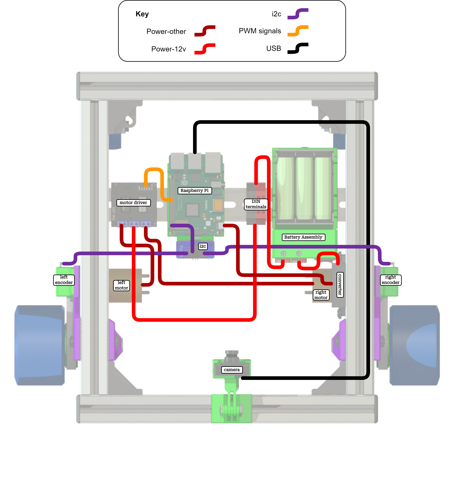

# ScuttleTechGuide
SCUTTLE Technical Guide

[this is my button](https://www.google.com/ ':class=button')

View this page as a website [HERE](https://docsify-this.net/?basePath=https://raw.githubusercontent.com/dmalawey/ScuttleTechGuide/main&sidebar=true#/?show-page-options=true)

View Github repository [HERE](https://github.com/dmalawey/ScuttleTechGuide)

# Signal Cables
To build the signal cables, they will look like this

_Figure: dupont cables_

And also the encoder wires consist of dupont terminals and ribbon cables.

_Figure: encoder cables diagram_

# Wiring Guide

## Motors

Here are the cables to power the motors from the motor driver.

_Figure: motor leads_

## Motor Driver

The cables to power the motor driver from 12v.

_Figure: motor driver wiring_

The motor wires to communicate from CPU to the motor driver.

_Figure: motor signal cable_

## Battery

_Figure: battery components_

## Power

The overview for power cables on SCUTTLE v3

_Figure: power overview_

## Encoders
Encoder wires consist of dupont terminals and ribbon cables.

_Figure: encoder cables diagram_

# Wiring Addons
> This section to include popular addons such as RPLIDAR, ultrasonic sensor, and more.

---

# CPU Options
This section covers the differences in wiring for various SBCs (single board computers).

---

## Raspberry PI 4

Overview of wiring SCUTTLE with Pi:

_Figure: Pi wiring overview_

## TI TDA4VM SK "Edge AI"

Overview of wiring SCUTTLE with TDA4VM:

_Figure: Edge AI wiring overview_

_Edge AI Pinout_
| Function  | PIN |    |  Function |
| --------- | --- | -- | ----- |
| Power_3.3 | 1   | 2  | Power_5.0 |
| I2C_SDA   | 3   | 4  | Power |
| I2C_SCL   | 5   | 6  | GND |
| GPIO      | 7   | 8  | UART_TXD |
| GND       | 9   | 10 | UART_RXD |
| GPIO      | 11  | 12 | I2S_SCLK |
| GPIO      | 13  | 14 | GND |
| GPIO      | 15  | 16 | GPIO |
| Power_3.3 | 17  | 18 | GPIO |
| SPI_MOSI  | 19  | 20 | GND |
| SPI_MISO  | 21  | 22 | GPIO |
| SPI_SCLK  | 23  | 24 | SPI_CS0 |
| GND       | 25  | 26 | SPI_CS1 |
| ID_SDA    | 27  | 28 | ID_SCL |
| GPIO      | 29  | 30 | GND |
| GPIO      | 31  | 32 | PWM0 |
| PWM1      | 33  | 34 | GND |
| I2S_FS    | 35  | 36 | GPIO |
| GPIO      | 37  | 38 | I2S_DIN |
| GND       | 39  | 40 | I2S_DOUT |
