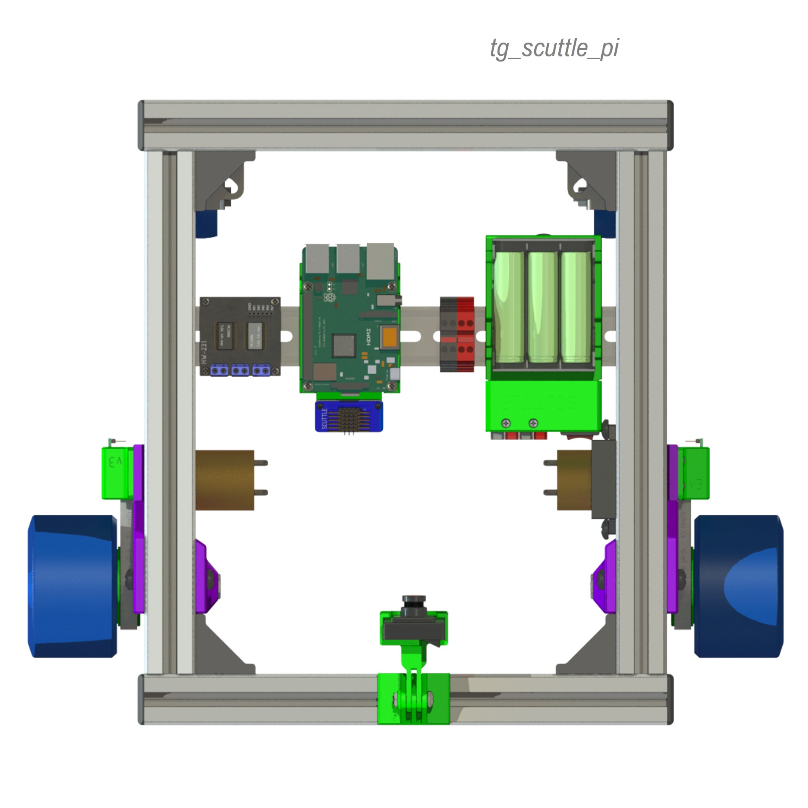
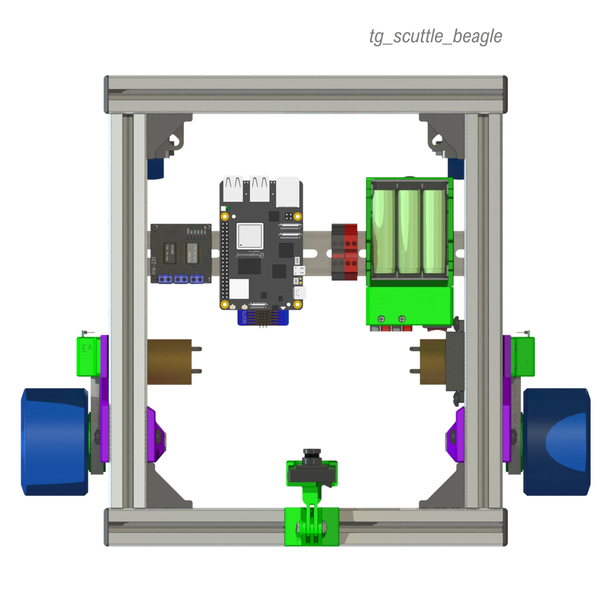
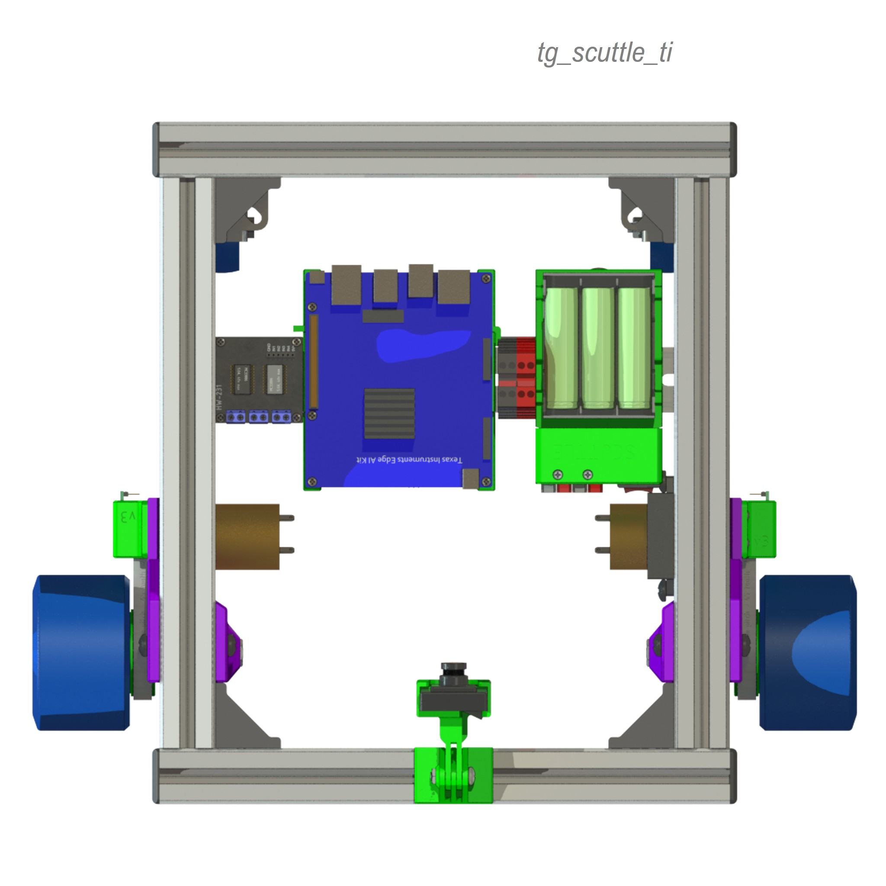
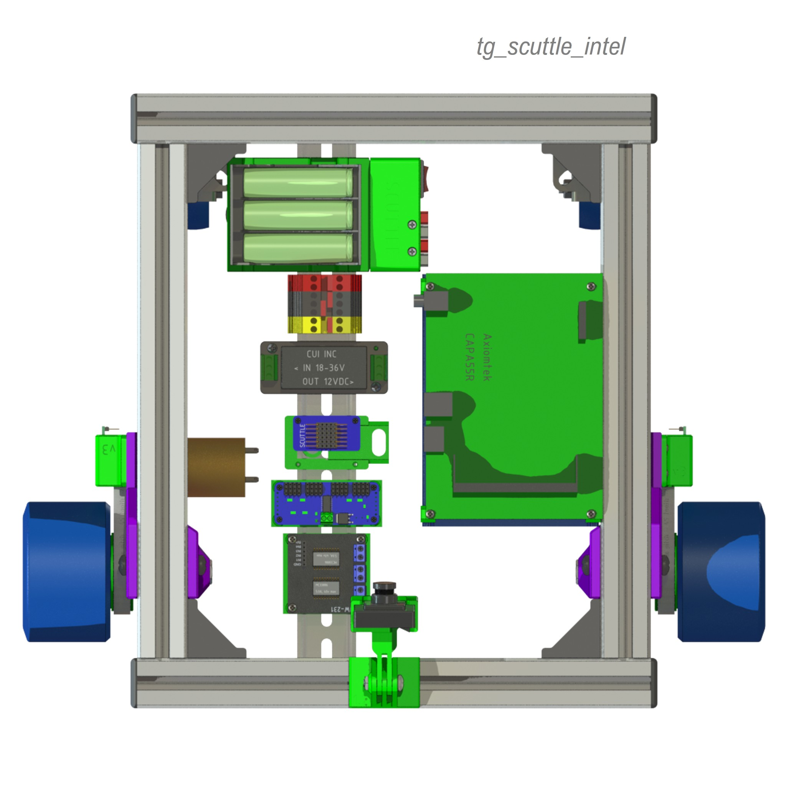
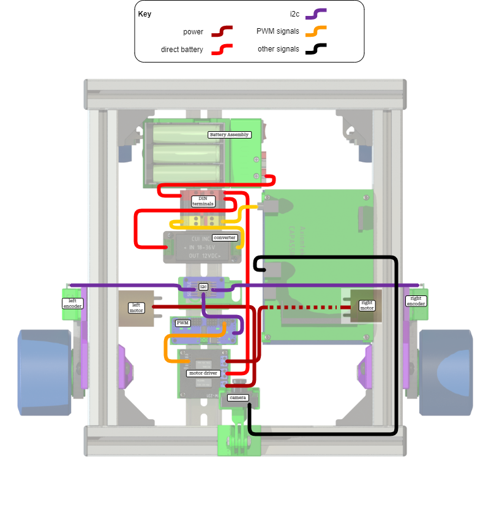
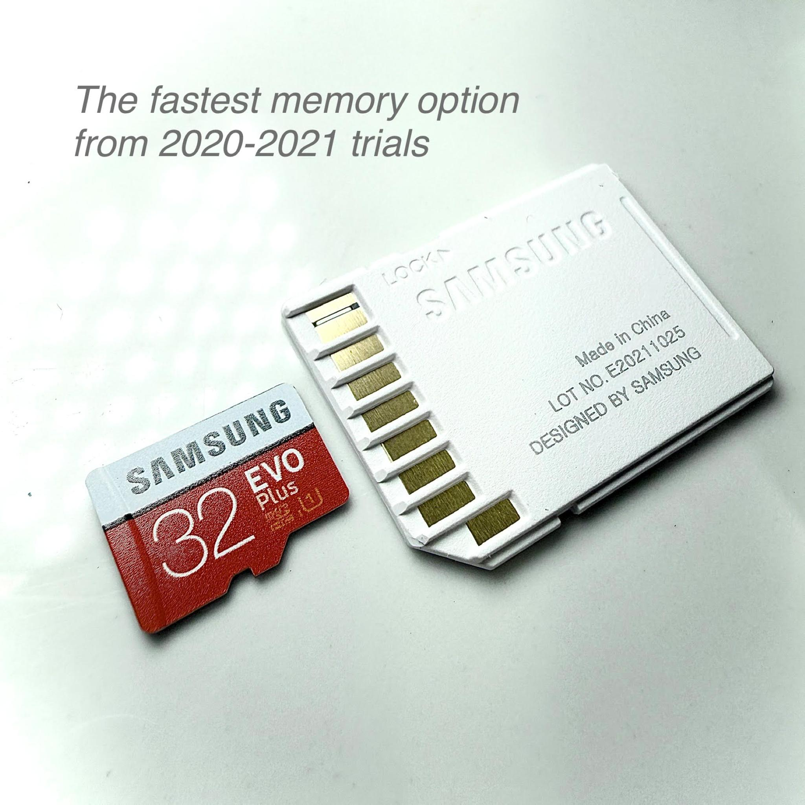
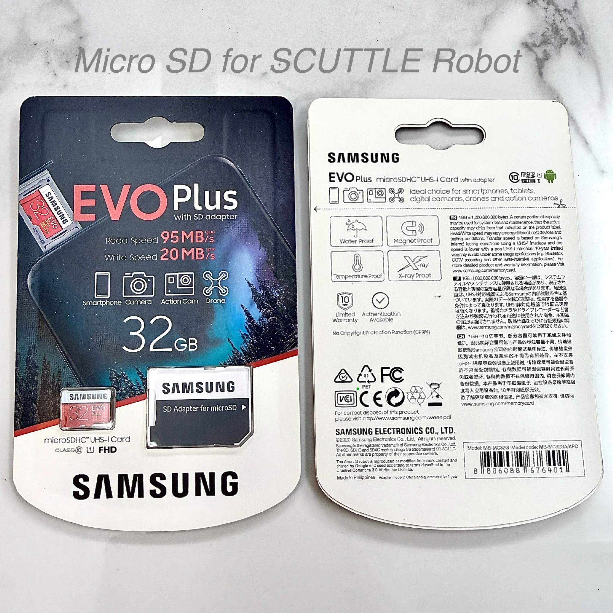
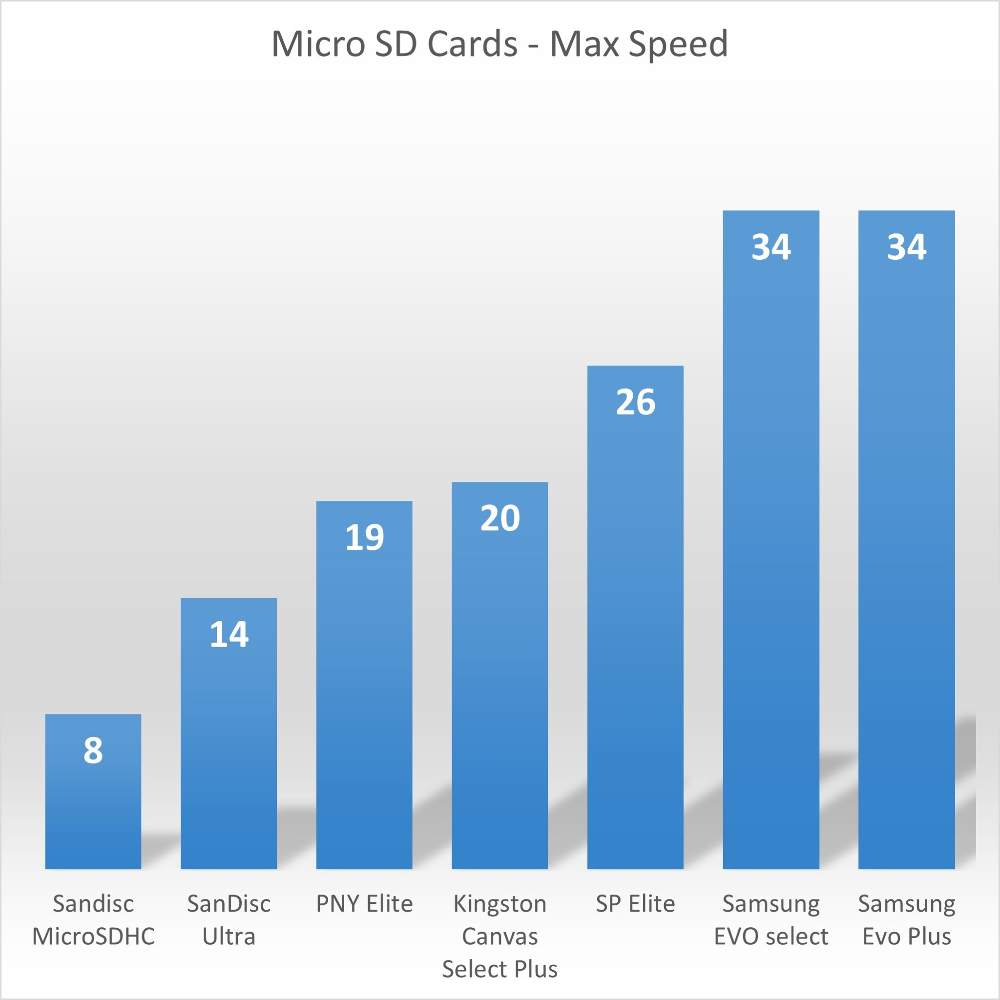

# Computing

This section covers the various computer options for your SCUTTLE CPU. We integrated these different computing options in partnership with some of the board developers, to help get users started in any direction they want.

| CPU choice | Key Advantage                       | Users |
| ---------- | ----------------------------------- | ----- |
|  Pi        | popular computer                    | students & resesarchers       |
| BeagleY-AI | for advanced robotics developers    | advanced mechatronics         |
| TI Edge AI SK | AI computing and generous IO     | autonomous driving developers |
| Intel      | industrial controller               | industry & manufacturing      |

_Images below feature scuttle with raspberry pi, with beaglebone y-ai, texas instruments edge-ai sk board, and intel-based industrial computer_

- 
- 
- 
- 
- 
- 

## Pi_4

**Raspberry Pi 4B with Broadcom ARM processor**
This is the latest model of raspberry pi as of 2025 with the pi version 3B the most popular unit on our robots right now.  Design-wise the integration is the same for version 3 and 4, except that Pi 4 uses USB-C for power input.
* [DOWNLOAD](https://lobfile.com/file/DIq7.drawio) editable design of wiring diagram
* [Pi 4 Datasheet](https://datasheets.raspberrypi.com/rpi4/raspberry-pi-4-datasheet.pdf)
* [Raspberry Pi Homepage](https://www.raspberrypi.com/products/raspberry-pi-4-model-b/)

_Overview of wiring SCUTTLE with Pi_

## Beagle
**BeagleY-AI, released 2024 March**

Beaglebone blue was actually the first ever board we integrated on SCUTTLE, with scuttle version 1 in the classroom for Mobile Robotics at Texas A&M in 2018.  From there we adopted raspberry pi to gain the most popular 40-pin i/o format the world's developers were getting very familiar with. As of 2024, we regrouped with Beagle to get their latest board set up on SCUTTLE.  The new AI device features Texas Instruments chips and an affordable, high performance compact board with a form factor like Pi.

* Access [Y-AI Datasheet here](https://openbeagle.org/beagley-ai/beagley-ai/)
* Beagle Y-AI homepage [Y-AI Home](https://www.beagleboard.org/boards/beagley-ai)
* ([DOWNLOAD](https://gofile.io/d/h81H31) editable design
* Official documentation [docs.beagle.cc](https://docs.beagle.cc/)
* Pinout diagram here: [pinout.beagley.ai](https://pinout.beagley.ai/)
* Expert user review: [docs.beagle.cc](https://community.element14.com/products/devtools/single-board-computers/next-genbeaglebone/b/blog/posts/beagley-ai-review)

_Figure: Beagleboard Pinout diagram_

## TI_Edge_AI

**Texas Instruments "Edge AI" sbc with TDA4VM ARM processor**

* Click to [DOWNLOAD](https://lobfile.com/file/DIq7.drawio) editable design
* Download the [TDA4VM Datasheet](https://www.ti.com/lit/pdf/spruj21)
* Access the [TDA4VM SK Product Page](https://www.ti.com/tool/SK-TDA4VM)

_Overview of wiring SCUTTLE with TDA4VM below_

## Intel_CAPA55R

**Axiomtek CAPA55R single-board industrial computer with Intel i7 X86 processor**

* Click to [DOWNLOAD](https://lobfile.com/file/DIq7.drawio) editable design
* Access the intel/axiomtek [SBC Datasheet](https://www.axiomtek.com/Download/Spec/en-US/capa55r.pdf)
* Visit the [CAPA55R Product Page](https://www.axiomtek.com/Default.aspx?MenuId=Products&FunctionId=ProductView&ItemId=26529&upcat=270)

_Below, images for overview of wiring SCUTTLE with Intel-based CAPA55R, and the axiomtek's Intel-based single board computer_
- 
- 
- 

---

## Memory
Embedded computers like Raspberry Pi rely on a solid-state memory card to perform well.  The speed and reliability of the whole robot depends on the performance of this Micro SD card, so we ship our kits with the top-tier choice of micro SD cards.  The choice memory card is Samsung's Evo Plus, which is the top performer by a large margin above the average SD card that we tested.  The size of the storage is not a major impact but the read and write speeds are crucial.  In the below images, find the SD card shown up close and the results of our speed testing.  The right-hand image comes from trials in 2020 and 2021 using read and write trials on a desktop PC with high speed USB3.0 ports and various SD card adapters.  If you source your own SD card we can recommend the Samsung brand of memory overall and expect all of their newer lines of SD cards to peform as well as Evo Plus and Evo Select.

- 
- 
- 
