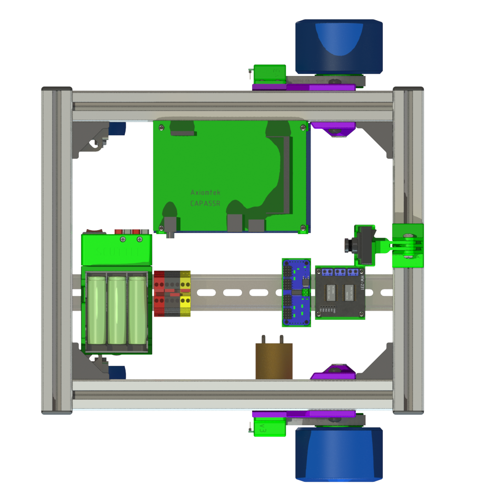

# Computing Guide

This section covers the various computer options for your SCUTTLE CPU.  It starts with differences in wiring for various SBCs (single board computers).  

---

| Pi | BeagleY-AI | TI | Intel |
| -- | -- | -- | ----- |
|  |  |  |  |
| [Pi 4 Datasheet](https://datasheets.raspberrypi.com/rpi4/raspberry-pi-4-datasheet.pdf) | [Y-AI Datasheet](https://openbeagle.org/beagley-ai/beagley-ai/) | [TDA4VM Datasheet](https://www.ti.com/lit/pdf/spruj21) | [SBC Datasheet](https://www.axiomtek.com/Download/Spec/en-US/capa55r.pdf) |
| [Pi 4 Home](https://www.raspberrypi.com/products/raspberry-pi-4-model-b/) | [Y-AI Home](https://www.beagleboard.org/boards/beagley-ai) | [TDA4VM SK Product Page](https://www.ti.com/tool/SK-TDA4VM) | [CAPA55R Product Page](https://www.axiomtek.com/Default.aspx?MenuId=Products&FunctionId=ProductView&ItemId=26529&upcat=270) |

## Pi_4

**Raspberry Pi 4B with Broadcom ARM processor**

[DOWNLOAD](https://lobfile.com/file/DIq7.drawio) editable design

Overview of wiring SCUTTLE with Pi:

_Figure: Pi wiring overview_

## Beaglebone

**BeagleY-AI, released 2024 March**

[EDIT](https://viewer.diagrams.net/?tags=%7B%7D&lightbox=1&highlight=0000ff&edit=_blank&layers=1&nav=1&title=Beagle_i2c.drawio&dark=auto#Uhttps%3A%2F%2Fdrive.google.com%2Fuc%3Fid%3D1CADlqB9Wtr29go60yFnloV_AVy1R_uL0%26export%3Ddownload) the design

<!--([DOWNLOAD](https://gofile.io/d/h81H31) editable design)-->
* Official documentation [docs.beagle.cc](https://docs.beagle.cc/)
* Pinout diagram here: [pinout.beagley.ai](https://pinout.beagley.ai/)
* Expert user review: [docs.beagle.cc](https://community.element14.com/products/devtools/single-board-computers/next-genbeaglebone/b/blog/posts/beagley-ai-review)

_Figure: Beagleboard Pinout diagram_

## TI_Edge_AI

**Texas Instruments "Edge AI" sbc with TDA4VM ARM processor**

[DOWNLOAD](https://lobfile.com/file/DIq7.drawio) editable design

Overview of wiring SCUTTLE with TDA4VM:

_Figure: Edge AI wiring overview_

  
Edge AI Pinout

 _Edge AI Pinout_
| Function  | PIN |    |  Function |
| --------- | --- | -- | ----- |
| Power_3.3 | 1   | 2  | Power_5.0 |
| I2C_SDA   | 3   | 4  | Power |
| I2C_SCL   | 5   | 6  | GND |
| GPIO      | 7   | 8  | UART_TXD |
| GND       | 9   | 10 | UART_RXD |
| GPIO      | 11  | 12 | I2S_SCLK |
| GPIO      | 13  | 14 | GND |
| GPIO      | 15  | 16 | GPIO |
| Power_3.3 | 17  | 18 | GPIO |
| SPI_MOSI  | 19  | 20 | GND |
| SPI_MISO  | 21  | 22 | GPIO |
| SPI_SCLK  | 23  | 24 | SPI_CS0 |
| GND       | 25  | 26 | SPI_CS1 |
| ID_SDA    | 27  | 28 | ID_SCL |
| GPIO      | 29  | 30 | GND |
| GPIO      | 31  | 32 | PWM0 |
| PWM1      | 33  | 34 | GND |
| I2S_FS    | 35  | 36 | GPIO |
| GPIO      | 37  | 38 | I2S_DIN |
| GND       | 39  | 40 | I2S_DOUT |

## Intel_CAPA55R

**Axiomtek CAPA55R single-board industrial computer with Intel i7 X86 processor**

[DOWNLOAD](https://lobfile.com/file/DIq7.drawio) editable design

Overview of wiring SCUTTLE with Intel-based CAPA55R:

_Figure: Intel wiring overview_

Axiomtek's CAPA55R Intel-based computer for industrial robotics:

_Figure: Axiomtek / Intel CAPA55R SBC_

---
