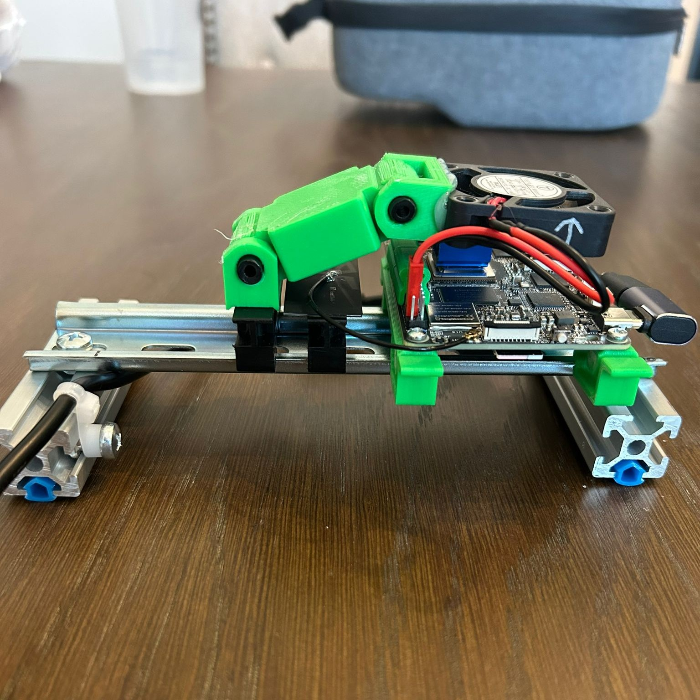
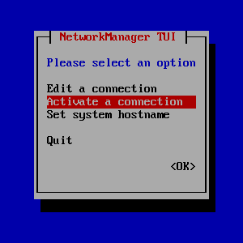
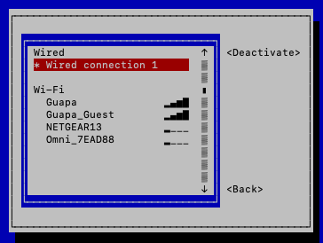
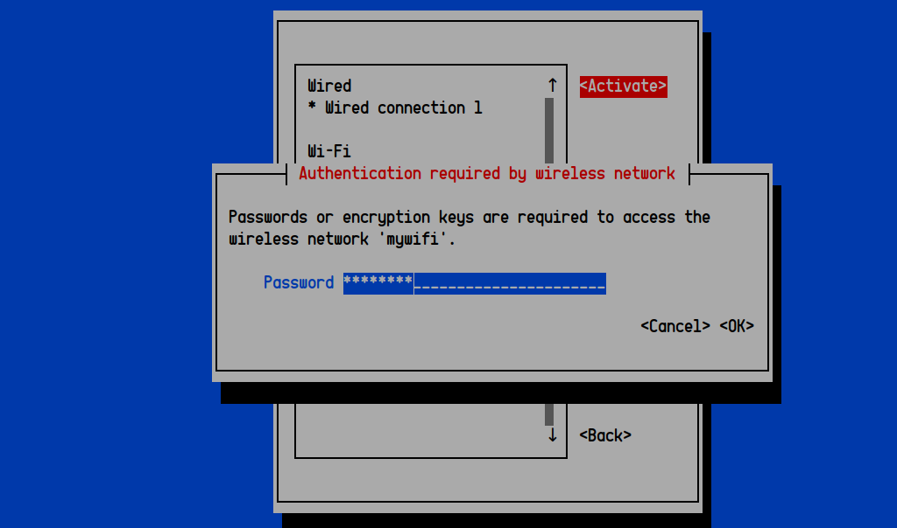

# Getting Started

**You'll need:**

- [BeagleY-AI board](https://www.beagleboard.org/boards/beagley-ai)
- microSD card (32GB+)
- USB-C power supply
    - Minimum: Rated for 15W (5V 3A)
    - Recommended: [Official Raspberry Pi power supply](https://www.raspberrypi.com/products/27w-power-supply/) or other USB PD-capable power supply
- Ethernet cable
- Active cooler is highly recommended
    - Minimum: Adhesive heat sink and small 5V fan
    - Recommended: [Official Raspberry Pi active cooler](https://www.raspberrypi.com/products/active-cooler/)
- Computer with Ethernet port and SD card reader
    - Devices without built-in Ethernet ports or SD card slots may use [USB dongles](https://www.amazon.com/Anker-Ethernet-PowerExpand-Aluminum-Portable/dp/B08CK9X9Z8)

## Electrical setup

### 1. Motors to Motor Driver
See [Wiring § Motor Driver](../../wiring.md#actuator-motor-driver) for how to wire the motors to the motor driver.

### 2. Motor Driver to Beagle
See [BeagleY-AI § Motors](./wiring-guide.md#motors) for how to wire the motor driver to the Beagle.

### 3. Encoders to Beagle
Encoders are used to determine the rotational position of each wheel. They are connected to the Beagle using the I2C protocol. The SCUTTLE design uses a simple I2C bus board to combine the I2C connections for both encoders into a single set of wires.

See [Wiring § Cables](../../wiring.md#cables) for how to create the wires connecting the bus board and the encoders.

See [BeagleY-AI Wiring § Encoders](./wiring-guide.md#encoders) for how to wire the bus board to the Beagle.

## Hardware setup

### 1. Cooling
The BeagleY-AI tends to run quite hot, so some kind of additional cooling is recommended.

#### Generic heat sink and fan
If you have a generic fan that is rated for 5V or more, connect the power wire to pins 2 or 4 on the BeagleY and the ground wire to pin 6. Refer to the [pinout diagram](https://pinout.beagleboard.io/).

Stick the heat sink onto the main processor, the large silver chip closest to the USB ports. 
Ensure the fan is oriented such that air is being blown through the fins of the heat sink.

The fan can be mounted in various ways, including [this joint](https://grabcad.com/library/fan_joint-1) for mounting on a DIN rail.



#### Raspberry Pi Active Cooler
You could also connect the fan using the 4-pin JST cable to the board's PWM fan connector located right below the GPIO pins. Connector's pinout is identical to the Rasperry Pi 5 one.

Top-side view (USB and Ethernet connectors on the bottom)
Pins from left to right:


This option would provide active cooling that the board can control. For example, the OS can decide to spin the fans slower to make the device quieter when it is already running cool.

More info about active cooling on [Beagle Docs:material-arrow-top-right:](https://docs.beagle.cc/boards/beagley/ai/02-quick-start.html#attach-cooling-fan).

### 2. Installing an OS
The BeagleY-AI is designed to run Debian Linux, an open-source operating system common among embedded systems and servers.

Follow the [official Quick Start guide](https://docs.beagle.cc/boards/beagley/ai/02-quick-start.html#bb-imager) for `bb-imager` to install an appropriate OS (1) on the SD card.
{ .annotate }

1.  [What's the difference between these OS images?](#whats-the-difference-between-these-os-images)


### 3. Network setup

Ultimately you'll want the BeagleY-AI to be connected to the internet via Wi-Fi. Depending on how you configured Wi-Fi when you flashed the SD card, it may not know how to connect to your Wi-Fi network out-of-the-box.

Follow the steps below if you are unable to connect to the Beagle from your computer using `ssh debian@beaglebone.local`.

1. **Establish a wired connection:** Plug one end of an Ethernet cable into your computer and the other end into the Beagle.
1. **Power on the board:** Plug your BeagleY-AI into a suitable USB-C power adapter.
1. **Connect to the board:** In a terminal on your computer, run `ssh debian@beaglebone.local`. If this succeeds, you will now be running commands on the Beagle.
1. **Connect to Wi-Fi:** Run `sudo systemctl start NetworkManager` and connect to your Wi-Fi network via NetworkManager TUI:
    1. Enable the Wi-Fi interface by running `sudo ifconfig wlan0 up`.
    1. Run `sudo nmtui` and select **Activate a connection**.
    
    1. Select desired network connect to.
    
    1. On the right, click **Activate**.
    1. If necessary, type the network password in the pop-up window.
    

> [!NOTE]
> If you are SSH'ed into the Beagle over Ethernet, the connection may drop out after a few minutes. A common workaround is to SSH into the board and run `sudo nmcli c m "Wired connection 1" ipv4.method link-local`.

## Software setup

### 1. Pre-requisites
After successfully connecting to internet, run `sudo apt update`. 

- Your system just grabs the newest lists of available software from all its repositories and stores them in `/var/lib/apt/lists/`. 
- It simply makes sure that whenever you do an install or upgrade next, you’re working with the most recent info.

> [!WARNING]
> You could also `sudo apt upgrade` but be careful as on some boards (e.g. BeagleBone Black with the Debian image), running `apt upgrade` can actually pull in an older kernel or overwrite vendor‐customized device trees, breaking hardware support. For example, users have reported their 5.10 kernel being downgraded back to 4.19 after an unguarded `apt upgrade`. [More info:material-arrow-top-right:](https://forum.beagleboard.org/t/apt-update-apt-upgrade-automatic-kernel-change-downgrade-to-4-19/32030)
> 
> Upgrading between major OS releases (e.g. Raspberry Pi OS Bullseye → Bookworm) via `apt full-upgrade` is *not* recommended; a clean flash of the new release image is the supported path to avoid partial‐upgrade failures. See [Upgrade rather than reinstall:material-arrow-top-right:](https://forums.raspberrypi.com/viewtopic.php?t=337992) or [Upgrade from 'Buster' to Raspberry Pi OS:material-arrow-top-right:](https://forums.raspberrypi.com/viewtopic.php?t=288172).

### 2. Enabling PWM
The BeagleY-AI has hardware PWM, but to use it you'll need to import the appropriate overlays on boot.

1. Open `/boot/firmware/extlinux/extlinux.conf` in a text editor. For example, `sudo nano /boot/firmware/extlinux/extlinux.conf`.
1. Locate the "microSD (default)" section at the end of the file.
1. Replace the commented `fdtoverlays` line with the following:

    ```
    fdtoverlays /overlays/k3-am67a-beagley-ai-pwm-epwm0-gpio12.dtbo /overlays/k3-am67a-beagley-ai-pwm-epwm1-gpio13.dtbo /overlays/k3-am67a-beagley-ai-pwm-epwm0-gpio5.dtbo /overlays/k3-am67a-beagley-ai-pwm-epwm1-gpio6.dtbo
    ```

1. The full section should look like this:
    ```
    label microSD (default)
        kernel /Image
        append console=ttyS2,115200n8 root=/dev/mmcblk1p2 ro rootfstype=ext4 rootwait net.ifnames=0 quiet
        fdtdir /
        fdt /ti/k3-am67a-beagley-ai.dtb
        fdtoverlays /overlays/k3-am67a-beagley-ai-pwm-epwm0-gpio5-gpio12.dtbo /overlays/k3-am67a-beagley-ai-pwm-epwm1-gpio6-gpio13.dtbo
        #initrd /initrd.img
    ```
1. Save the file. For Nano, hit ++control+x++ and then ++enter++.

### 3. Downloading code
To install the repo type:
```bash
git clone https://github.com/yoshiask/SCUTTLE-BeagleY-AI-Demo
```
Navigate to the directory:
```bash
cd SCUTTLE-BeagleY-AI-Demo
```

### 4. Installing Python
The `pip` command available from the BeagleY-AI's core environment is locked, so you'll need to use a Python virtual environment.

- To create a new virtual enviornment: `python3 -m venv ./venv`
- To activate an environment: `source venv/bin/activate`
- To deactivate an environment: `deactivate`

> [!NOTE]
> You'll have to activate the virtual environment in every terminal you wish to run or manage your Python project from.

Within the virtual environment, install the required libraries:
```bash
pip install -r requirements.txt
```

### 5. Running the demo
With the robot on the ground, run `L3_gpDemo.py` to drive the SCUTTLE with a wired gamepad:
```bash
python L3_gpDemo.py
```

## Appendix

### What's the difference between these OS images?
There are three pieces of information to note for each image: the Debian version, the environment, and the Linux kernel version. For example, "BeagleY-AI Debian 12.11 2025-05-21 XFCE (v6.6.x-ti)" is Debian 12.11, with the XFCE desktop environment, and Linux kernel 6.6.

* [XFCE:material-arrow-top-right:](https://xfce.org/about/screenshots) is a desktop environment, meaning you will have an interface similar to Windows or MacOS. Note that you'll need a micro HDMI cable and an external monitor to make use of it.
* The minimal environment contains only a text-based command line. If you intend on running the board headless (meaning, without a dedicated display), this is the recommended configuration.

### What's a kernel?
In a few words, an operating system kernel is a piece of low-level software whose primary job is to schedule tasks on the CPU.

In more words: The main processor of a computer can really only do one thing at a time. Early operating systems such as DOS didn't have a kernel, and as such code had to be executed in sequence. However, as computers got more powerful, it made sense to want to multitask on them. To accomplish this, kernels were created to manage all tasks running on the system. The kernel is then responsible for deciding when to let a task run and when to give control of execution to another task.

Modern kernels like the Linux kernel and Windows NT also include a hardware abstraction layer (HAL) which allows software to talk to hardware without knowing exactly how the hardware works or who makes it.
