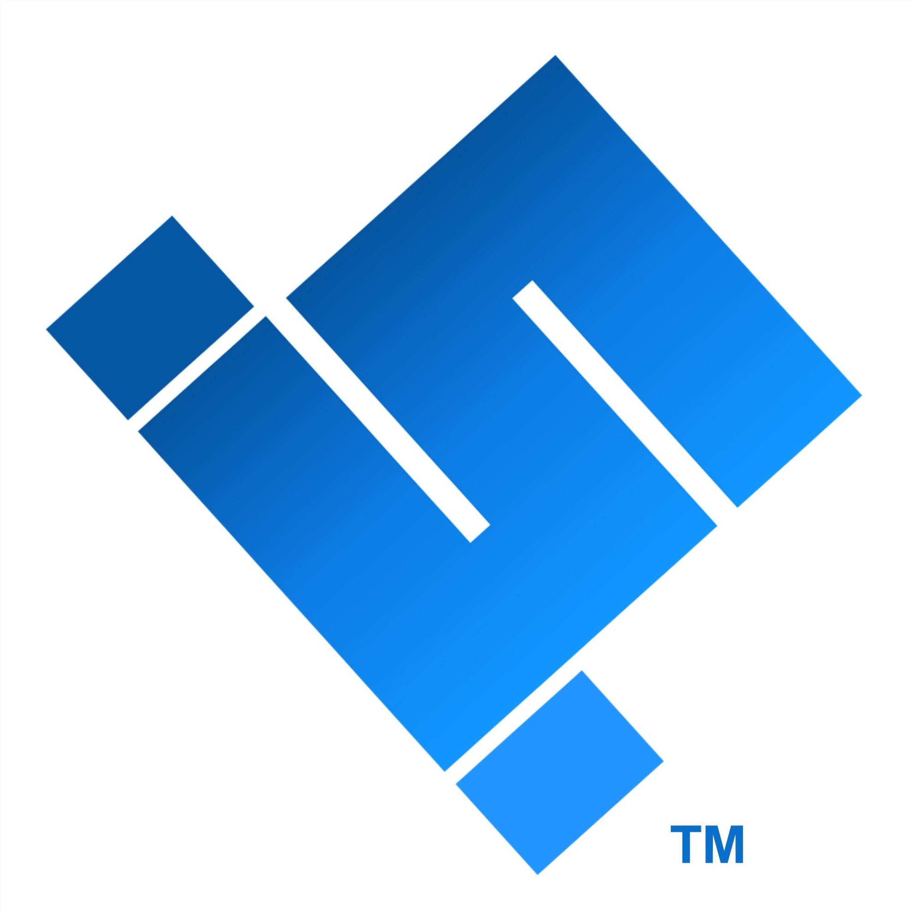
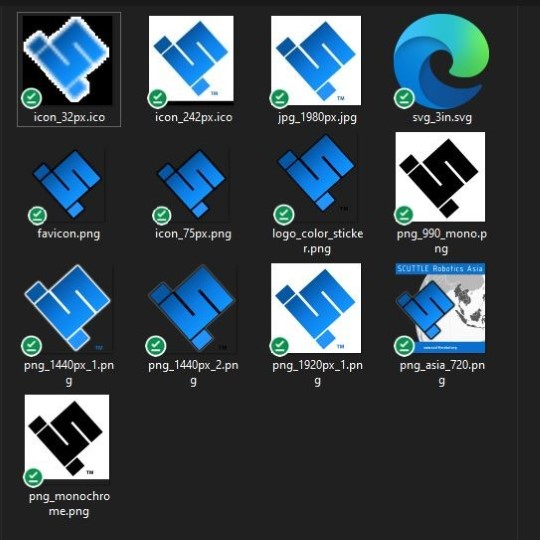

## Logos
Download these logos as needed to refer to scuttle robotics in your documents or slides.  It is OK to use our brand when you are referring to SCUTTLE Robotics organiztion but it is not ok to impersonate our organization or pretend that your publication was authored by us.  Pretty simple!

### Preferred Logo
Preferred means it's the most commonly used as of right now (they get adjusted sometimes, mainly by filetype, background, pixel count) and right now this one is the most usable.  JPG is in general the smallest file type for a simple colored logo, whereas some of the png files have a clear background and are best for powerpoints with colored backgrounds.

### Logo Packet
Download this zip file to grab the set of logos with various backgrounds and sizes, including ico filetype for icons.  However, we mostly use .png filetype even for icons since 2024, because it became more accepted by docsify-this, wordpress, etc.

* Download [Brand Packet, 2MB zip](docs/2025.01_branding.zip)

## Copyright
Brief explanation of copyright to follow.  All copyrighted content is managed in a way that is reasonable, fair, and (I think) helpful for students or creators who want to use our content.  You won't have any trouble unless you are causing trouble.
