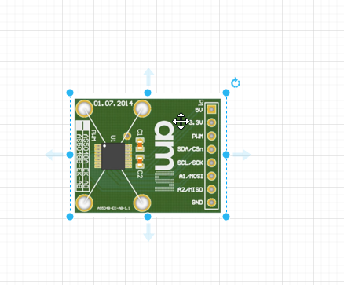

## About
Welcome to ScuttleTechGuide! An open door to building and developing with the SCUTTLE multidisciplinary ecosystem.  For several years we hosted all of the documentation for SCUTTLE Robotics on our website, [scuttlerobot.org](https://scuttlerobot.org). But, since mid 2024 we found new ways to make the documentation more flexible & easily updated.  This repository will feature items such as wiring diagrams so that customers can view while contributors can edit.  Also, students can download source files for our diagrams and use them to kickstart documentation for their project.  This repo will expand until we have a solid, fully open, set of docs for the standard SCUTTLE robot and we will trim back the website (scuttlerobot.org) to focus on business interactionss such as ordering robots.

## More Projects

>
> More open-source designs:
>
> | Project | Link | Purpose | 
> | --------------- | ---------------------- | -------------------------------------------------------- | 
> | OpenAir | [qr.net/openairproject](https://qr.net/openairproject) | take control of air, pressure, & flow with open elements | 
> | OpenArm | [qr.net/openarmproject](https://qr.net/openarmproject) | revolutionize robotic arms, a 10-year goal | 
> | OpenBox | [qr.net/openboxproject](https://qr.net/openboxproject) | array of open designs beginning with a steel box | 
> | OpenGrow | [qr.net/opengrowproject](https://qr.net/opengrowproject) | open designs for hydroponics & aquaponics systems | 
> | OpenJar | [qr.net/openjarproject](https://qr.net/openjarproject) | array of designs for standard jars, threads, & seals | 
> | OpenLab | [qr.net/openlabproject](https://qr.net/openlabproject) | build a laboratory to design & fabricate anything. |
> | openME | [qr.net/openmeproject](https://qr.net/openmeproject) | a Mechanical Engineering degree, comprehensive & free, in-progress | 
> | OpenSpin | [qr.net/openspinproject](https://qr.net/openspinproject) | array of designs based on parametric bearings | 
> | SCUTTLE_Nigeria | [qr.net/scuttleafrica](https://qr.net/scuttleafrica) | university-level robotics lab in Lagos, Nigeria |
> | SCUTTLE_tech | [qr.net/scuttleproject](https://qr.net/scuttleproject) | engineering design guide for scuttle robot |
> | SCUTTLE_Mini | [qr.net/scuttlemini](https://qr.net/scuttlemini) | miniature mobile robot, 10kg payload, designs |
>

## Reference

A section for terminology, footnotes, and sources cited within the tech guide.

### Quick Links

> | [SCUTTLE Resources](https://scuttlerobot.org/resources ':class=button') | [CAD Models](https://www.scuttlerobot.org/resources/models ':class=button') | [Videos](https://www.scuttlerobot.org/resources/videos/ ':class=button') |
> | [Applications Guide](https://qr.page/g/15vgHvaHTAe ':class=button') | 

### Glossary

| Abbreviation or Term | Definition |
| -------------------- | ---------- |
| LH, RH | left-hand, right-hand |
| OTS | off-the-shelf |
| DFM | design for manufacturing |
| SBC | single-board computer |

### Key Standards

If you learn about these standards, you can benefit in your project. A) you may find affordable off-the-shelf solutions to integrate. B) you may find a cluster of design knowledge to dive deeper in your favorite area as a maker C) you can invent a project that segways into commercialization more smoothly. 

Learn [Why Standards are your best friend](https://www.scuttlerobot.org/updates/blog/standards-inventions/)

A quick list of standards we integrate:
* 18650 battery cells [specifications](https://www.fenixlighting.com/blogs/news/the-ultimate-guide-to-the-18650-battery)
* MQTT [protocol for IoT](https://info.hivemq.com/mqtt-essentials)
* USB-PD, or Power delivery (integration in progress)
* DIN rail, 35mm, mechanical geometry
* Aluminum Extrusion, 30-series or 30x30mm.
* Camera fastener thread, 1/4-20 (integration in progress)
* Toyota's 5S methods
* Toyota's Lean Manufacturing practices
* Toyota's Kaizen practices
* Toyota's 5-why root cause analysis
* Wheel bearings, 608 spec, the ABEC scale (used worldwide from skateboards to fidget spinners)
* Metric System of Units
* Markdown programming language for documentation (in progress)
* Embedded Linux Shell scripting
* Creative Commons Open Source License [CC BY-SA 4.0](https://creativecommons.org/licenses/by-sa/4.0/)
* Water & dust intrusion [IP rating scale](https://en.wikipedia.org/wiki/IP_code)

## Documenting

### Learn Docs

Resources for Documenting
 * Docs, simplified with [Docsify-This](https://docsify-this.net/#/)
 * Emoji - in markdown with [Github Emoji Picker](https://github-emoji-picker.rickstaa.dev/) ► Use this for markdown compatibility.
 * Markdown [Cheat Sheet](https://www.markdownguide.org/cheat-sheet/)
 * Diagrams, with draw.io also known as [Diagrams.net](https://diagrams.net)
 * Altcodes, from [AltcodeUnicode](https://altcodeunicode.com/) ► use these for compatibility with all word processors.

> **GET LATEST**
> * Draw.io Library [version 06.29](diagram/lib_sctl_v0629.xml)
> * Draw.io Diagram [draft version 06.29](diagram/diagram_wiring_v0629.xml)

### Our Goals

1. Become the first multidisciplinary open project that addresses the 2020-era pain points for the community:
  * Mechanical designs are locked into specific CAD software. 
  * Manufacturing methods span broadly with poor repeatability by open community.
  * Documentation for high-fidelity designs does not address novice experience level.
  * Highly professional projects are scarce.  Designs that are robust enough to be repeated are usually expensive.
  * It is hard to get help.  Well designed components don't have engineering-level customer service.
  * Robot designs are tied to one embedded controller - availability and costs are limiting.
  * Designs do not offer a curriculum to accompany them.
  * Prerequisites for materials, knowledge, components, are not clear from the beginning.
  * As a robot develops, it's software becomes specific to only that robot - unlike open 3D printing software, for example.
2. Leverage the community for documentation
  * Build standards to clearly outline documentation needs
  * Offer training resources on how to document
  * Make documentation friendly to each respective discipline & their typical applications
  * Only use methods that have been shown successful by other communities.
  * Keep documents and source files open & free as much as possible, and their tools thereof

### Diagramming

Okay, hear us out: diagrams may be the most important part of a multidisciplinary design.  Electrical circuits have established standards, hardware designs have them, but the crossover gets messy.  We are implementing new libraries starting in 2023 to help get your projects planned & documented for repeatability & collaboration.

Starting with [Draw.io](https://app.diagrams.net/), here's some technology magic:
| Click a library component | Drop it in your Diagram | Edit Connection Points |
| ------------------------- | ----------------------- | ---------------------- |
|  |  |  |

As we build a library of the most common components, we will release open draw.io libraries so you can grab preconfigured, labeled images with connection points already set.  The images are high quality, lightweight, and easily pulled into other softwares like Visio and Powerpoint.

## Benchmarking

As an open source community, we aim to gather best practices from leading open projects.  The multidisciplinary nature of SCUTTLE means no existing model fits us, but many elements have been resolved by great communities with an ongoing development and outcomes.

## Community Stars

The organizations in this table have influenced SCUTTLE organization heavily and we continue seeking out best practices from groups like them

| Team              | Site                                                                                          | Feature to Aspire to:                                       | Team No. |
| ----------------- | --------------------------------------------------------------------------------------------- | ----------------------------------------------------------- | -------- |
| Voron 3D Printer  | [Voron Docs](https://docs.vorondesign.com/)                                                   | well-made multidisciplinary documentation                   | 1        |
| Thingiverse       | [Thingiverse Library](https://www.thingiverse.com/)                                           | attracted millions - easy to sign up, easy to use           | 2        |
| GrabCAD           | [GrabCAD Library](https://grabcad.com/library)                                                | in-browser Visualization - great permalinks - great tagging | 3        |
| OpenBuilds        | [openbuilds](https://openbuilds.com/?o=l)                                                     | attracted high-effort contributions - peak modularity       | 4        |
| Leo Rover         | [Leo Dev Resources](https://www.leorover.tech/developers)                                     | Use github for software development                         | 5        |
| Printables        | [Printables Library](https://www.printables.com/)                                             | Helps designers post designs with clear licensing           | 6        |
| Hackaday          | [Hackaday.io](https://www.hackaday.io/)                                                       | Curating well-engineered designs                            | 7        |
| Hackster.io       | [Hackster Contests](https://www.hackster.io/contests)                                         | Attracts all types of designers with nice contests          | 8        |
| Leo Rover         | [Leo 3D Models](https://a360.co/378zqRp)                                                      | Convenient in-browser viewing of 3D models                  | 9        |
| Viam              | [Viam Discord](https://discord.gg/viam)                                                       | Refined Discord channel for asking questions                | 10       |
| Texas Instruments | [TI Robotics Academy](https://dev.ti.com/tirex/global?id=com.ti.Jacinto%20Robotics%20Academy) | Research-grade tasks taught in Edge AI                      | 11       |
| uStepper Arm      | [Build Guide](https://qr.page/g/1PZfPMFuz8x)                                                  | Build Guide with detailed graphics                          | 12       |
| Moveo Arm         | BCN3D Moveo                                                                                   | Remaining 3D Printable post-commercialization               | 13       |
| Instructables     | [Instructables Library](https://www.instructables.com/projects)                               | Access to PDF version of every project writeup              | 14       |
| Open Dynamic      | [Open Dynamic Robot Initiative](https://open-dynamic-robot-initiative.github.io/)             | Computations for Dynamics at Academic Level                 | 15       |
| Arxive            | [Free Academic Pub - Cornell](https://arxiv.org/)                                             | Free distribution & open access to scholarly articles       | 16       |

 

 
Wish List from Community Stars
  

 Table ► Wish List  
 _Elements that would enhance these offerings - based on our experience, community, feedback, needs, and dreams._

| Team No. | Wish                                                                                                                                                                                                                           |
| -------- | ------------------------------------------------------------------------------------------------------------------------------------------------------------------------------------------------------------------------------ |
| 1        | Give more clear metrics on performance - why should you build it?                                                                                                                                                              |
| 2        | Better support for native CAD files                                                                                                                                                                                            |
| 3        | Allow users to implement a license with each post, like printables.org                                                                                                                                                         |
| 4        | Create a segway into robotic control, instead of only CNC control                                                                                                                                                              |
| 5        | Reduce the custom parts & replace with OTS parts.  Make designs more print-friendly                                                                                                                                            |
| 6        | Dial back the Printables Branding and help posts link to full projects.                                                                                                                                                        |
| 7        | Grade submissions by an open standard, help projects recruit team members in some form                                                                                                                                         |
| 8        | Offer PDF downloads for instruction - enhance tools for professional level developers.  Better classification of disciplines behind posts (mechanical, electronic, software).                                                  |
| 9        | Become more inviting to community contributions - make a library of addons or changes.                                                                                                                                         |
| 10       | Publish goals & core values that speak to community - help broader disciplines outside software answer "how will Viam enhance open robotics" in more disciplines.  Better express what is needed from community vs in-company. |
| 11       | Improve navigation of content - help users (of various backgrounds) find answers ► students, researchers, makers, businesses, academic partners                                                                                |
| 12       | Build a community of some sort.  Explain why the robot is open source.                                                                                                                                                         |
| 13       | Better explanation of where to buy parts                                                                                                                                                                                       |
| 14       | Better categorize projects by discipline, by key component, and/or others.  Make easier to find relevant projects for users.                                                                                                   |
| 15       | Publish the source files for the robot components - particularly 3D printed parts.                                                                                                                                             |
| 16       | Offer a category for mechanical engineering along with CS, EE, PHYS, etc.                                                                                                                                                      |

 _Figure: Table of Wishes from Community Stars_
 
 

 ---
 
## Thought Leadership

* Linux is the largest open source project in history, and it's founders created [TheOpenSourceWay.org](https://www.theopensourceway.org) to guide other communities.  Their publication called [The Open Source Way](https://www.theopensourceway.org/the_open_source_way-guidebook-2.0.html#_why_do_people_participate_in_open_source_communities) offers insights to how it all works.
* The Open Source Hardware Association pushes to engage hardware development teams in open source.  They have regular releases of their [State of Open Source Hardware](https://qr.scuttlerobot.org/g/58a4R641DBp), and this one is from 2021.

---

[Github Repo](https://github.com/dmalawey/ScuttleTechGuide ':class=button')
[Website](https://docsify-this.net/?basePath=https://raw.githubusercontent.com/dmalawey/ScuttleTechGuide/main&sidebar=true#/?show-page-options=true ':class=button')
[SCUTTLE Africa](https://qr.page/g/leQK0r6g6q ':class=button')

