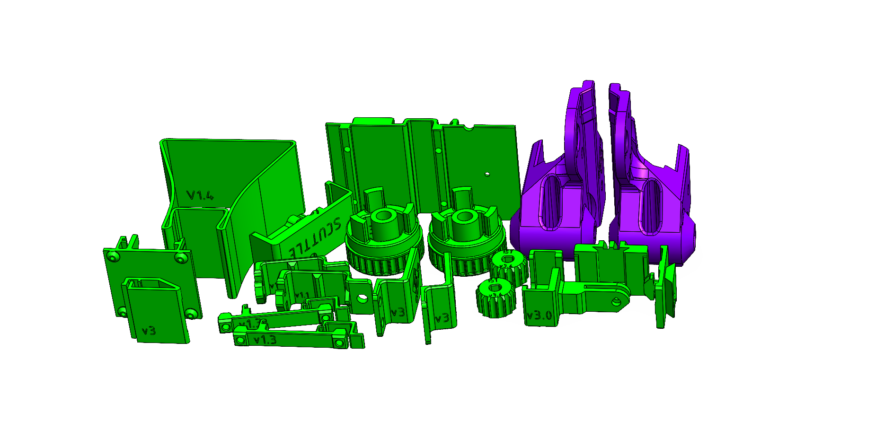

# Parts for the SCUTTLE Robot

## OTS
Off-the-shelf parts make up the key technologies onboard the robot.  They're made from world-class technology companies and highly refined manufacturers.

## Prints

Printed parts are the custom designs that hold your robot together.  In the SCUTTLE design, there are about 15 standard prints and hundreds of community-made addons.

# 3D Printing

---

> Standard SCUTTLE v3.0 requires about 330g of 3D printed parts.  Everything is designed for manufacturing in FFF with no supports.

_Figure: All 3D Printed Parts for a SCUTTLE kit_

  
3D Model - Wheel Assembly

  See our 3D model for the wheel assembly
  
  _We've uploaded the model to sketchfab to embed this viewer - let us know if this is helpful!_

 
 

 
  <iframe title="Drivetrain_L" frameborder="0" allowfullscreen mozallowfullscreen="true" webkitallowfullscreen="true" allow="autoplay; fullscreen; xr-spatial-tracking" xr-spatial-tracking execution-while-out-of-viewport execution-while-not-rendered web-share src="https://sketchfab.com/models/6089b024280f4fadb31e674b08e08839/embed?autospin=1&ui_theme=dark%22%3E">
 
  </iframe>
 

---
