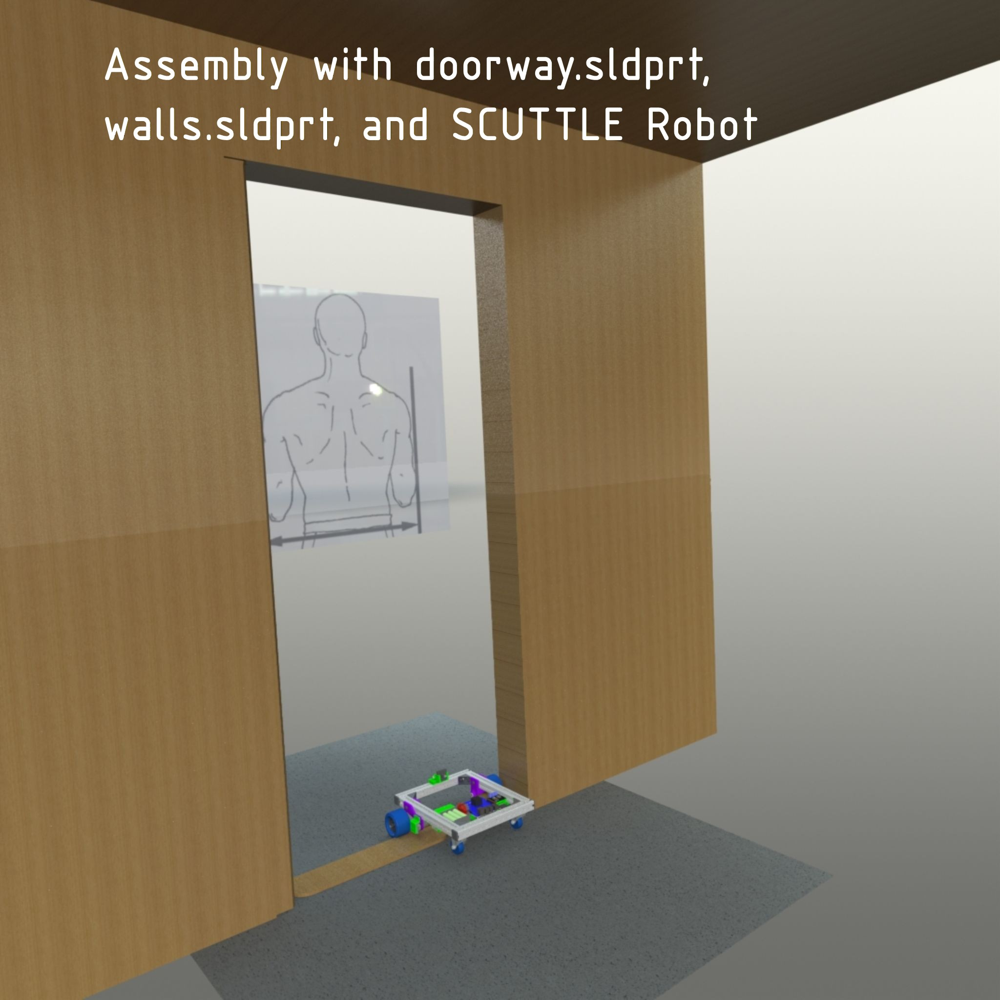
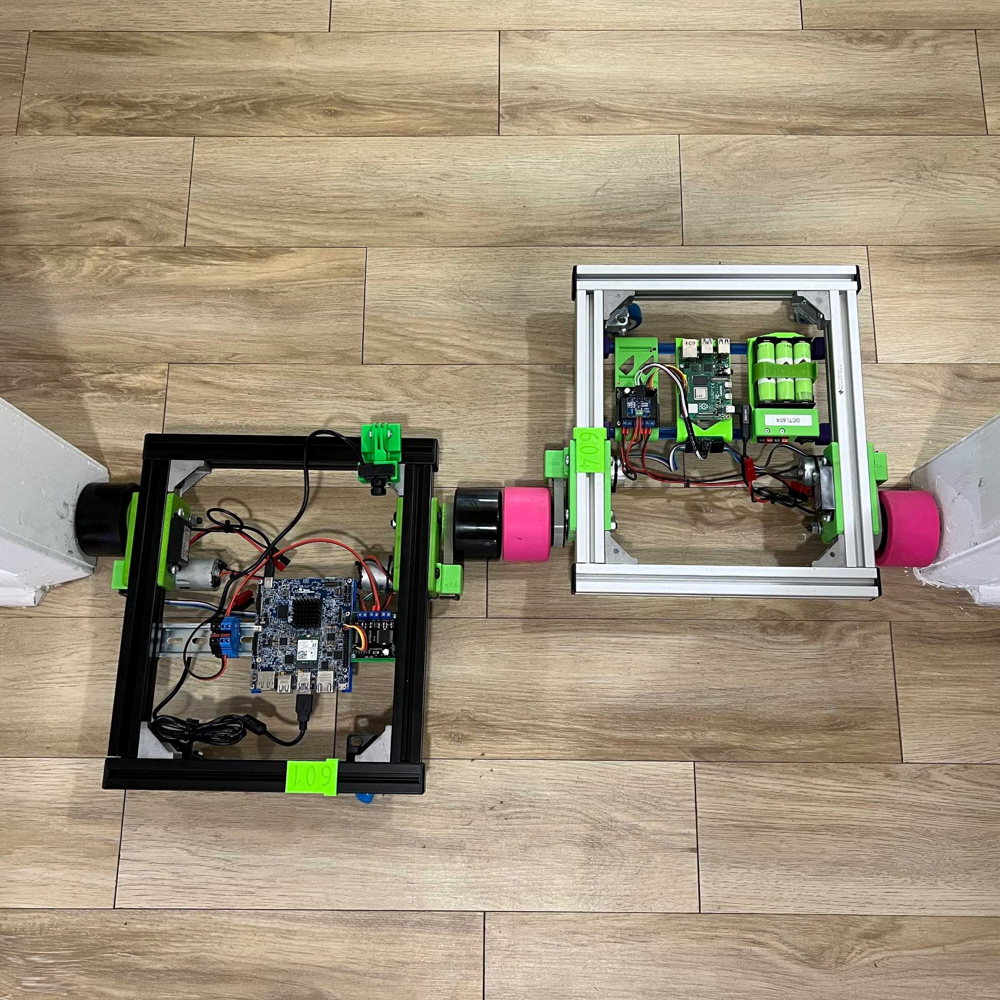
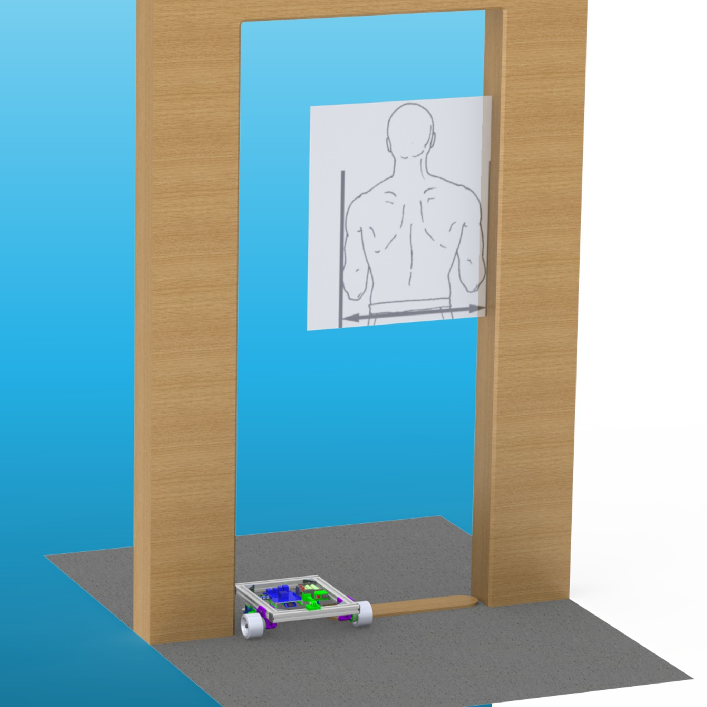
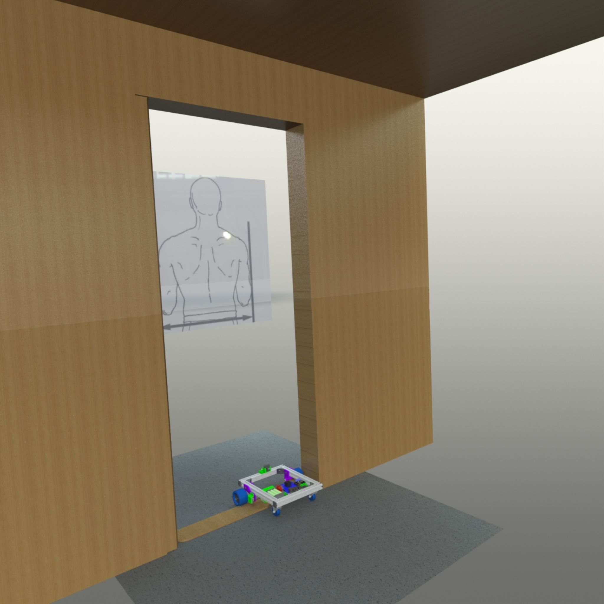
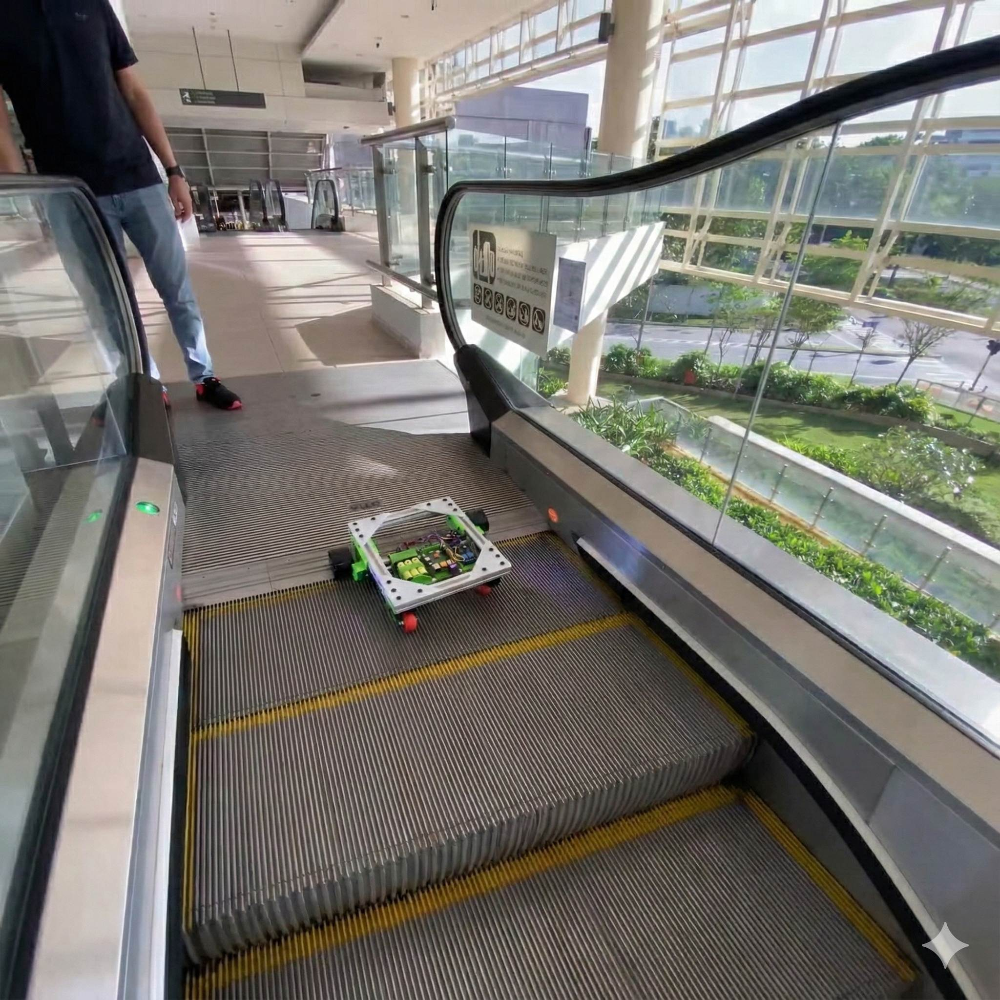
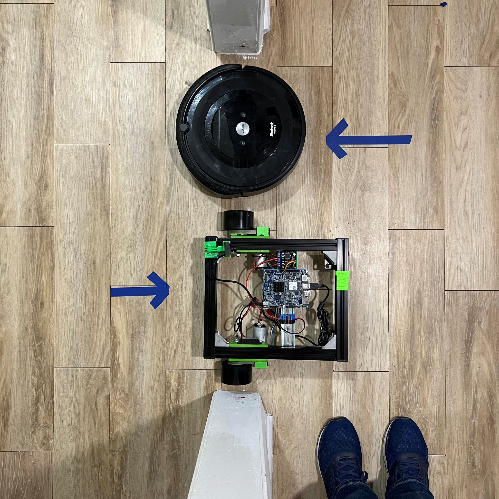
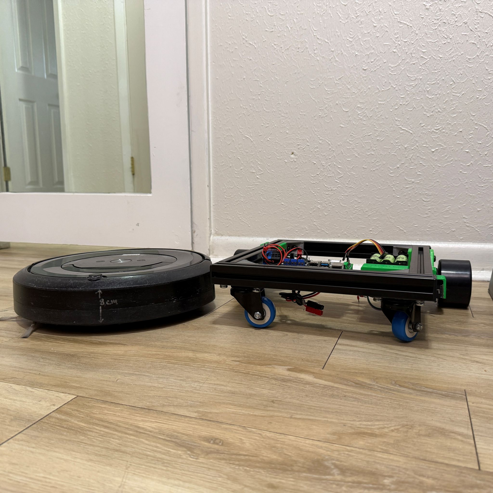
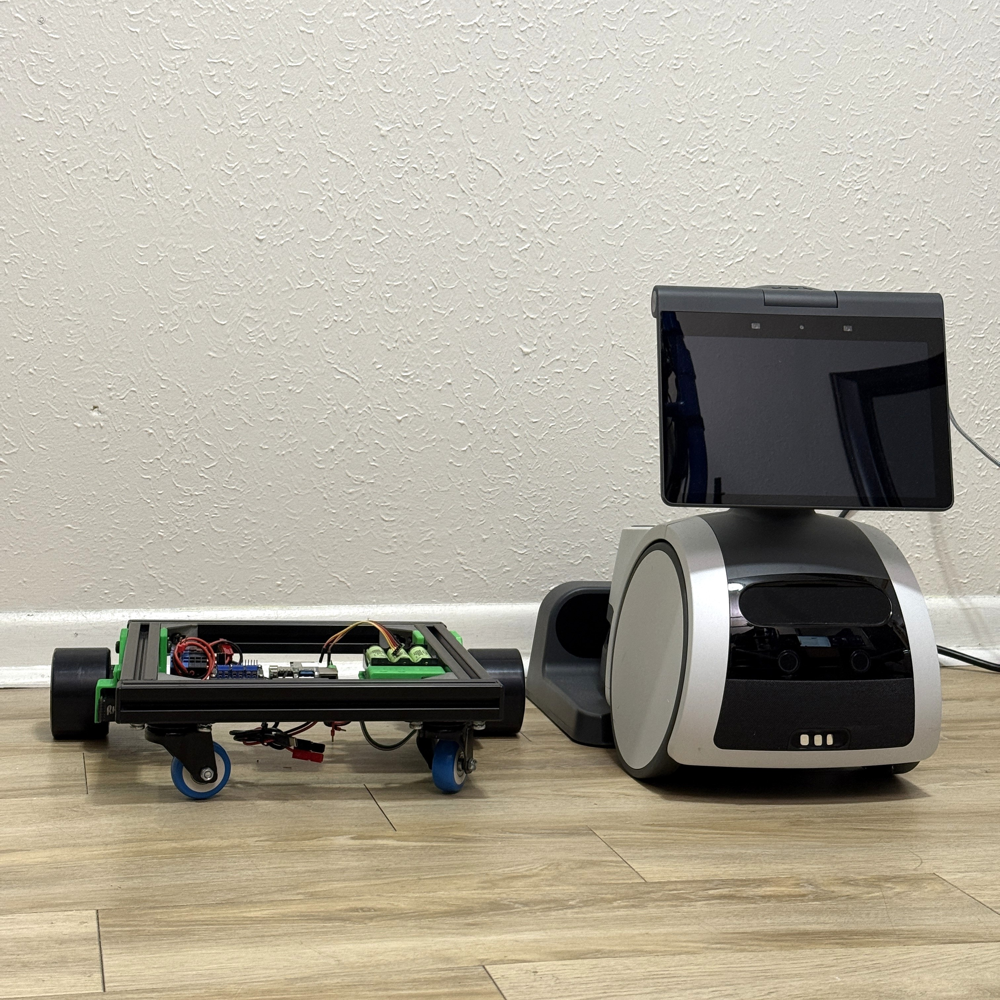
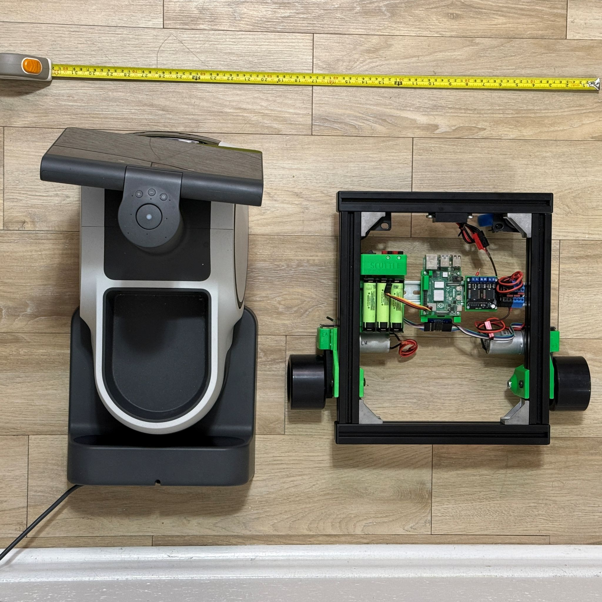

Navigation

This page is to support navigation and planning of robot tasking for SCUTTLE Robot developers.  The task of navigating reduces to where are we going, what are the obstacles, and where do we fit?

**General Size**
What spaces are accessible for this robot? SCUTTLE should be able to fit where people go, indoors and outdoors. The main considerations are doorways and facility infrastructure.  See the first image - two robot chassis fit in a common interior door frame. This generic door frame was placed in a CAD model to share a digital description of this geometry.  The next 2 photos show that doorway which you can download, which also includes some anthropometry data.  The general location of a human in the doorway has been added with a footspace location and an upright location for visualizing.
* download [Doorway on grabCAD](https://grabcad.com/library/doorway-3) online free

- 
- 
- 

**Escalator**
We ran some trials in 2020 that test out SCUTTLE accessing an escalator.  This is a unique advantage as most other robot designs cannot quite fit on an escalator stair.  See the image with scuttle carrying a payload (consisting of a 3D printer) and accessing the escalator. There are minor edits to the image (to get a square aspect ratio) but the photo is clipped from a real filmed trial.

- 
- 
- 

How much clearance is needed for SCUTTLE to pass below furniture? For comparison, see the photo with SCUTTLE and Roomba model e5 by iRobot.  The roomba is popular enough to include as a reference people can relate with.  The standard SCUTTLE is only 1cm taller than the roomba and 12cm is recommended as a clearance height for SCUTTLE to pass under.  This low-profile was not a main target of the design but it is still important.  In 2019 some collaborators had a challenge for scanning below a passenger vehicle, in support of security checkpoints.  See also the size comparison with Amazon's Astro home assistant robot, which was released in 2021 by invitation only.  We want to make sure users who perform interactions can carryover learning and algorithms from the most popular robots in this class.

- 
- 
- 
- 
