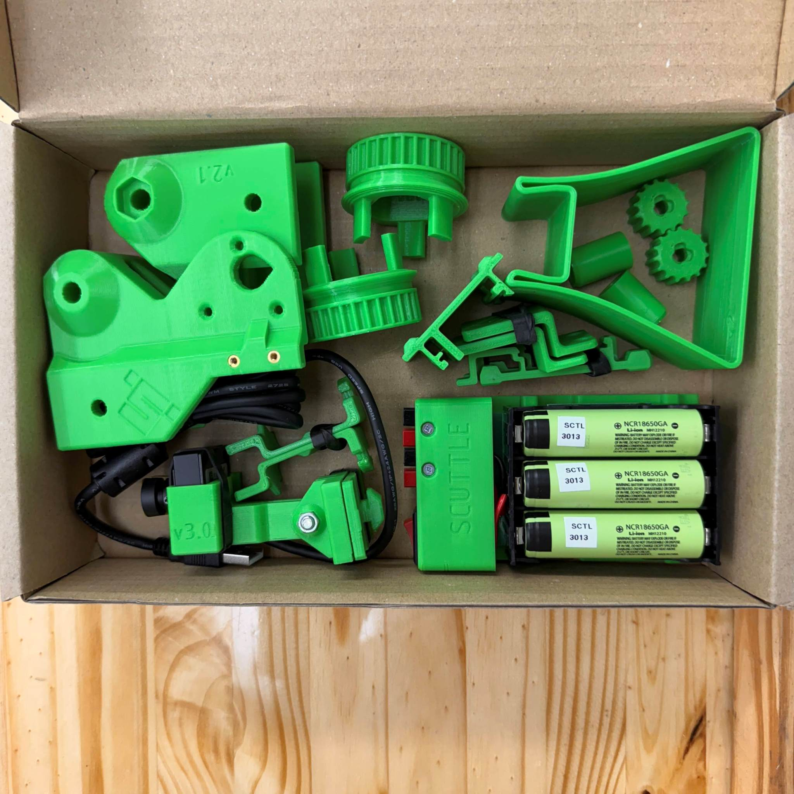
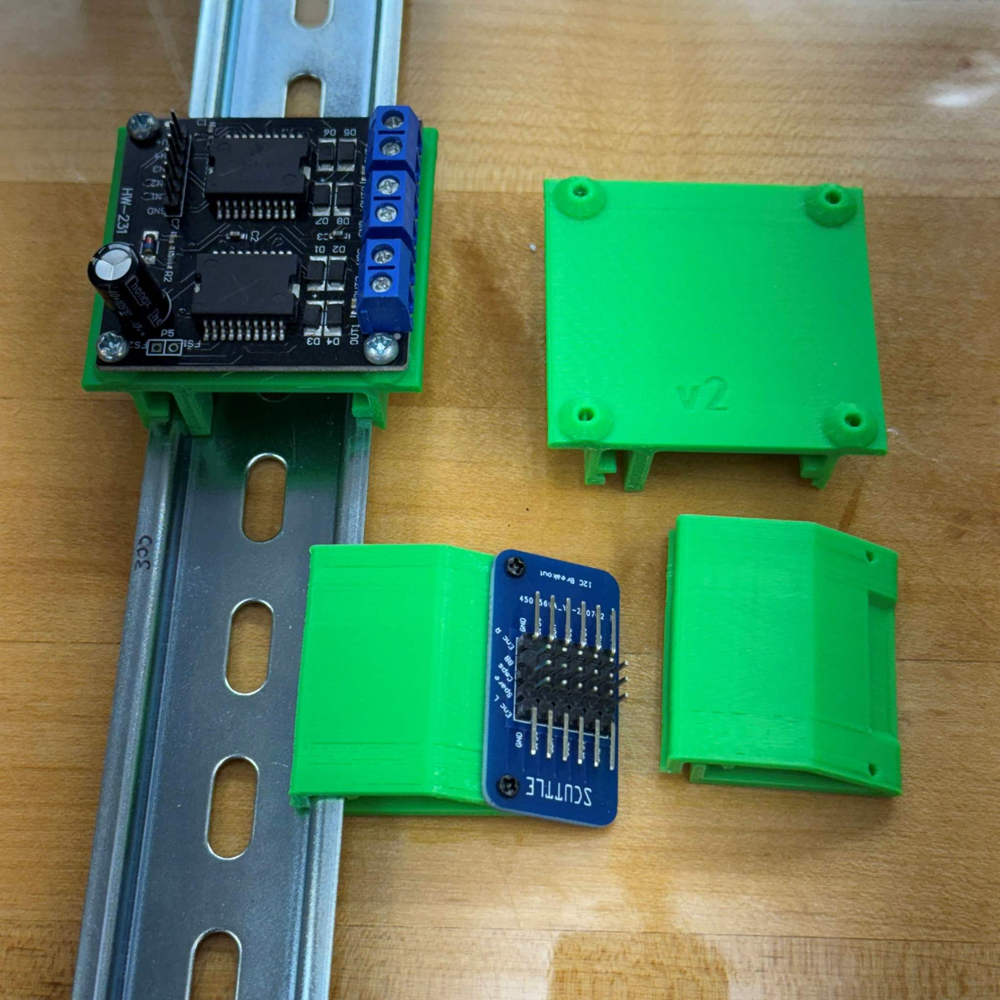
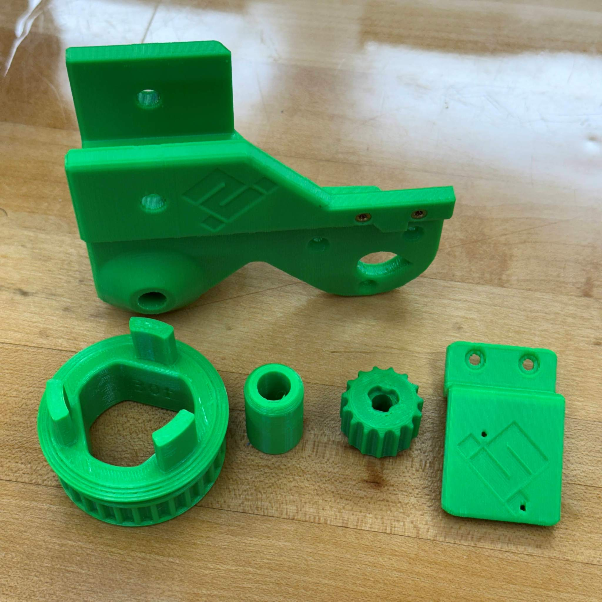
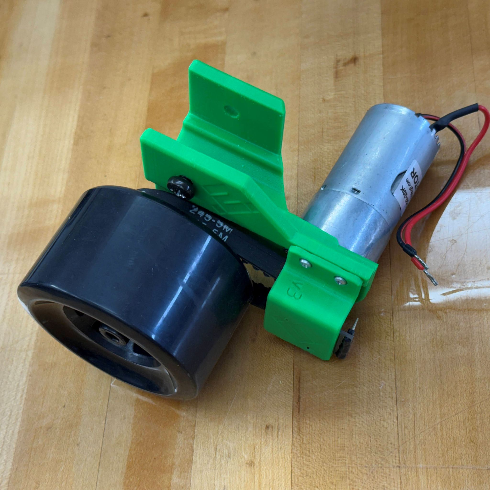
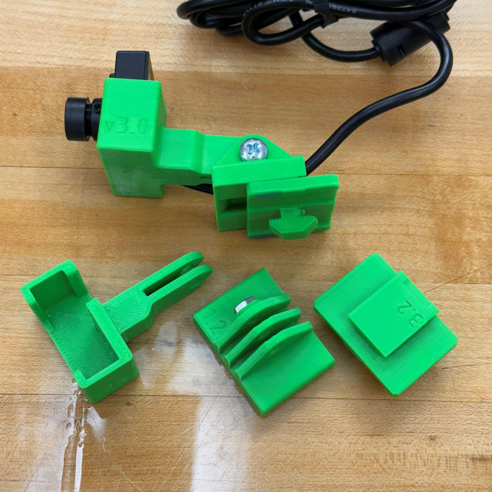
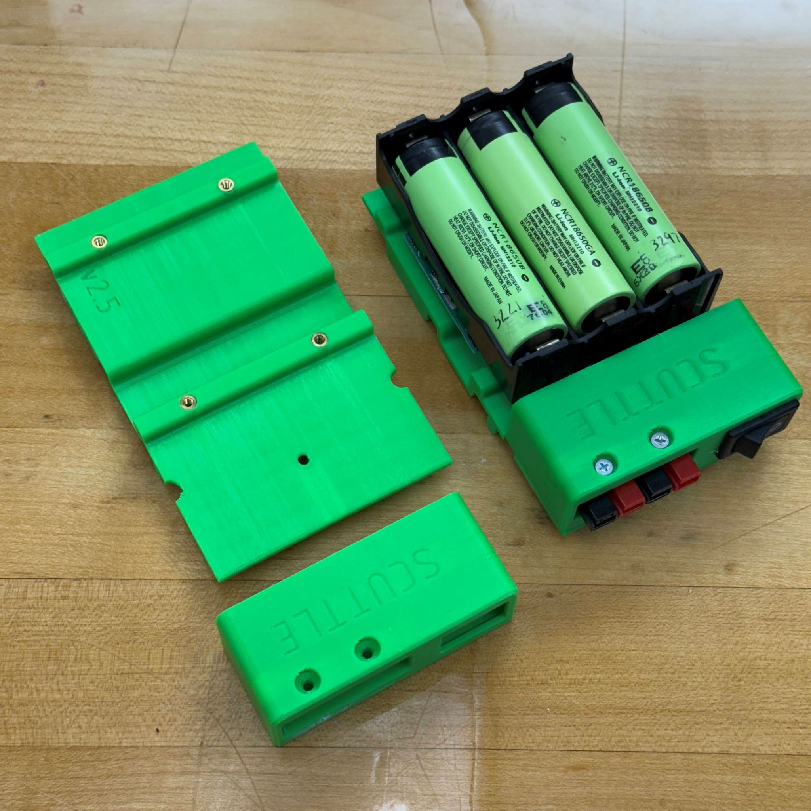
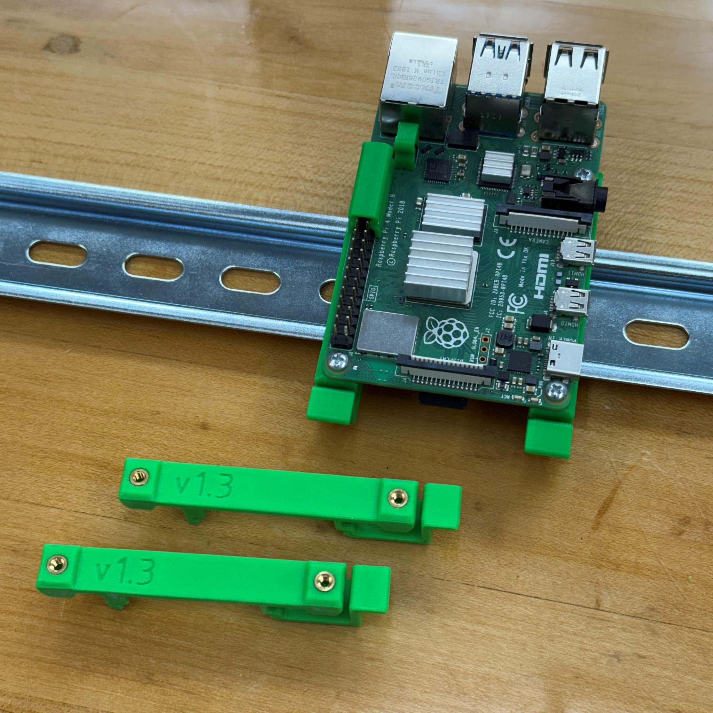
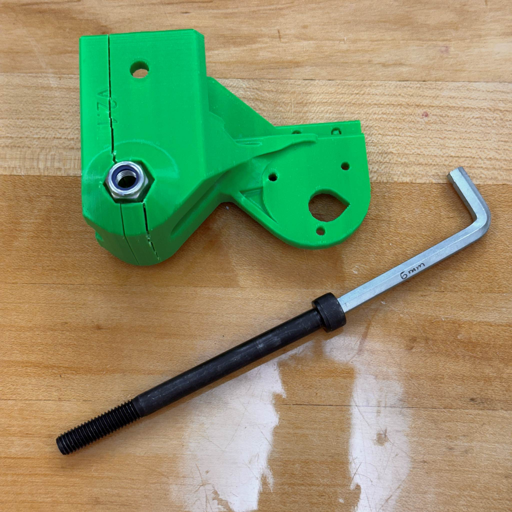
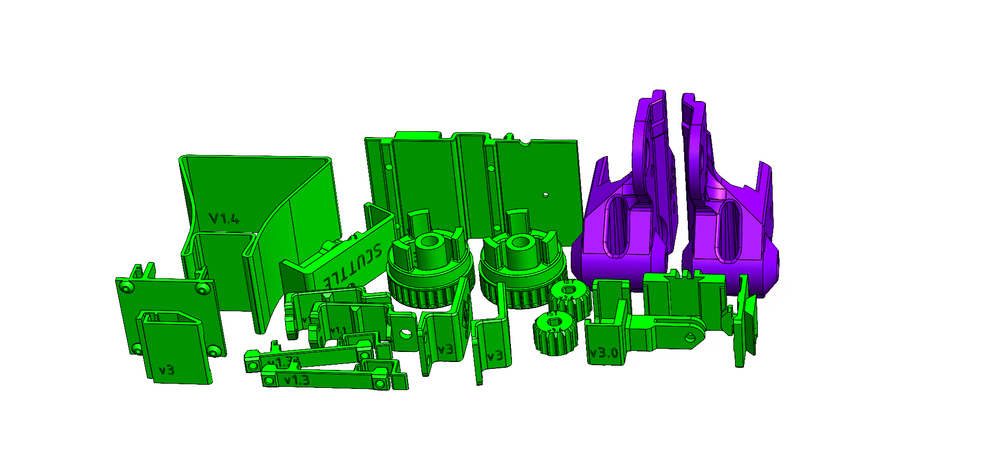

# Parts for the SCUTTLE Robot

>
> * **Sourcing: BOM Downloads for sourcing parts**
> * download [BOM v3, PDF](https://github.com/dmalawey/ScuttleTechGuide/blob/e01a412a85ed5757fea2188e6432ee075e86c56f/docs/BOM_v3.pdf)
> * download [BOM spreadsheet, XLSX](https://github.com/dmalawey/ScuttleTechGuide/blob/e01a412a85ed5757fea2188e6432ee075e86c56f/docs/BOM_v3_publish_2024.xlsx)
> * These bill of materials feature vendors like amazon and mcmaster while equivalent parts are available globally.  The robot design is flexible enough to select variations as you need. 
> * **Building: BOM downloads for building the robot**
> * download [BOM thumbnails, PDF](https://github.com/dmalawey/ScuttleTechGuide/blob/c05570d2dcd6559e1039815b424ecbd671699423/docs/BOM_v3_thumbnails.pdf)
> * download [BOM thumbnails prints, PDF](https://github.com/dmalawey/ScuttleTechGuide/blob/668c17a193f97723ec31de08682bc4f6dce895b1/docs/BOM_v3_thumbnails_prints.pdf)
> * The BOM_Thumbnails features images of parts, for visual reference only. This can help you identify screws, and 3D printed part names, or plan 3D prints to build SCUTTLE.  
>   

## OTS
Off-the-shelf parts make up the key technologies onboard the robot.  They're made from world-class technology companies and highly refined manufacturers.

## Prints

Printed parts are the custom designs that hold your robot together.  In the SCUTTLE design, there are about 15 standard prints and hundreds of community-made addons.

Here's a photo with all the prints for SCUTTLE version 3.0 in one box.  Some of the prints are preassembled with their mating parts.
* 

The i2c bracket snaps onto the DIN rail and secures the i2c circuit board.  The motor driver bracket snaps onto the DIN rail and holds the motor driver.  Self tapping screws are used for both brackets.
* 

The wheel assembly has four parts (wheel bracket, wheel pulley, wheel spacer, and motor pulley)  Here are the raw prints and the assembly together.
* 
* 

The camera assembly features 3 prints.  The "bracket" holds the camera, the "pivot" joins both parts, and the "mount" clips into the chassis aluminum rails.  This assembly holds the only M5 sized fastener, with 20mm length and nested nut feature in the print.
* 

The battery assembly has two prints.  The "panel" carries a power switch and two pairs of anderson terminals.  The "din bracket" clips onto the DIN rail with an embedded spring clip.  The parts join with superglue but they are aligned using a screw, M2.5x10.
* 
* 

Don't overtighten the shaft bolt!  Grip the narrow end of the tool to achieve proper hand-torque.

# 3D Printing

---

> Standard SCUTTLE v3.0 requires about 330g of 3D printed parts.  Everything is designed for manufacturing in FFF with no supports.

_Figure: All 3D Printed Parts for a SCUTTLE kit_

  
3D Model - Wheel Assembly

  See our 3D model for the wheel assembly
  
  _We've uploaded the model to sketchfab to embed this viewer - let us know if this is helpful!_

 
 

 
  <iframe title="Drivetrain_L" frameborder="0" allowfullscreen mozallowfullscreen="true" webkitallowfullscreen="true" allow="autoplay; fullscreen; xr-spatial-tracking" xr-spatial-tracking execution-while-out-of-viewport execution-while-not-rendered web-share src="https://sketchfab.com/models/6089b024280f4fadb31e674b08e08839/embed?autospin=1&ui_theme=dark%22%3E">
 
  </iframe>
 

---
