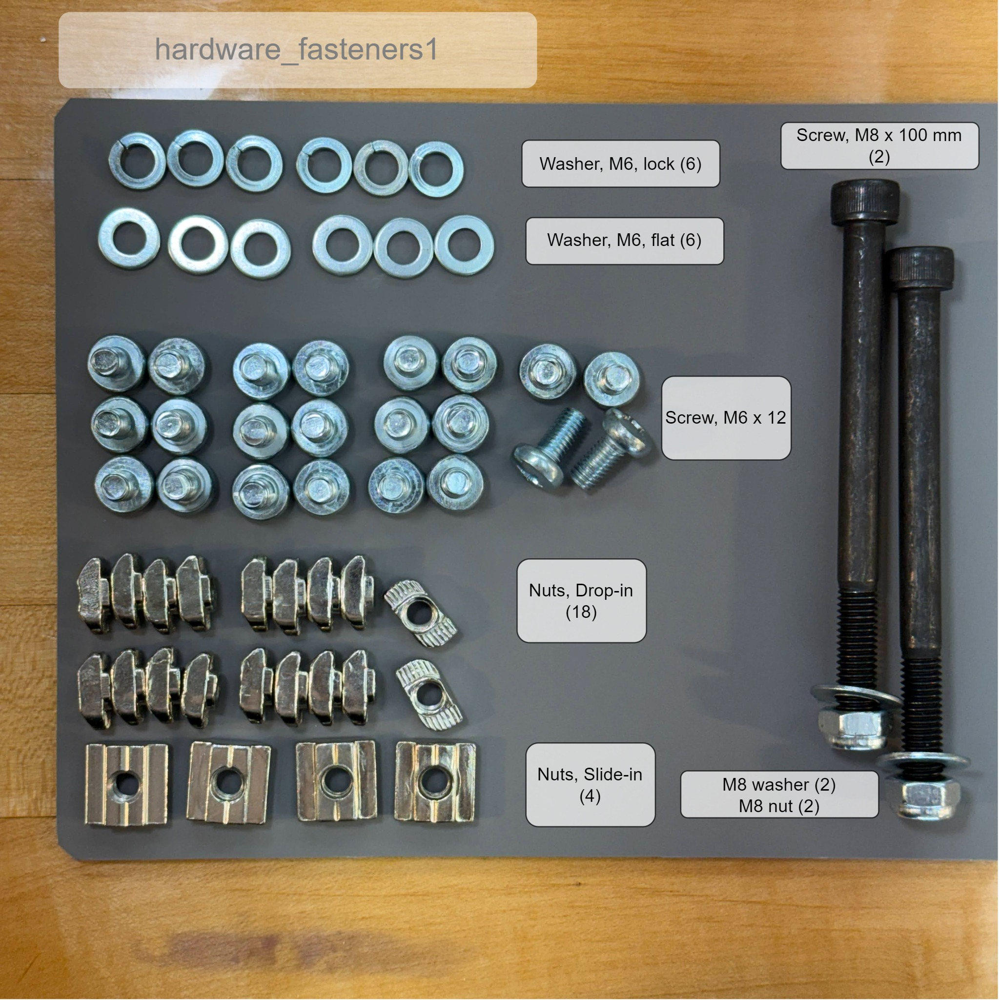
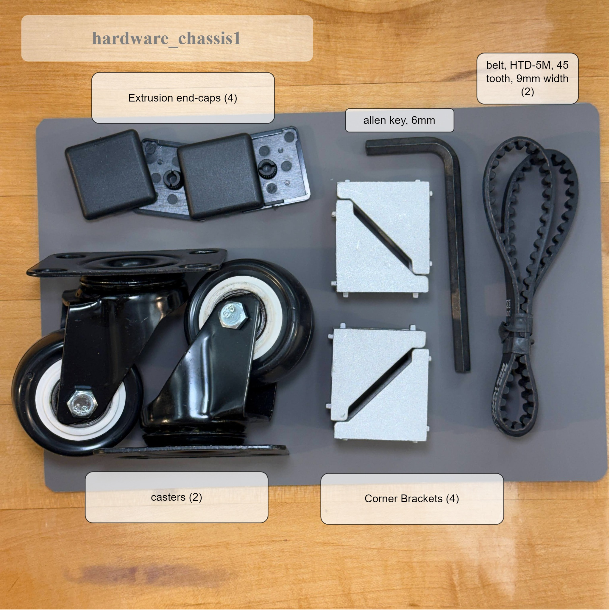
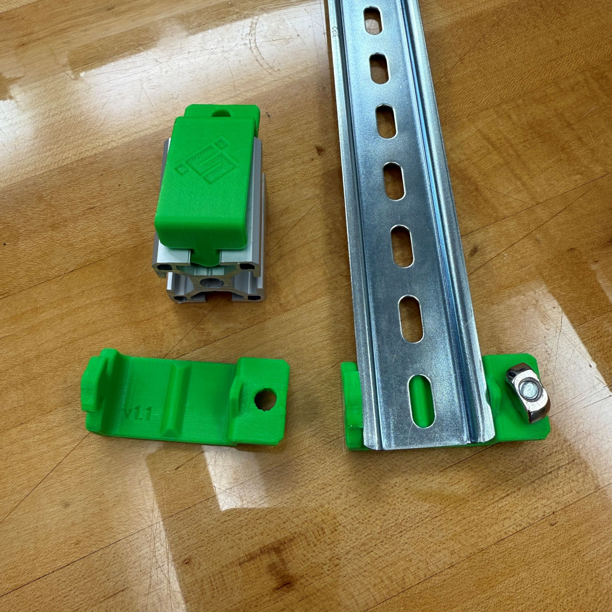
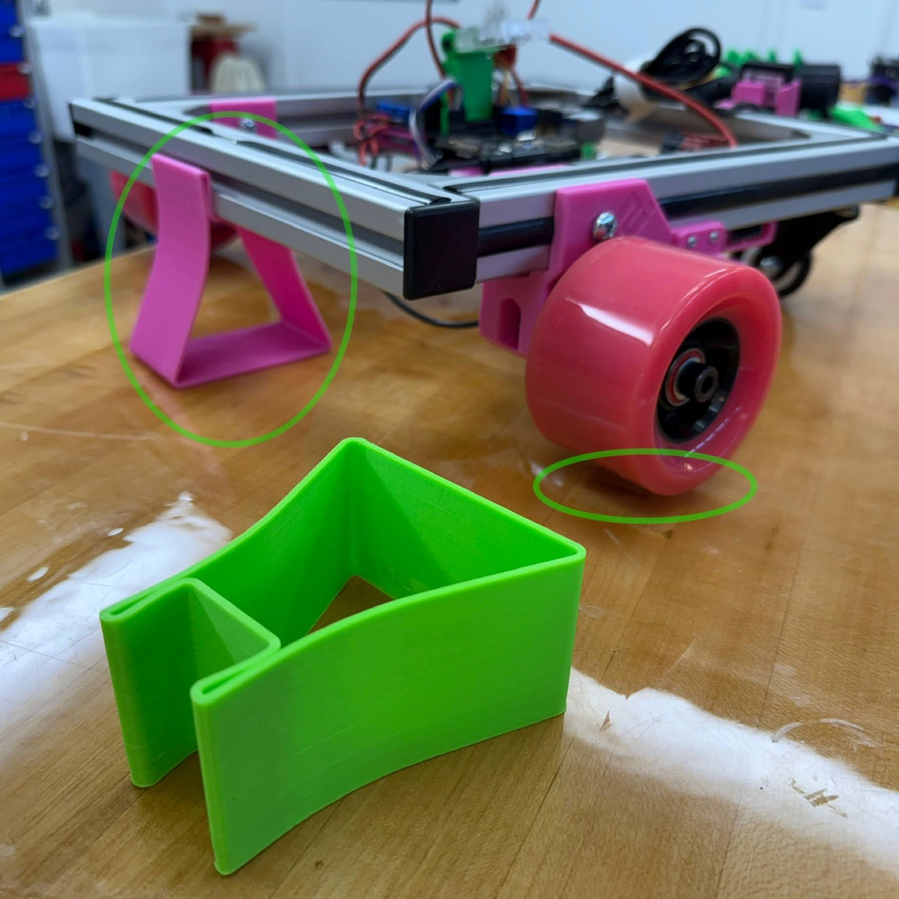
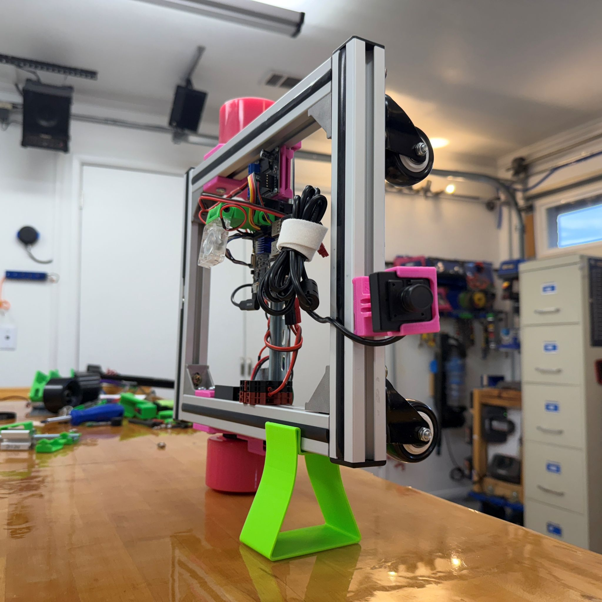
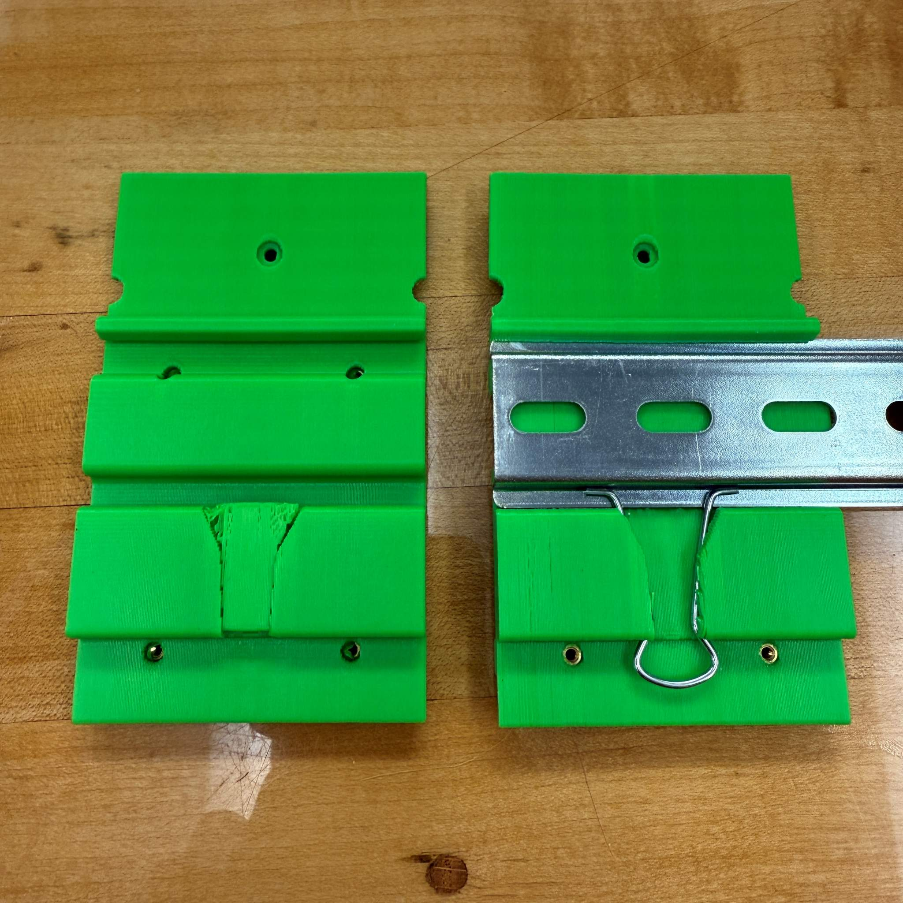
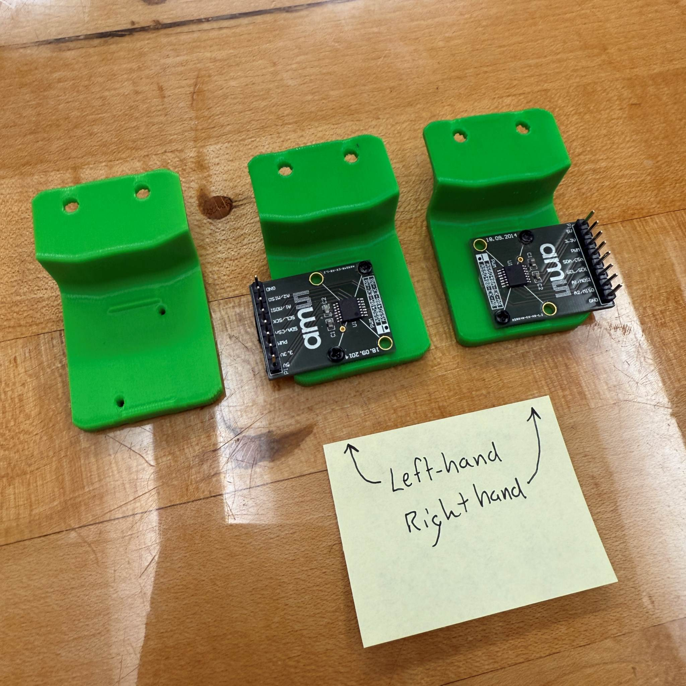

# Parts for the SCUTTLE Robot

>
> **Sourcing:**
> * download [BOM v3, PDF](https://github.com/dmalawey/ScuttleTechGuide/blob/e01a412a85ed5757fea2188e6432ee075e86c56f/docs/BOM_v3.pdf)
> * download [BOM spreadsheet, XLSX](https://github.com/dmalawey/ScuttleTechGuide/blob/e01a412a85ed5757fea2188e6432ee075e86c56f/docs/BOM_v3_publish_2024.xlsx)
> * These bill of materials feature vendors like amazon and mcmaster while equivalent parts are available globally.  The robot design is flexible enough to select variations as you need. 
>
> **Building:**
> * download [BOM thumbnails, PDF](https://github.com/dmalawey/ScuttleTechGuide/blob/c05570d2dcd6559e1039815b424ecbd671699423/docs/BOM_v3_thumbnails.pdf)
> * download [BOM thumbnails prints, PDF](https://github.com/dmalawey/ScuttleTechGuide/blob/668c17a193f97723ec31de08682bc4f6dce895b1/docs/BOM_v3_thumbnails_prints.pdf)
> * The BOM_Thumbnails features images of parts, for visual reference only. This can help you identify screws, and 3D printed part names, or plan 3D prints to build SCUTTLE.  
>   

## OTS
Off-the-shelf parts make up the key technologies onboard the robot.  They're made from world-class technology companies and highly refined manufacturers.

**Hardware**

The preferred fasteners are M6 for the frame and M2.5 for fastening electronics, and only deviating as needed.  See images below to identify the parts, and note the following
* The course screws maybe called "screws for plastic", "thread-forming screws", or "self-tapping" by some distributors.
* The M3 machine screws fasten the motors, 3 per motor.
* The M8 machine screw forms the axle in the drivetrain.
* The M2.5x6 screws fasten the electronics, mating in brass threaded inserts.
* The tiny M2.5 course screws have two for each encoder, chosen to make more clearance in the encoder assembly
* Two of the 6 M2.5 course screws also fasten the i2c board into the i2c bracket.
* The M6 nuts are installed in aluminum extrusions:
  * 18 for corner brackets and casters
  * 4 slide-in type for mounting the drivetrain assembly
* The drive belt has HTD tooth style, 9mm width, with length described by 45-tooth-count or 245mm.

- 
- 
- 

**Not shown above:**
The heat-set inserts we choose have 6mm length and M2.5 threads. They are installed into the 3D prints for wheel brackets and battery bracket, and raspberry pi brackets.  These are not shown in the images, nor the fasteners of the battery bracket.  In the battery bracket, we use M2.5x10mm countersunk machine screws which fasten the battery tray, secure the panel to the bracket, and fit in the Anderson connector pairs to retain the connector position.

## Prints

Printed parts are the custom designs that hold your robot together.  In the SCUTTLE design, there are about 15 standard prints and hundreds of community-made addons.

>
> **Printing**
> * download [printable parts kit](https://grabcad.com/library/scuttle_prints_v3-1)
> * note the dates on each CAD post to verify the latest
> * this model contains STL files, plus native CAD files for printed-only parts
> * use this model to quickly arrange your own prints in CAD or your Slicer
> * 

Here's a photo with all the prints for SCUTTLE version 3.0 in one box.  Some of the prints shown are preassembled with their mating parts, as found in the kit product. (left) The i2c bracket snaps onto the DIN rail and secures the i2c circuit board.  The motor driver bracket snaps onto the DIN rail and holds the motor driver.  Self tapping screws are used for both brackets. (right)

* 
* 
* 

Each wheel assembly has five parts (wheel bracket, wheel pulley, wheel spacer, and motor pulley, encoder bracket).  The wheel bracket (big print) has a unique print for left and right, but the remaining parts are identical left-to-right.  This means you'll find 6 total .STL files for these 5 parts.  See the first photo with fresh prints and the second photo with one drivetrain assembly built.

The camera assembly features 3 prints.  The "bracket" holds the camera, the "pivot" joins both parts, and the "twist bracket" clips into the chassis aluminum rails.  This assembly holds the only M5 sized fastener, with 20mm length and nested nut feature in the print.

- 
- 
- 

The battery assembly has two prints.  The "panel" carries a power switch and two pairs of anderson terminals.  The "din bracket" clips onto the DIN rail with an embedded spring clip.  The parts join with superglue but they are aligned using a screw, M2.5x10.

Two identical prints called pi bracket hold the pi in place.  The pi bracket grips the DIN rail on one edge and snaps-down on the other edge (left and right as shown in the photo).  Brass heat-set inserts are fitted into the prints and M2.5 machine screws secure down the raspberry pi.  Assembly: mount the brackets to the DIN, line up the pi using the holes, and add the four screws.  To remove the pi, keep the bracket attached.  Lift the tabs which bend, and release the bracket from the DIN rail. It's recommended to keep these brackets attached to your pi to protects the bottom facing features from shorting on a tabletop.  The pi fits best in the direction shown, with lifter tabs exposed.

The DIN bracket attaches a DIN rail to the chassis, with two identical copies per robot.  Features on this design: tabs interlock with the aluminum, so you can first mount these without screws.  Loosely fit the M6 screw and dropin nut to hold the DIN rail while allowing repositioning.  Finally, tighten the M6 screw to lock in the position.

* 
* 
* 

The kickstand attaches by-hand without hardware.  The design features compliance to snap onto the aluminum rail, and the kickstand lifts the wheels off the ground.  Test your drivetrain right at your desk without your SCUTTLE running off!  Alternatively, lift your robot 90 degrees to store it on the kickstand, taking less space.  The designed height suits the standard robot clearance and you can adjust this model to modify as needed.

- 
- 
- 

The battery din-bracket features a pocket that accepts a spring clip, and the spring clip locks this bracket on DIN rail (but you can still nudge it to slide it).  After printing, the supports are removed and the clip is installed.  In the photo below, find the left-hand bracket as-printed and the right-hand bracket installed on the DIN rail.

The encoder bracket has two copies on the robot, for the left and right encoders. It features two holes for M2.5 machine screws to attach to the wheel assembly.  Two more holes accept the tiny M2 screws for either left-hand or right-hand mounting of the encoders.  The configurations are shown in the photo.  

Don't overtighten the shaft bolt!  Grip the narrow end of the tool to achieve proper hand-torque.

* 
* 
* 

**Part Names & Abbreviations**
The following abbreviations are found in our STL files at times.  This helps view selections on a small printer display.  
| Part                  | STL | STL | Part                 |
| --------------------- | --- | --- | -------------------- |
| battery panel         | BPN | MDB | motor driver bracket |
| camera bracket        | CAM | MPL | motor pulley         |
| camera joint          | CJT | PDN | pi bracket, DIN      |
| battery bracket, DIN  | DBB | TWS | twist bracket        |
| DIN/extrusion bracket | DIN | WBL | wheel bracket left   |
| encoder bracket       | ENC | WBR | wheel bracket right  |
| i2c bracket           | I2C | WPL | wheel pulley         |
| kickstand             | KST | WSP | wheel spacer         |

# 3D Printing

---
Printing Info
1. We always use ABS filament for the best toughness.  You can build the robot with any material but the design is for ABS.
2. Standard SCUTTLE v3.0 requires about 330g of 3D printed parts.  Everything is designed for manufacturing in FFF with no supports.
3. Direction: Each design is exported with a coordinate system called "PRINT" to give the STL a default upright direction. To help identify the orientation, our labels are debossed for reading upright during printing, and the default text location is 6mm up from the base with 6mm font.  Then you can catch an issue early in the printing of a new part.
4. Designs are made for typical out-of-box print settings, such as 30% infill and two exterior layers.  The nozzle is 0.4mm and path width 0.45 or 0.5mm.
5. Designs aim for anyone to print.  Instead of dialing in super-fine print settings, we build geometry that tolerates a common low-cost printer performance.
6. Most of our parts feature a built-in design lesson.  The kickstand is a great example for compliance.  The wheel bracket carefully integrates print direction with stress direction.
7. The version numbers are independent for each part.  If we improve a design for one part, we release that design so you can upgrade individual pieces.

  
# Addon

Lidar is the most popular sensor for addons, and the most popular selection of lidars is a low cost RPlidar model A1 or the very similar YDlidar (more common in Asia), which consumes just about 4 watts and integrates on SCUTTLE easily.  We built a lidar bracket and a beautiful 3D model for you to work with in your lidar project. The images show the lidar added to vertical aluminum extrusion, attached by a printable bracket and M6 fasteners.
* Access the [Lidar Tower Model on grabCAD](https://grabcad.com/library/lidar-tower-1)
* Order this lidar module [on amazon](https://amzn.to/4j8EHcL) for $99

- 
- 
- 

Another integrated sensor includes binocular vision.  Several projects have implemented 3D vision and one popular choice is the intel realsense camera.  We have an open design posted with an articulating ball mount and the camera assembled, so most of the mechanical engineering is done for your sensor integration.  Includes a 3D printed mount to add 1 degree of freedom.
* Access the [Realsense on GrabCAD](https://grabcad.com/library/realsense-camera-mount-1)

- 
- 
- 

For integrating a new choice of CPU, the modifications are now easy!  Follow the same design strategy implemented on the latest Edge AI board bracket (Texas Instruments Edge AI SK with TDA4VM processor).  All main electronics components attach to the DIN rail so the brackets begin to carry all of the same features for attaching to PCBs and DIN.  For this design, we include two printed parts that are parametric and feature holes spaced appropriate for the PCB mounting holes.  For any rectangular pcb, you can modify this bracket to adjust for the hole spacing of your board.  The third image below shows the demo robot for industrial automation featuring advanced telemetry, made by D3 Engineering with Texas Instruments electroncis integrated.
* Access the [Edge AI Bracket on GrabCAD](https://grabcad.com/library/edgeai-bracket-v3-1)

- 
- 
- 

The L298N motor driver is the most popular low cost device for DC actuators, among makers.  SCUTTLE developers often add this module to drive an extra actuator like lights or a stepper motor.  This can handle 12v input directly from the power bus but less current than our onboard motor drivers, at only about 2A continuous output.  The inputs are PWM and output is DC or pulses for a stepper motor.  Online, find thousands of tutorials with this module with keyword H-bridge, motor driver, stepper driver, etc.  This model contains a quick, easy 3D printable bracket which uses ~m3 self-tapping screws and a medium binder clip for tools-free DIN clamping.
* download [CAD model L298N](https://grabcad.com/library/motordriver-1)

- 
- 
- 
