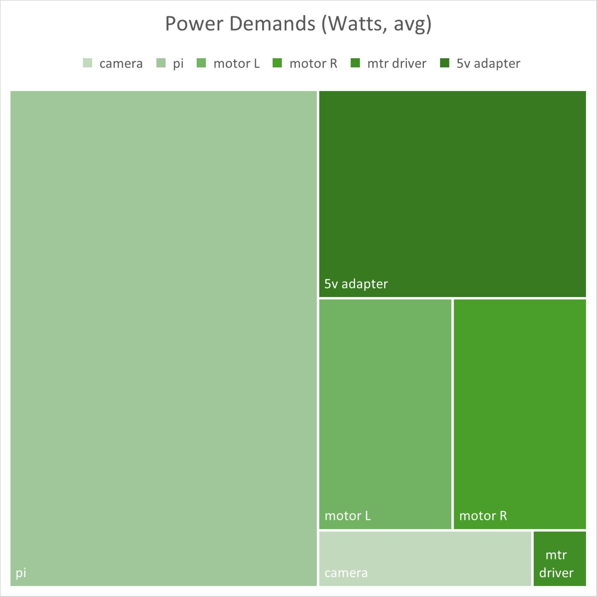
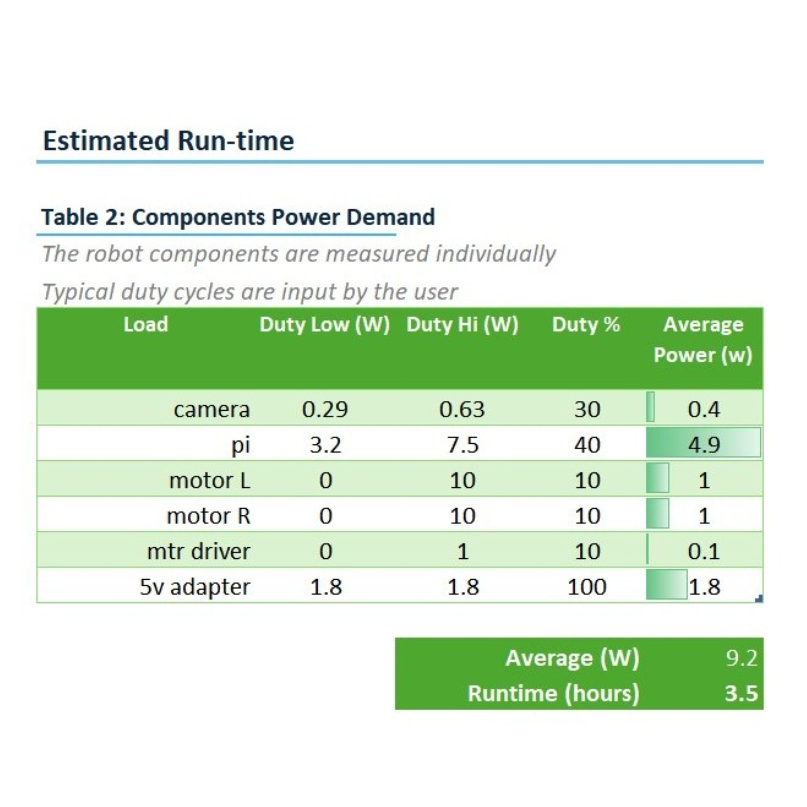
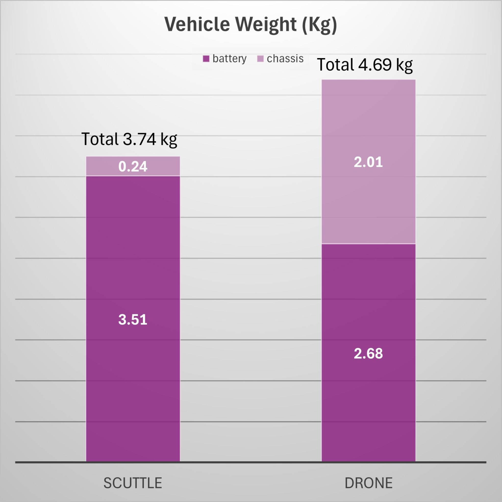
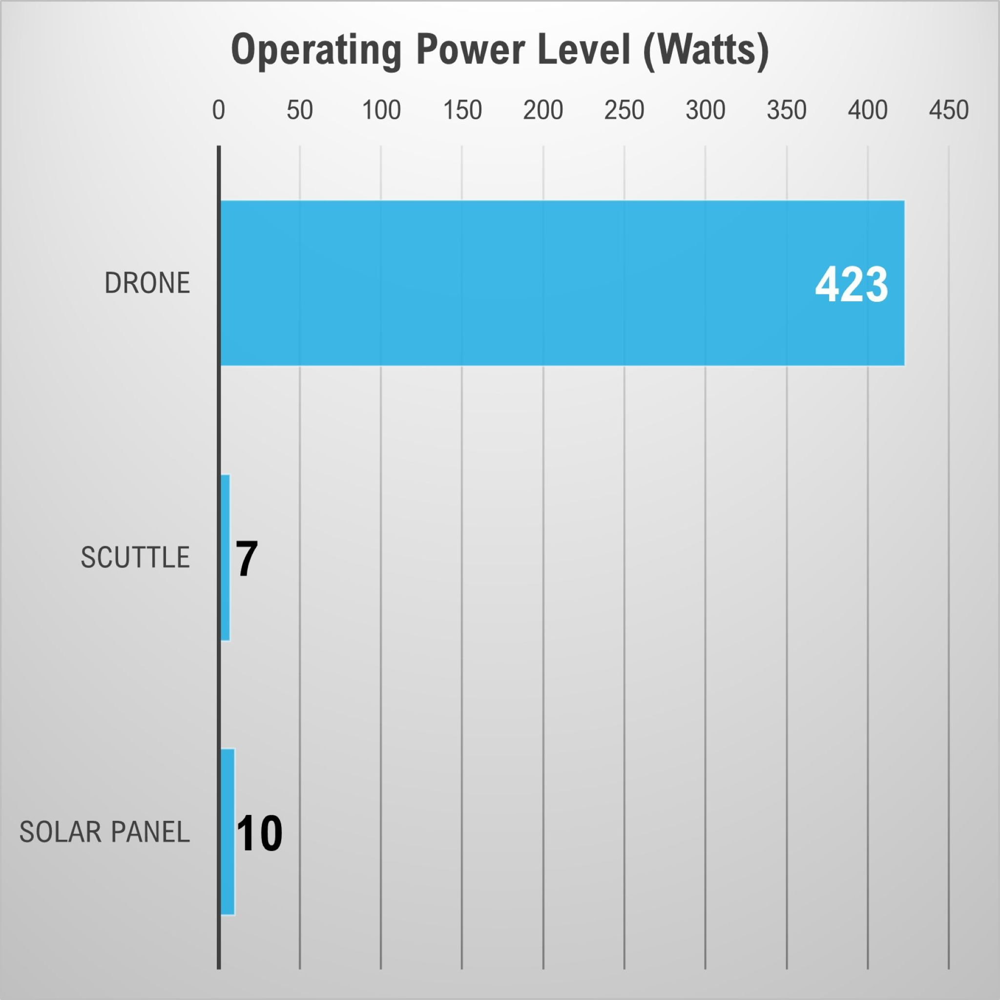

# Power Budget
A dedicated section for budgeting power. This contains details the power system onboard SCUTTLE.  With extensibility as a central goal for SCUTTLE, we aim to offer sufficient detail to let you engineer any new function or actuator you can dream of.  The data below shows the power demand when averaging the devices onboard the robot, with their expected duty cycles and power levels.  We made individual measurements of the devices - the raspberry pi uses the most power at around 4 watts on average.

- 
- 
- 
---

## DIN Power

Quick guide steps to route power with DIN rail.

1. Use a simple DIN bracket to secure a terminal.  Drill out the center hole to 4mm.
2. Use an M2.5x12mm screw and M2.5 heat-set insert.
3. If you have a deburring tool, deburr your hole for a cleaner insertion.
4. Insert the thead to a flush position.
5. use a zip tie to secure the cable.
6. We recommend the terminal pair for the power source is secured and the load pair is free.
7. secure your source wires into the power distribution terminals and the DIN bracket onto your rail.
Now your power source is ready for quick plugging!

### Images

Images for general power distribution components & examples.

* 
* 
* 
* 
* 
* 
* 

## Efficiency
The mobile robot is designed for efficiency at carrying loads and SCUTTLE specifically was designed with energy consumption in mind.  Note when compared to a typical quadrotor drone, the robot has more runtime, less mass, and higher payload by immense factors.  The "typical drone" values come from a research publication (2022 Jacewicz et al) covering detailed evaluation of the energy spent during flight routines.  The sampled model of drone was model M690B from tmotor.com, a medium-class quadrotor with typical configuration.  For mobile projects of scanning an area or delivering items, both mobile robots and drones can be implemented but the drone is likely to consume 60 times more energy as in our comparison.

In this chart we also included a common solar panel at the $25 range with a size around 300x300 mm, which would fit on top of SCUTTLE.  This class of solar panel produces more energy than SCUTTLE consumes, meaning that when connected to the system, it can charge the battery and run the robot at the same time (and we have tested this!).  This pairing of solar and scuttle is a huge opportunity because it means a robot could operate indefinitely without plugging in.

- 
- 
- 
