# Power Budget
A dedicated section for budgeting power. This contains details the power system onboard SCUTTLE.  With extensibility as a central goal for SCUTTLE, we aim to offer sufficient detail to let you engineer any new function or actuator you can dream of.  The data below shows the power demand when averaging the devices onboard the robot, with their expected duty cycles and power levels.  We made individual measurements of the devices - the raspberry pi uses the most power at around 4 watts on average.

- 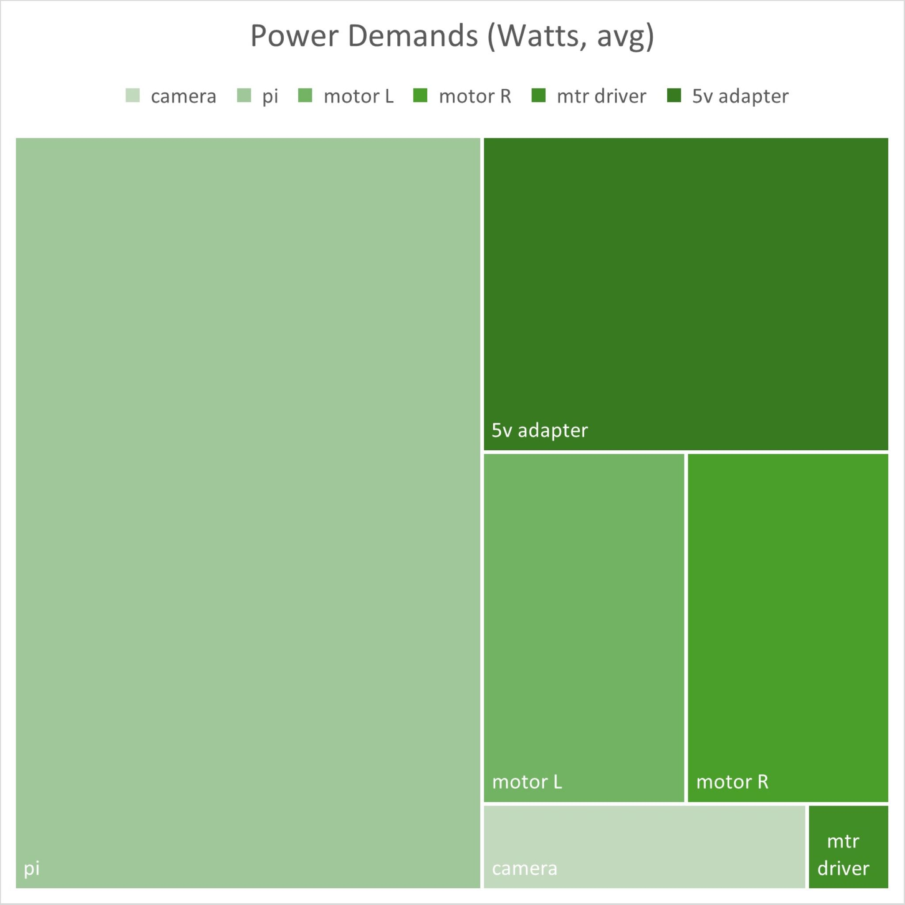
- 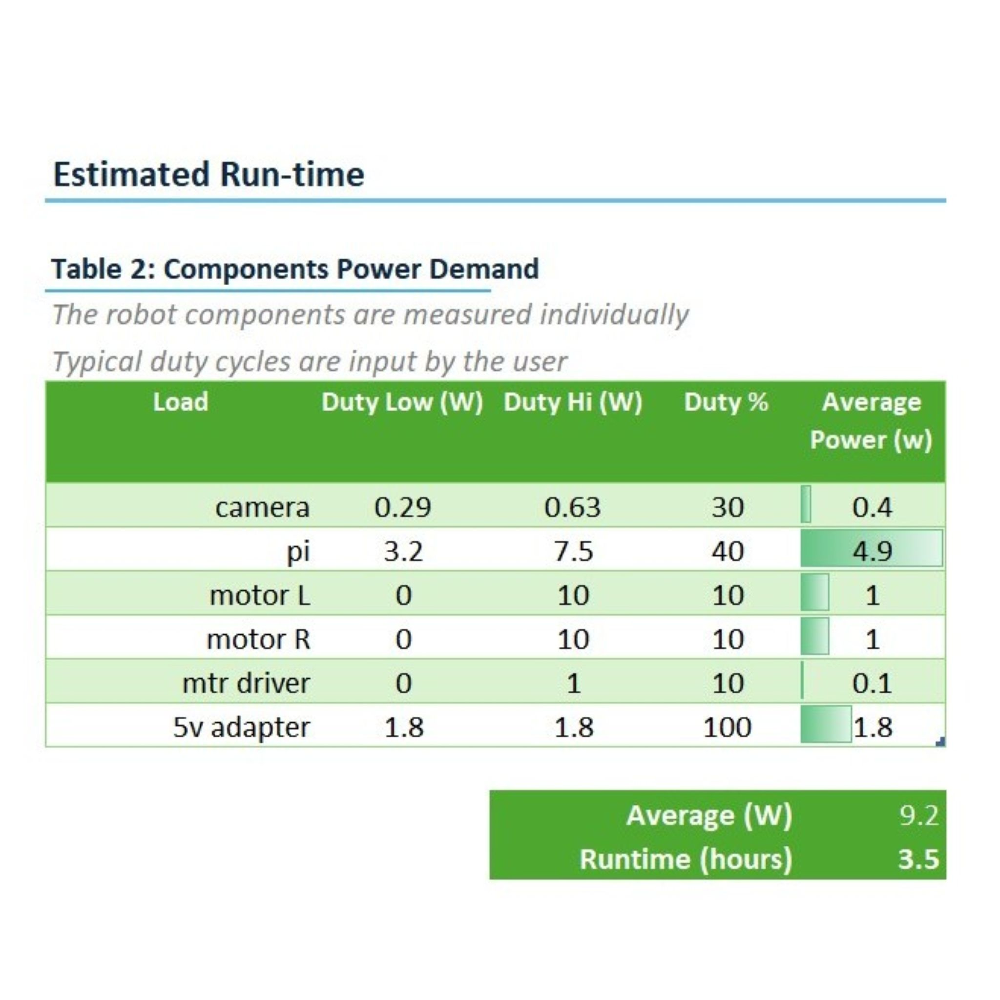
- 
---

# DIN Power

Quick guide steps to route power with DIN rail.

1. Use a simple DIN bracket to secure a terminal.  Drill out the center hole to 4mm.
2. Use an M2.5x12mm screw and M2.5 heat-set insert.
3. If you have a deburring tool, deburr your hole for a cleaner insertion.
4. Insert the thead to a flush position.
5. use a zip tie to secure the cable.
6. We recommend the terminal pair for the power source is secured and the load pair is free.
7. secure your source wires into the power distribution terminals and the DIN bracket onto your rail.
Now your power source is ready for quick plugging!

Images for general power distribution components & examples.

* 
* 
* 
* 
* 
* 
* 

## Efficiency
The mobile robot is designed for efficiency at carrying loads and SCUTTLE specifically was designed with energy consumption in mind.  Note when compared to a typical quadrotor drone (or UAV), the robot has more runtime, less mass, and higher payload by immense factors.  The "typical drone" values come from a research publication (2022 Jacewicz et al) covering detailed evaluation of the energy spent during flight routines.  The sampled model of drone was model M690B from tmotor.com, a medium-class quadrotor with typical configuration.  For mobile projects of scanning an area or delivering items, both mobile robots and UAVs can be implemented but the drone is likely to consume 60 times more energy as in our comparison.

In this chart we also included a common solar panel at the $25 range with a size around 300x300 mm, which would fit on top of SCUTTLE.  This class of solar panel produces more energy than SCUTTLE consumes, meaning that when connected to the system, it can charge the battery and run the robot at the same time (and we have tested this!).  This pairing of solar and scuttle is a huge opportunity because it means a robot could operate indefinitely without plugging in.

- 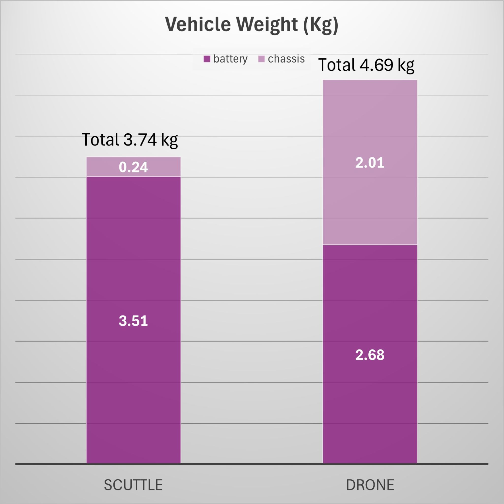
- 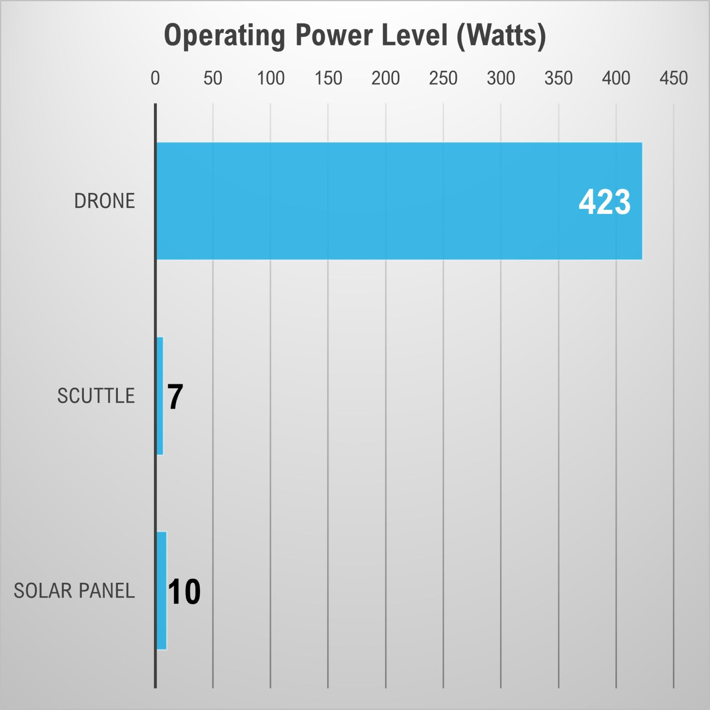
- 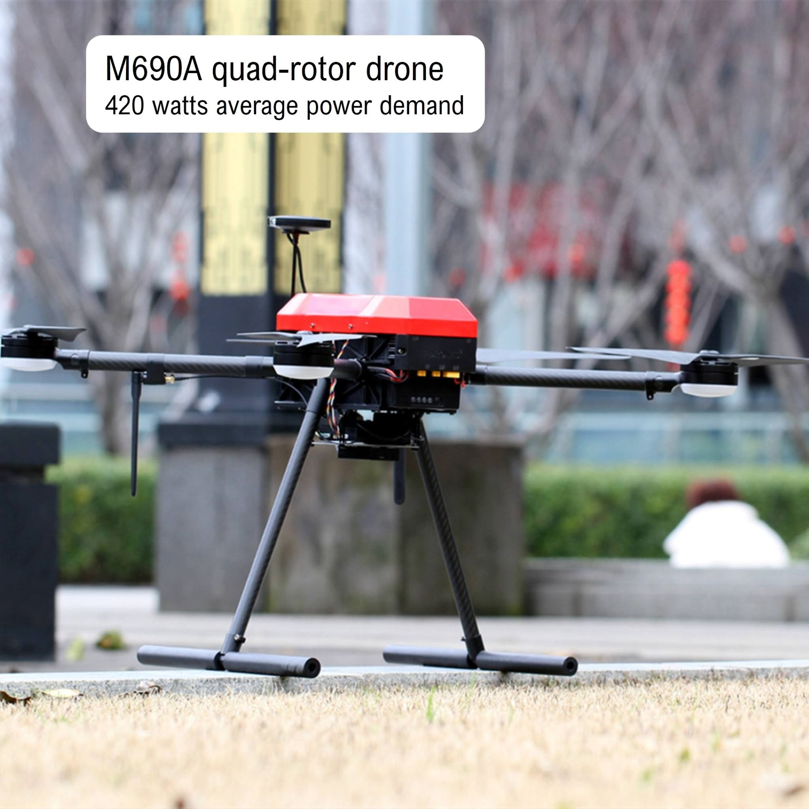

## Upgrading

Many users of SCUTTLE add bigger computers or heavy actuators that demand more power.  The limitation of capacity (watt-hours) is usually more consequential than shear power (in watts) in supporting larger power loads.  

 **Energy storage capacity** is the goal of any upgrade to the battery, rather than peak power output.  If the user seeks more capacity, it is often sensible to change over to a Lithium Iron Phosphate type of battery because they have a competitive market and are designed for energy storage such as in solar energy systems.  We have tested out two specific models of recommended options during 2024 and 2025, with the basic data charted below.  If you are familiar with the feel of the 35 watt-hours provided by the standard 3-cell li-ion battery pack, this chart gives a sense of the available gains with the 10AH LiFePo and 4AH higher voltage Ridgid battery pack.  These options are very well engineered and distributed widely.

 Specifically, we benchmarked an Eco-Worthy LifePo4 10-AH model battery and the Ridgid Power Tools 18v 4AH battery.  Each is highly competitive in their respective spaces and cost competitive as a robotics upgrade.  Both of these choices contain internal battery management and can operate as a drop-in replacement, almost.  For the EcoWorthy you will need to design a fastening setup and for the Ridgid you will need a 12v DC step-down adapter.
 * Download the [ECOworthy Battery Data (PDF, 4MB)](https://github.com/dmalawey/ScuttleTechGuide/blob/dc0e3186e3062b4a9f7b40f1f98807e4061f844d/research/2023_EcoworthyData.pdf)
 * Access [Battery CAD Model](https://grabcad.com/library/lifepo-battery-10ah-1) to further integrate on your robot

- 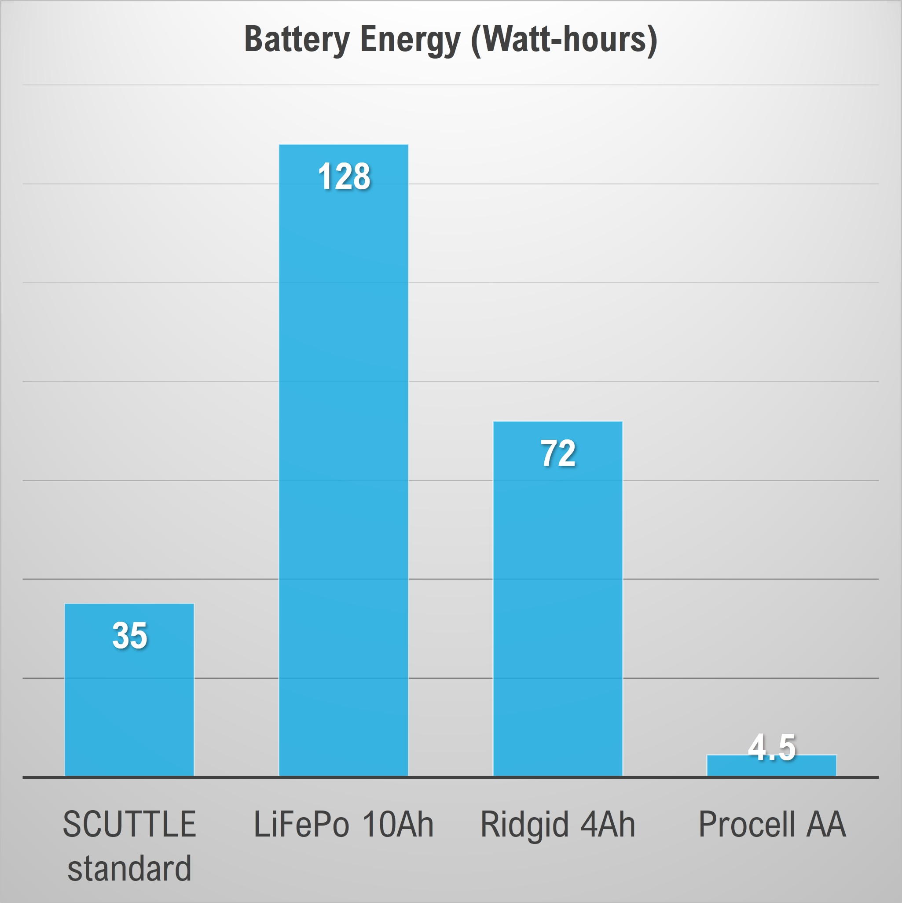
- 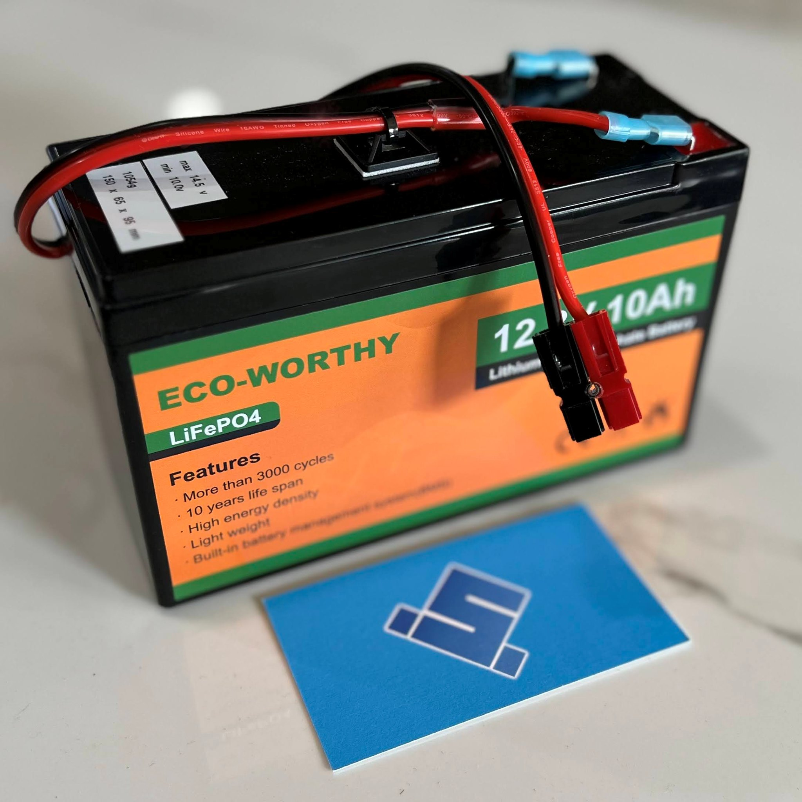
- 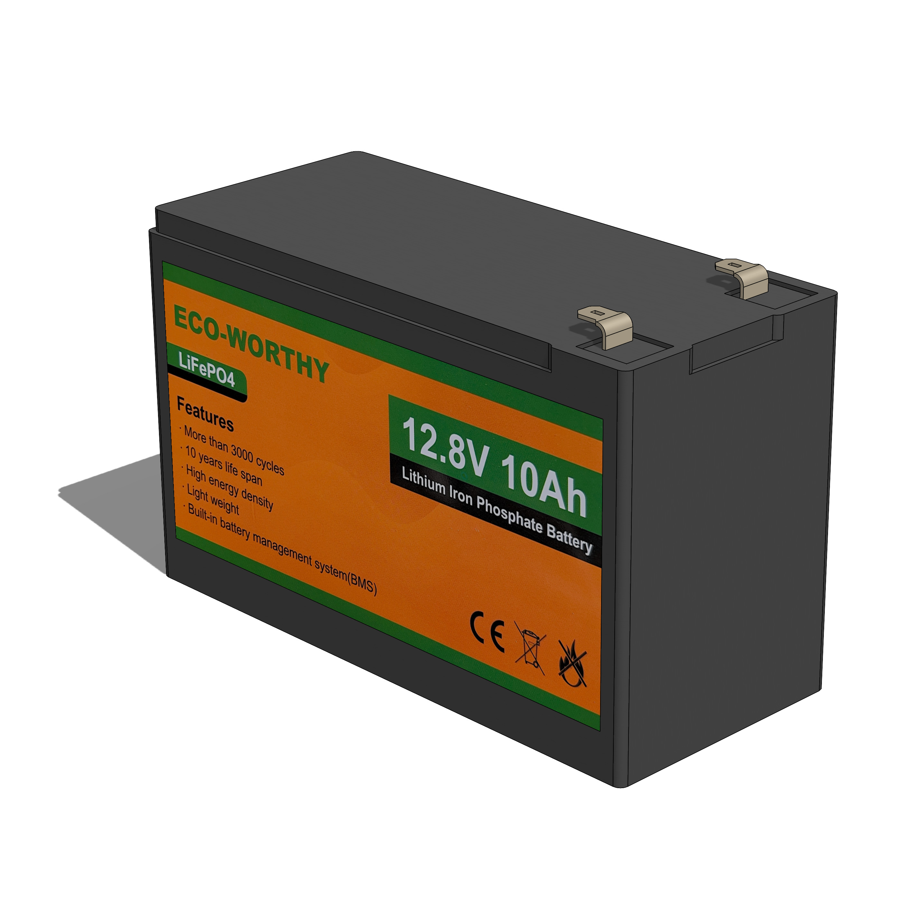

**CPU power demand** is key for evaluating your battery needs. In the second chart, find the power demand of a few different computers shown.  Most SBCs in the class of Raspberry Pi are gentle on power consumption but if you gear up towards AI dedicated machines or intensive GPU performance, then the power can leap up to an average of 20 watts.  This data comes from real tests performed by the SCUTTLE team around 2023, with the highest power drawn from the industrial single board computer with Intel-inside.

The Industrial computer tested is the Axiomtek CAPA55R model which is found in machines like Walmart's warehousing mobile robots.  It features a full-blown Intel 11th-gen Tiger Lake processor, with M.2 slots for RAM and solid state hard drive - it's much more like a desktop PC than a common single-board computer.  The chart shows two bars representing the 20 watts average power and 40 watts peak power.  You can reproduce this test with a benchmark software such as [PerformanceTest](https://www.passmark.com/products/performancetest/) by Passmark.  This software runs performance tests on CPU, RAM, Hard drive and more and we can capture the highest overall power demand by measuring the DC power input to the computer during the test.  Overall the chart is intended to summarize the power demands for a range of computer types to help engineers plan for the power demands as we select a computer for SCUTTLE.

**USB accessory power** can also be evaluated using a low-cost USB power meter as shown in the right-hand image above.  For each item plugged into the USB port of your SBC, the power demand should be verified.  The photo shows a test from November 2020 that informs us about the power to the bluetooth transciever of the gamepad.  This dongle effectively draws only a few miliamps and can be negated from the power budget, which is great information. For devices such as this, power depends on the state of operation where a burst of energy takes place during transmission, so be sure to take an average when performing this test.  The device shown is no longer available but similar [USB-C Power Meter](https://amzn.to/4uRkcXE) cost only about $10 and work great.  Regardless of the brand, perform your own verification by comparing to a known accurate power meter. 

- 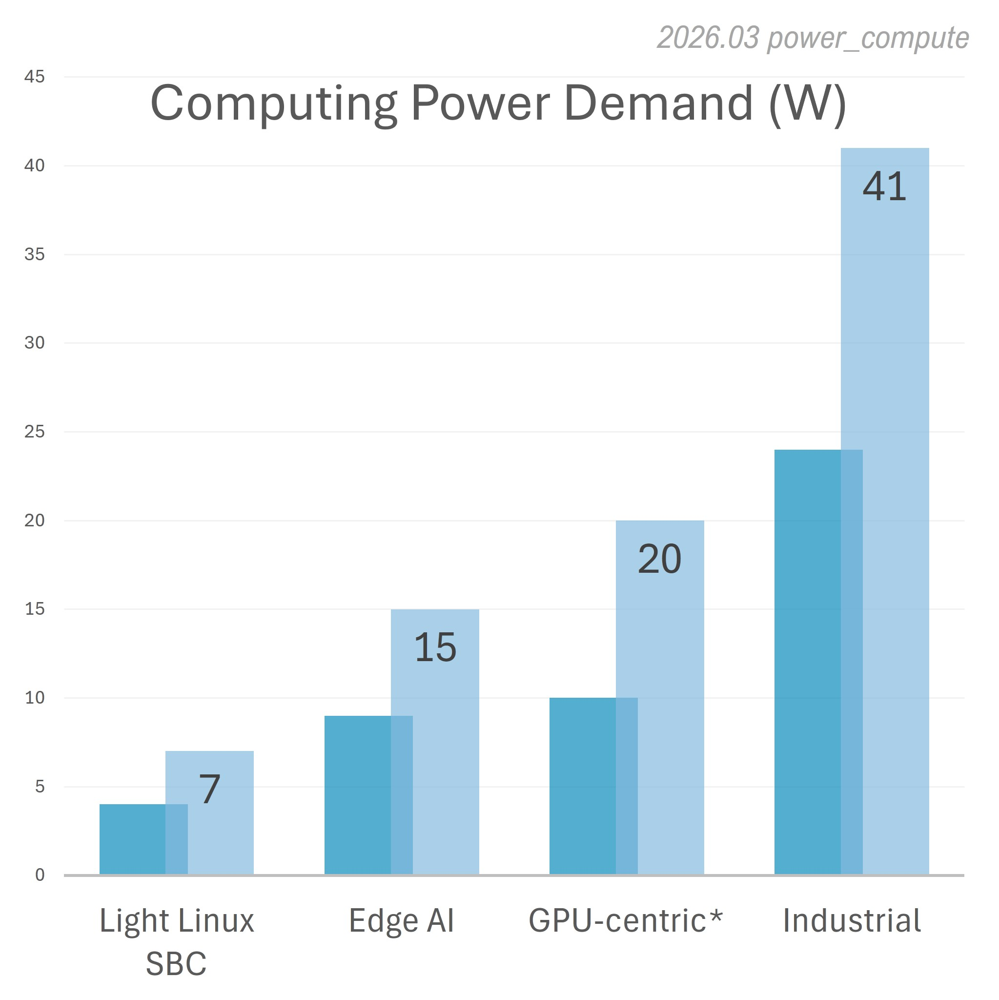
- 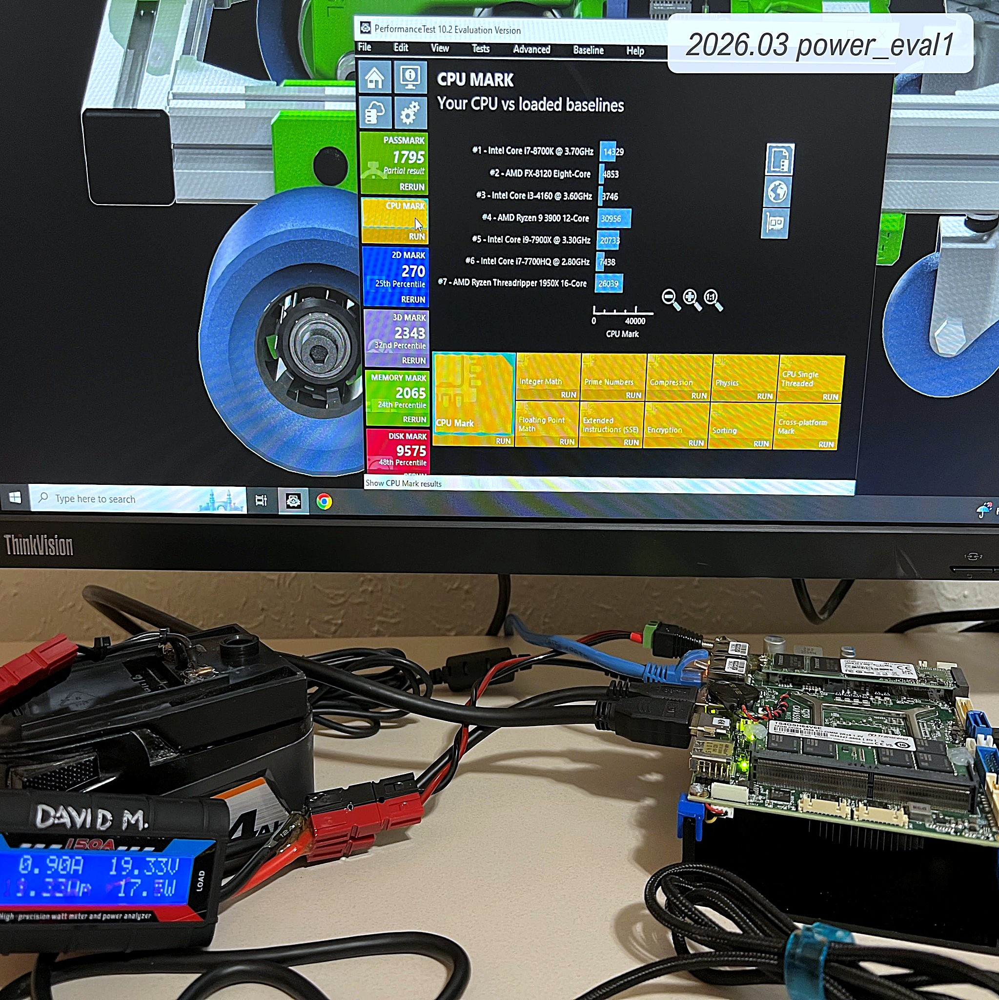
- 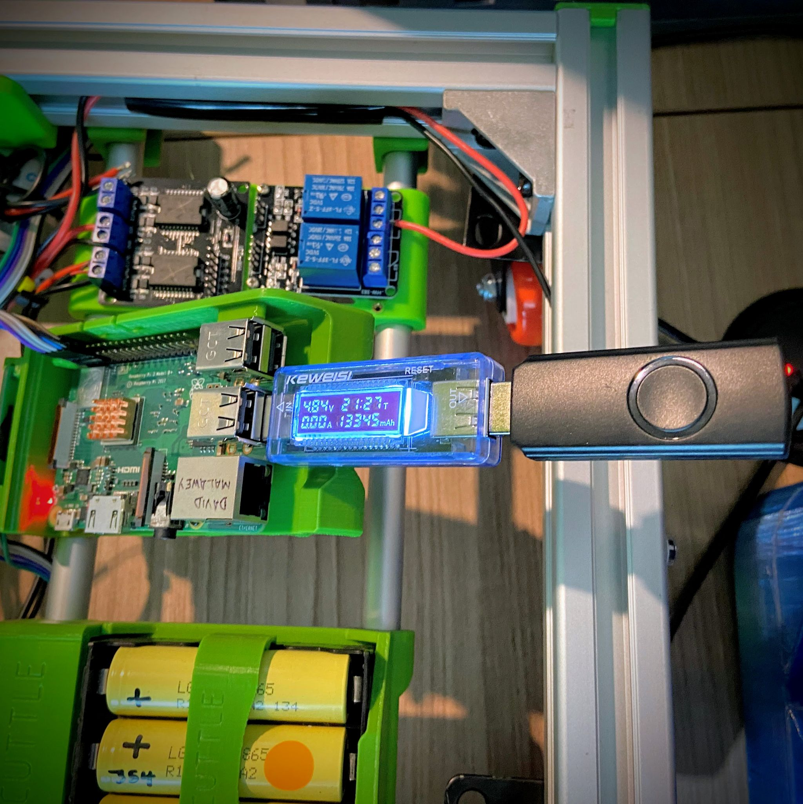
