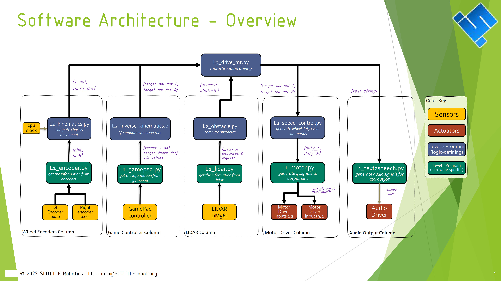

_Standard Software for the setup of SCUTTLE Robot_

This page will link to the relevant software and firmware.

**Introduction**
As I populate this page (May 2026), it will eventually contain the same information as our **Software Guide** Which was updated in 2022, then add some additional content.  For new users, treat the SCUTTLE Robot as a raspberry Pi with sensors and motors plugged in.  The standard software files were designed so learners can learn one module, build and test, then learn the next.  In the same way, we can run programs for one module at a time without a full robot.  For example, the left wheel module consists of (pi + left motor + left encoder + motor driver) for hardware and is tested with (L1_encoder.py + L1_motor.py) for software.  This subsystem can be operated with no chassis, and just the encoder and motor and motor driver plugged in.

* Get the [Software Guide PDF](https://github.com/dmalawey/ScuttleTechGuide/blob/bdd8d0708c821d431ba32c125f5a06159cf654f4/docs/SCTL_SoftwareGuide.pdf) which breaks down the software.

