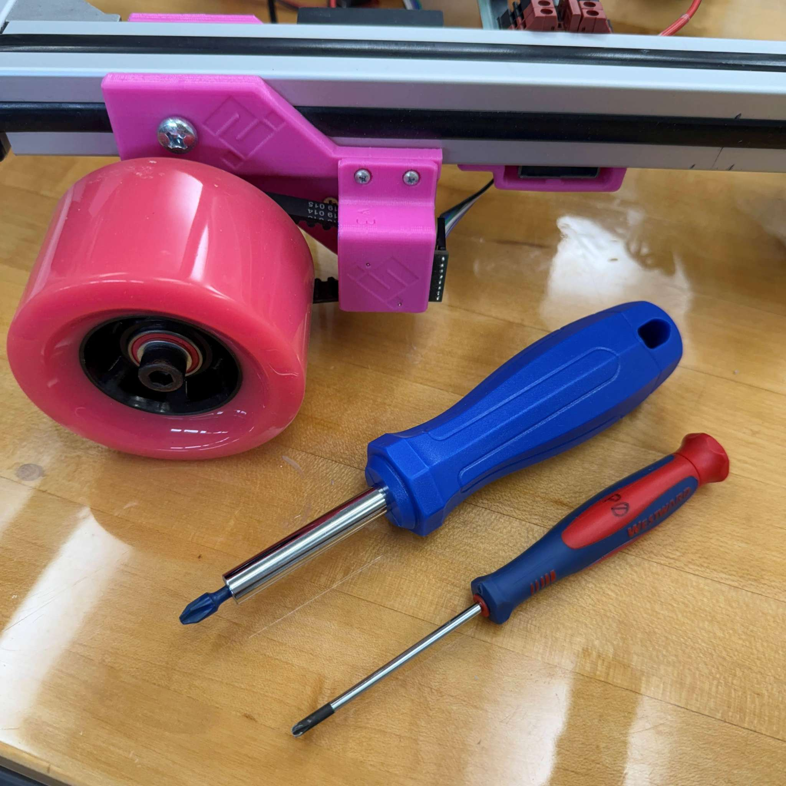
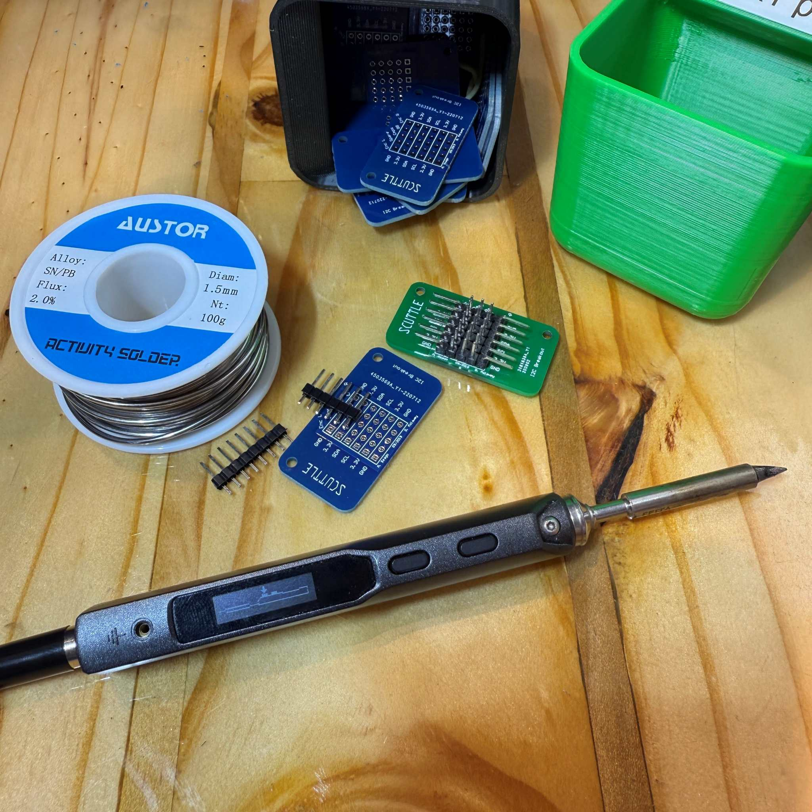
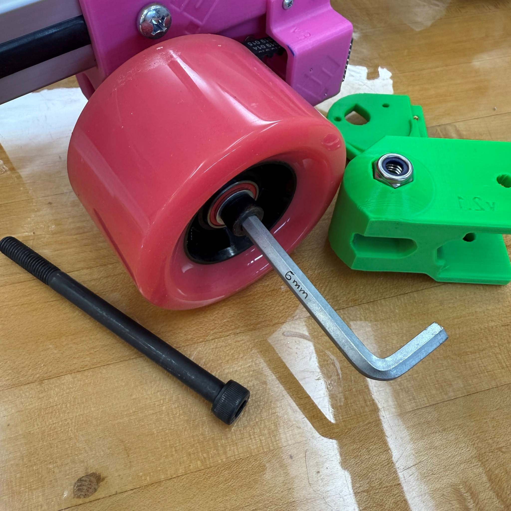
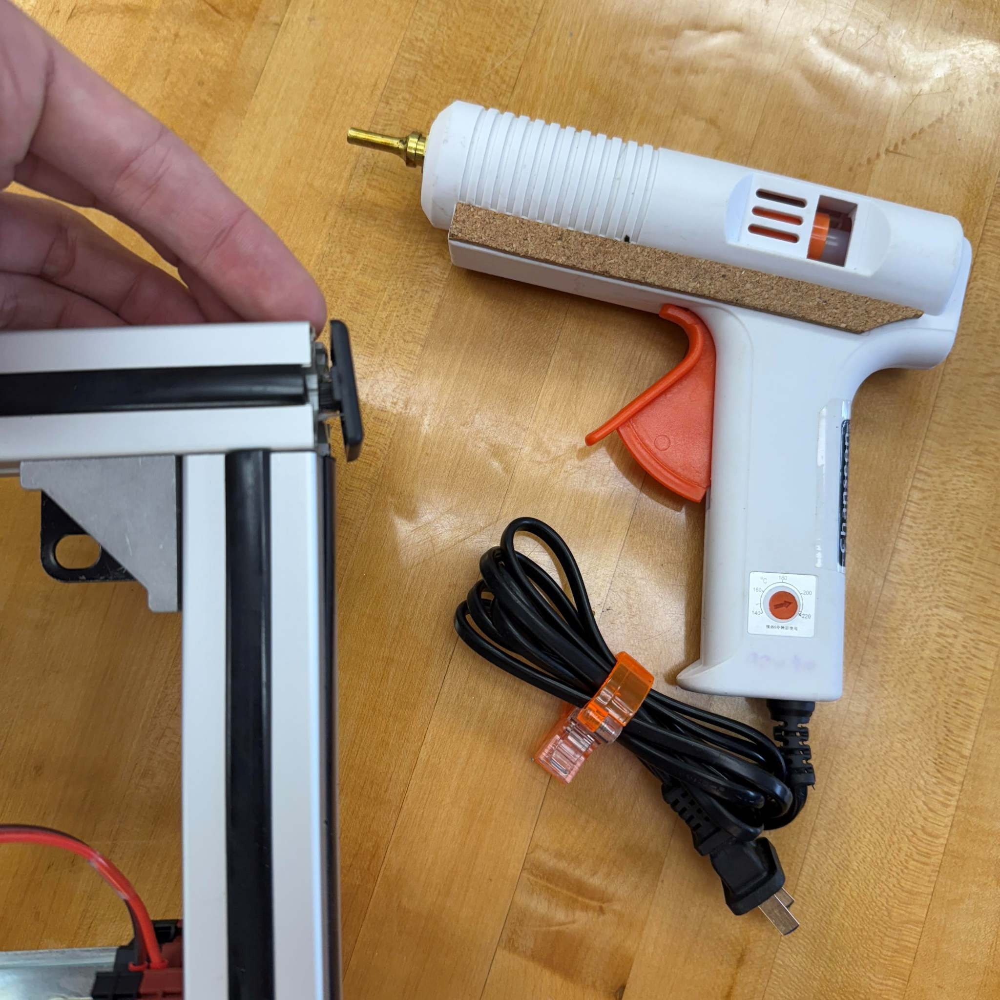
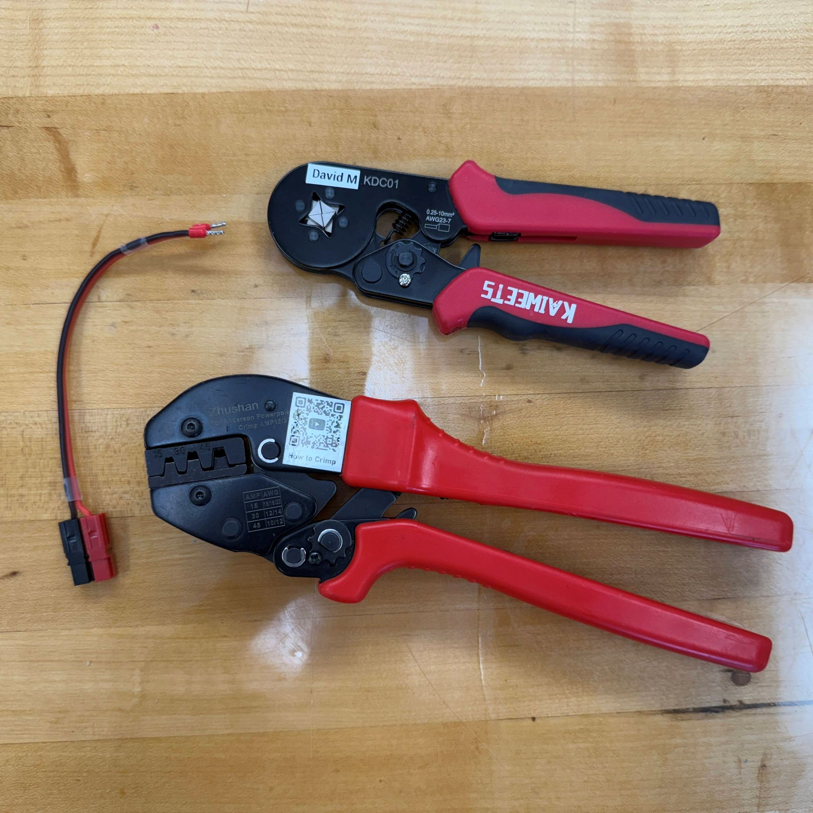

# Tools

Tools for SCUTTLE Robot learning & development

## Build

The tools to build a SCUTTLE Robot from our kit are incredibly simple.  We engineered version 3.0 down to the individual fasteners for assembling the robot with minimal tools.

Screwdrivers:  you need phillips no.1 and phillips no.3.  The main chassis fasteners all feature phillips size 3 (PH3) and they are M6 size screws.  You can manage to use PH2 in the short term, the most ordinary philips screwdriver size at home.  Likewise, the small fasteners are nearly all M2.5 machine screws using the PH1 tool.  The electronics are built around PH1 size, with the tinest screws use size PH0, holding the i2c board to its bracket, but similarly you can fit most philips tools with one size deviation.  In design we prioritized metric M2.5 machine screws for all parts, where the design will allow.  These screws fit PH1.  

Soldering iron: building the robot from scratch requires soldering of common dupont pins into the circuit board, including the i2c distribution board and the encoder sensor boards.  The most common soldering iron tips will work fine, and the job requires introductory-level soldering only.  Equip your lab with ordinary solder such as 1.5mm diameter, flux-cored leaded solder shown in the image.

Hex wrench: We couldn't quite eliminate all hex-tools from the job!  For the axle, made of M8 bolt, we tighten it with a 6mm hex wrench, which is always included in hex wrench kits but we ship one specially with our kit.  The wheel is hand-tightened with a low torque (grip the short end) while the lock-nut on the opposing side is captured in the plastic print to hold it in place.

Hot glue gun (optional) this is recommended for adding strength to the end-caps on the aluminum extrusion, and also for protecting any exposed pins.  We recommend adding hot glue to the enccoder circuit boards exposed pins to prevent short-circuits in case metal contacts the pins.  The same is recommended for the backside of our i2c distribution bus.  Hot glue is a priority tool for general electronics work and serves many more uses!

Crimpers, ferrules:  This is optional, since we ship kits with cables having copper ends that are pre-crimped.  Always 18awg wire for power cables, and highly common ferrules to keep wire ends from fraying.  The ferruled ends enter the DIN rail terminals and the motor driver terminals, and tighten down with PH0 screwdriver.

Crimpers, Anderson: This is recommended for building any custom power electronics.  It's optional for building scuttle, and required for expanding anderson connections.  They are a top choice of crimp connector for custom electronics builders and growing in popularity.  It's a $30 investment for extremely repeatable crimps with minimal skills. 

* 
* 
* 
* 
* 

* soldering iron
* hot melt glue gun
* phillips screwdriver (ph3 and ph1)
* hex wrench, 6mm

## OpenLab

2025 March update:  The tools for a basic SCUTTLE build, a robot lab, and a mechatronics workshop are all equivalent.  Please visit OpenLab webpage for lots of recommended tools for robotics work. 

>
> [Go to OpenLab Project](https://qr.net/openlabproject)
>

## Manuals

_The info below will be relocated to OpenLab, along with lots more._

>
> Please find the "Tools Guide" published as a PDF in archives tab, until we can unpack the main tools on this page.
>

You can learn a great deal from reading these manuals - not only how to use a tool, but better techniques, compatible materials, safety wisdom, and available mods that you didn't know existed.

We customize many of our manuals (modified pdfs) for the following goals:
* reduced file size
* improved readability & accessibility
* add notes as needed
* make manuals easier to distribute online
* digitize manuals that were previously paper-only

**This is a placeholder to begin posting tools manuals.**
* [Ridgid Vacuum - 18v - WD03180](https://lobfile.com/file/M8QL.pdf)
