# Wiring Guide

All about the wiring of electronics for your robot. This page is divided into signal wires & power wires.  As of 2025, find the full wiring documentation in archives under "wiring guide."  Our goal is to break down this guide into pieces and include them directly here in the github.  In that way, users can download individual pieces and collaborators can improve the diagrams and push updates in the github.  We now use draw.io for easy diagrams with good quality while powerpoint has been used in the past. 

- 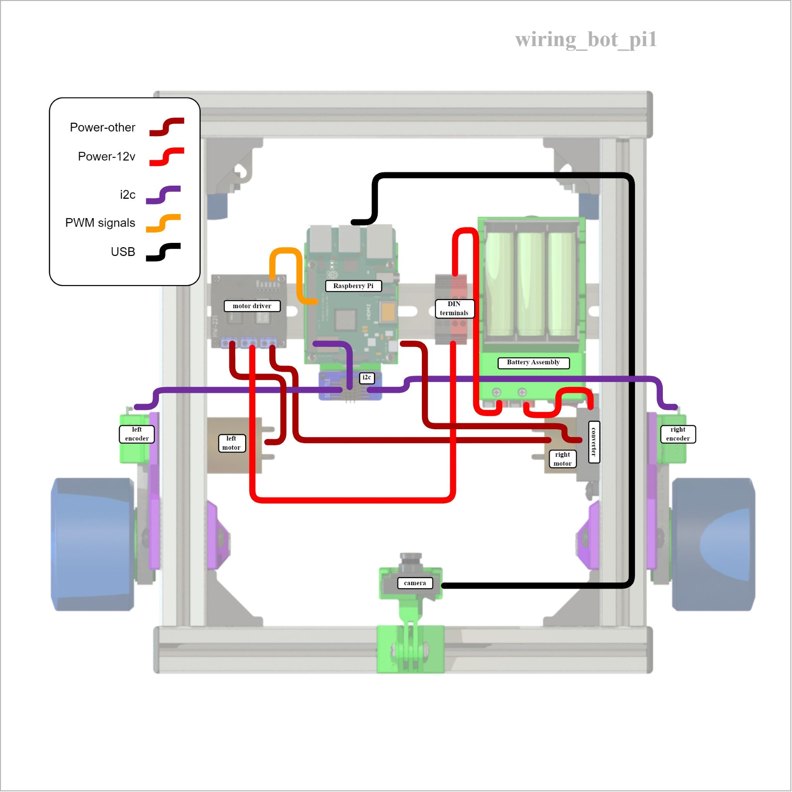
- 
- 

## Signals

Signal wires perform the communication on your robot, between sensors, CPU, and actuators.  Several wires make up a cable, and the cables get plugged in when you build your robot.
All signals on SCUTTLE can be made with regular off-the-shelf Dupont-style terminals, all female.  Lengths are 10cm and 20cm as shown.

**Signals Routing**
The following image shows the routing of signals for PWM on the robot. Then see the routing of signals for i2c.  Having i2c already distributed on a simple breakout board gives the users access to A) probe the signals during operation for troubleshooting or B) connect further sensors, since i2c is the most popular communication protocol for off-the-shelf sensors. Last, find the pinout designations for the i2c-based encoders. Note the encoders have one difference and that is to drive the pulldown pin necessary for changing the i2c address.  By differentiating the addresses, we can communicate with both sensors on the same lines simultaneously.

- 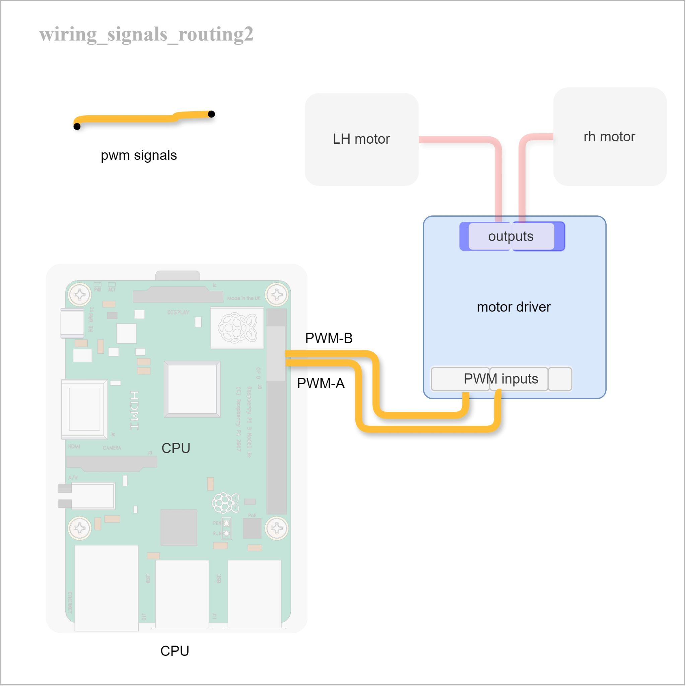
- 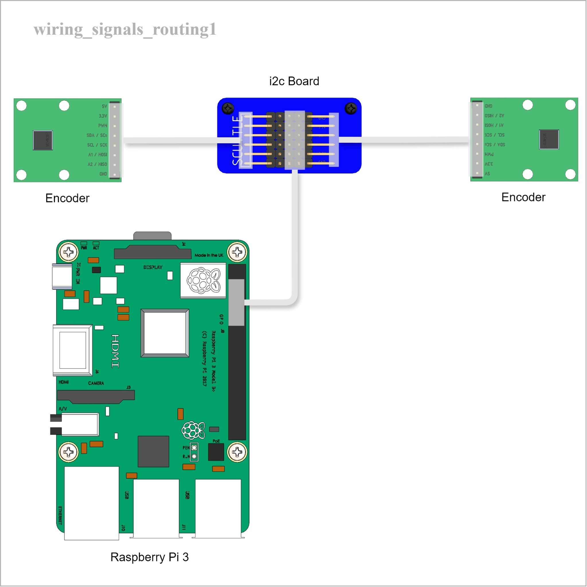
- 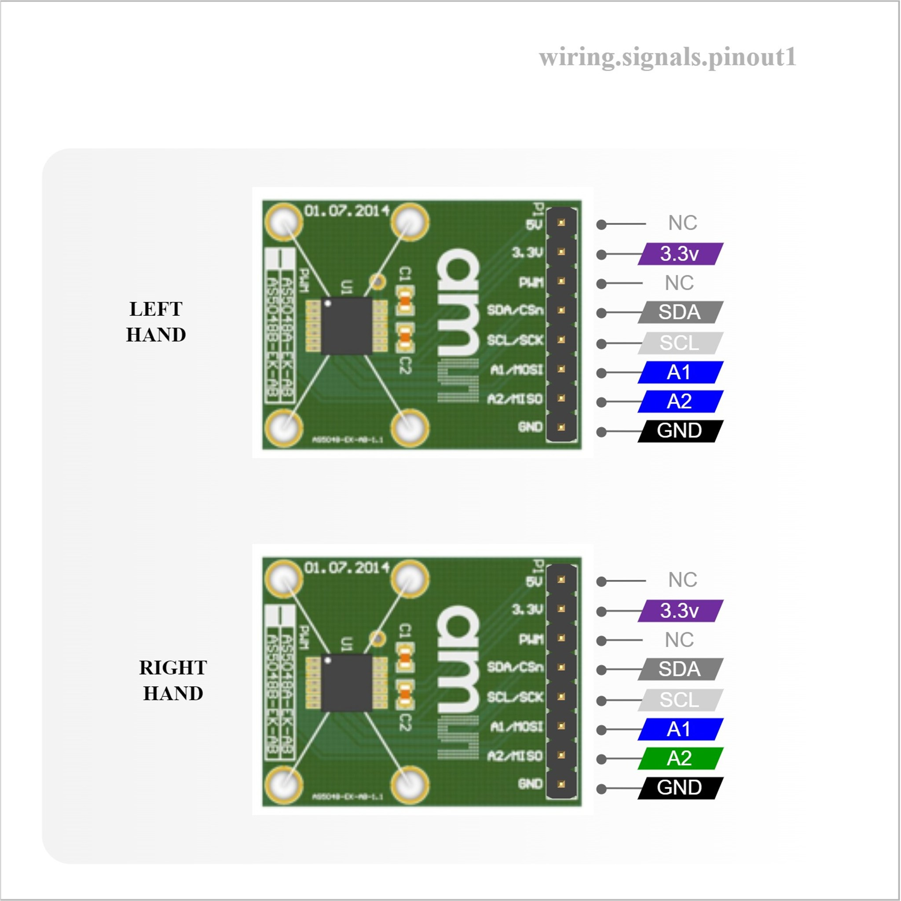

## Motor

The following diagrams give motor signals, motor power, motor pinout with images.

**Motor Pinout:**  The motor driver is shown which receives two pairs of PWM signals.  One PWM signal can control the speed of a motor, but two are required to implement both forward and reverse.  Input 1 and 2 control the right-hand motor, and correspond to output 1 and 2.  The input ranges 0-100% PWM at 3.3v while the output ranges 0-12v where 12v is the input voltage level.  This motor driver board features two independent h-bridge MOSFETs has its very own detailed datasheet for those who wish to explore.

**Motor Power** The power diagram shows an anderson power connector which is appropriate for the 18awg paired wire, where the anderson pair can plug into the battery directly. However, in the latest v3 robot we have simple ferrules crimped on the end of this cable and tie it into power at the power distribution terminals, which are DIN terminals.   The motor wires are soldered into the motor terminals with polarity reversed for left and right, so the positive signals from the CPU ultimately give "forward" motion while each motor turns opposite from each other.   Users can duplicate this exact setup for powering LEDs, fans, or other DC actuators with the same stack of software, wiring, connections, and PWM scheme.

- 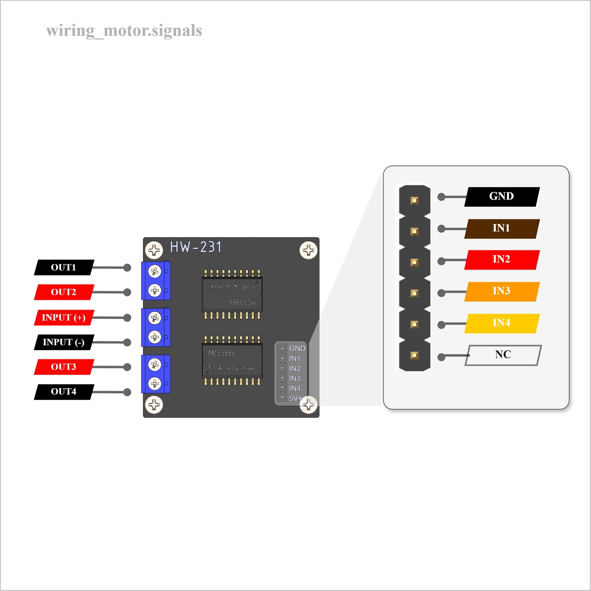
- 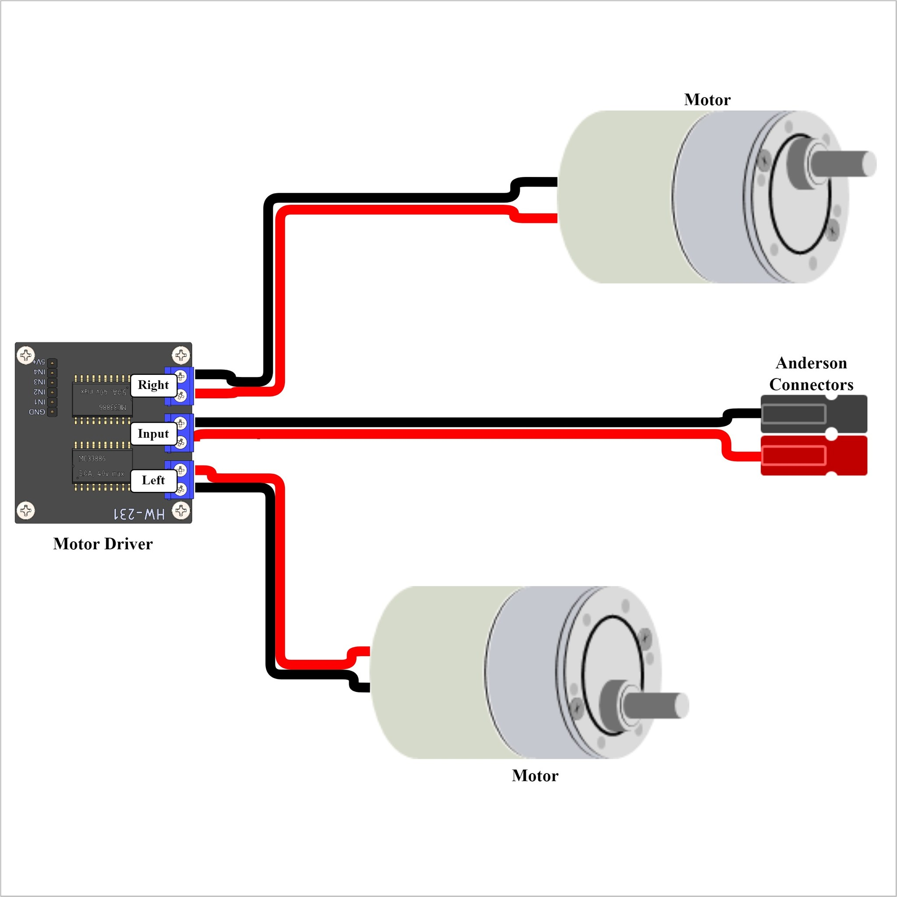
- 

## Power

See the power and signals across the whole robot for scuttle v3 with raspberry pi.

The first diagram shows all main cables, and the second diagram shows only the power cables.  

- 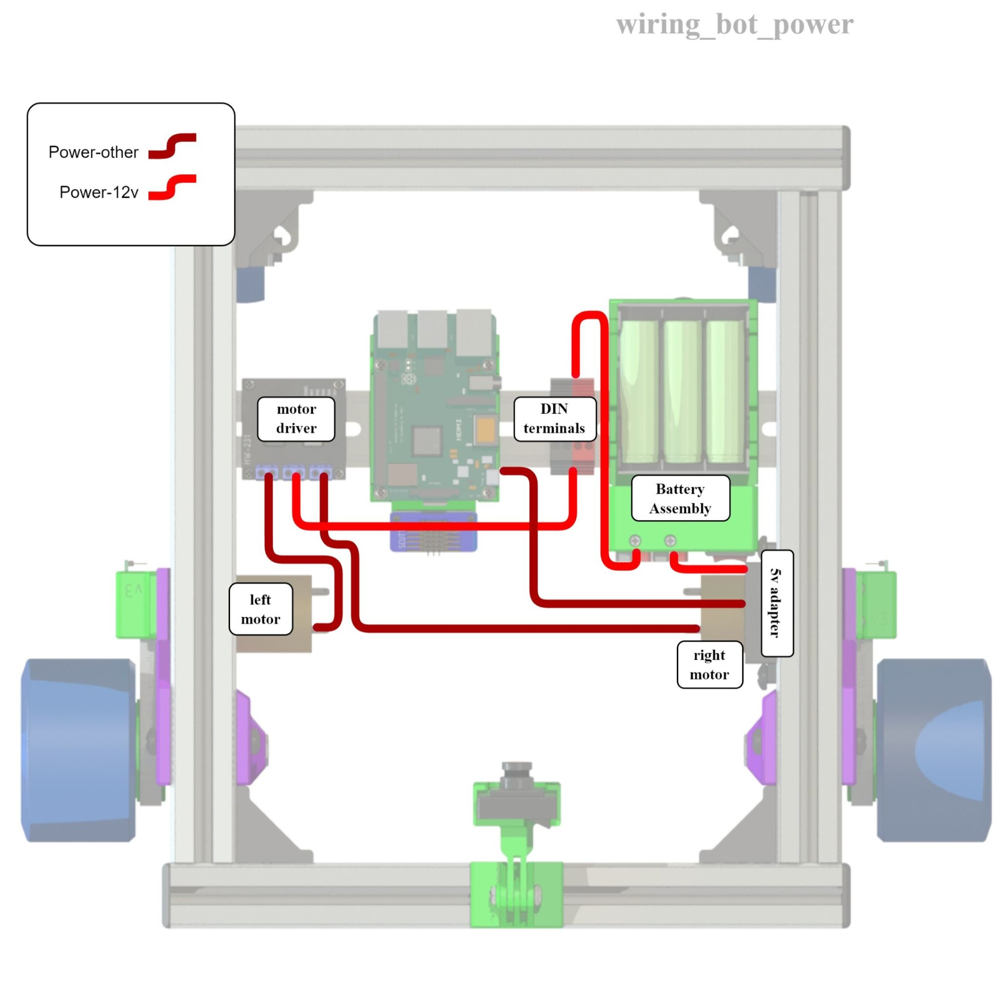
- 
- 

Our terminal blocks are Dinkle DK2.5N, a choice for an easy introduction to the big world of DIN rail terminals.  This model is equivalent to the industry leader Phoenix Contact, with model UK 2.5N.  The video below shows how to assemble the screw terminals and jumpers to build the power circuit.

<iframe width="700" src="https://www.youtube.com/embed/2WlvUsMasX8" title="How to use the gray terminal block kit with Dinkle DIN rail DK2.5N blocks and accessories." frameborder="0" allow="accelerometer; autoplay; clipboard-write; encrypted-media; gyroscope; picture-in-picture; web-share" referrerpolicy="strict-origin-when-cross-origin" allowfullscreen></iframe>

**Battery**

The diagrams below isolate the battery, dc converter/adapter, and CPU.  The 5V converter receives power from the 12v battery output and delivers it out via USB-C.  This is a traditional fixed-voltage adapter rather than a PD device so the USB voltage is 5 volts only, and up to 15 watts of power.  These images show battery output directly to the adapter but you may instead connect the converter to the 12v DIN terminal blocks.  In the middle image, the external power supply (or battery charger) is shown.  Users can operate the robot and charge the battery simultaneously with this conifguration. In the third diagram (right) we have the motor driver included in the diagram.  The ground wire of the motor driver communication cable is important for any occasion that the raspberry pi is powered independently.  If the pi is powered from your laptop over USB, then there is no common ground between CPU and motor driver except this one wire.

- 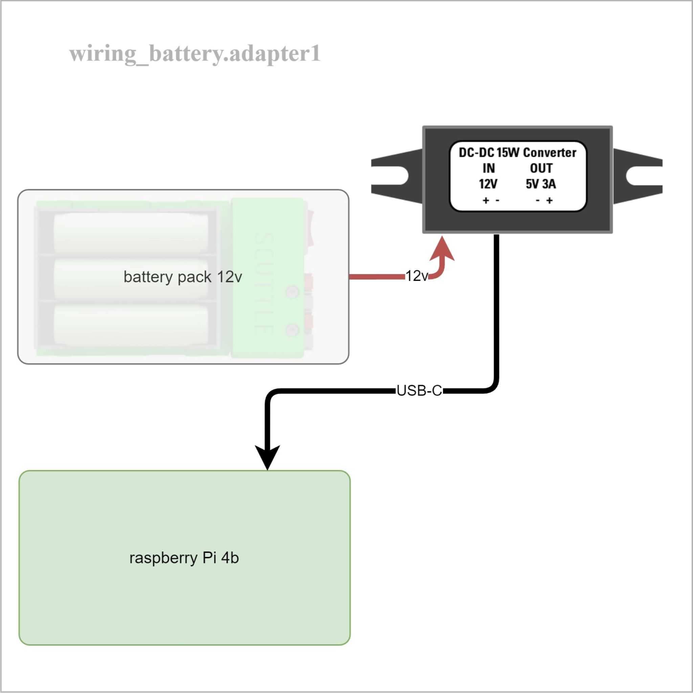
- 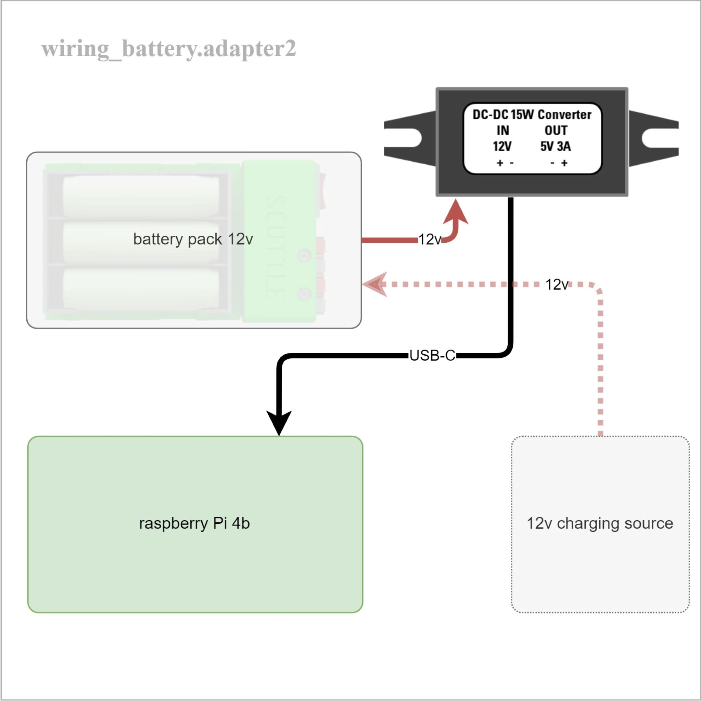
- 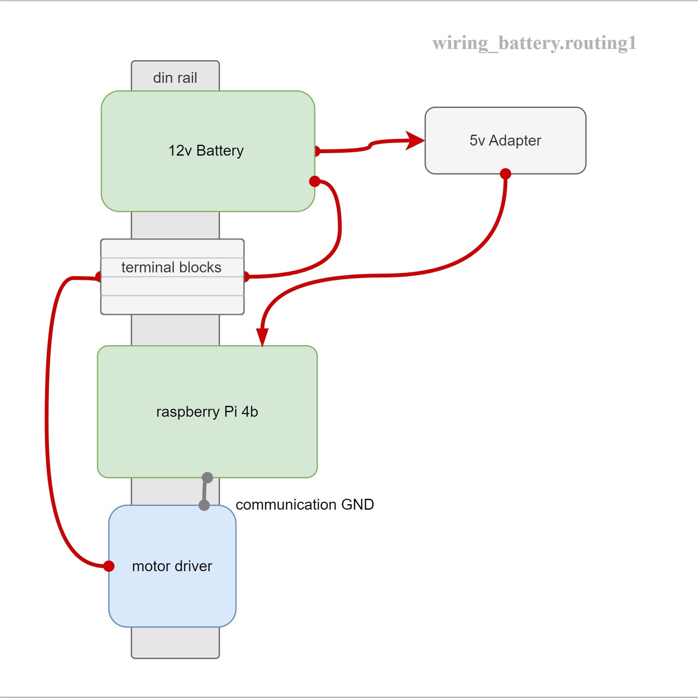

Wire type: it is highly advised to choose SILICONE insulated wires because they tolerate high temeperature and are not affected by soldering.  Soldering activities in a factory are performed rapidly but makers need a bit more time to complete a solder job.  If the wire remains hot for more than a few seconds, the popular PVC type insulation will begin melting.   Look for these properties in your wire:
* paired, bonded wire (for neatness & easier cut-to-length pairs)
* 16 gauge (smaller limits the current, larger wires lose fitment within the screw terminals)
* silicone insulation (for heat resistance)
* high strand-count (for best flexibility)

## Cables

These diagrams are designated for building the cables, which is recommended for all users even if you receive the cables in a kit.  Get familiar with the type of signal carried on each wire color, and you will find it's very advantageous when integrating new sensors.  Get familiar with the mechanical formation (from an off-the-shelf ribbon cable to a purpose-built cable) and it saves huge headaches when configuring new sensors and actuators. It is highly intentional to separate color clusters for i2c and PWM, because thousands of other devices fall into these categories, requiring the same wire-count or the exact same signals.  Try to adopt a minimum of 4-count dupont terminals for your custom cables for secure plugging and simplified wiring work.

- 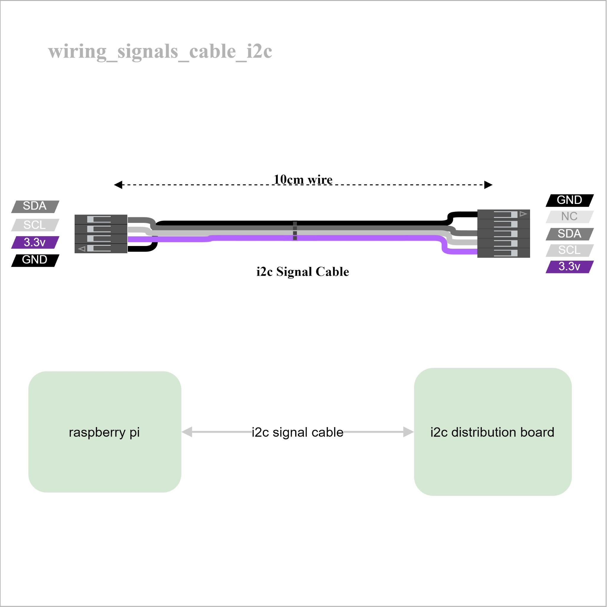
- 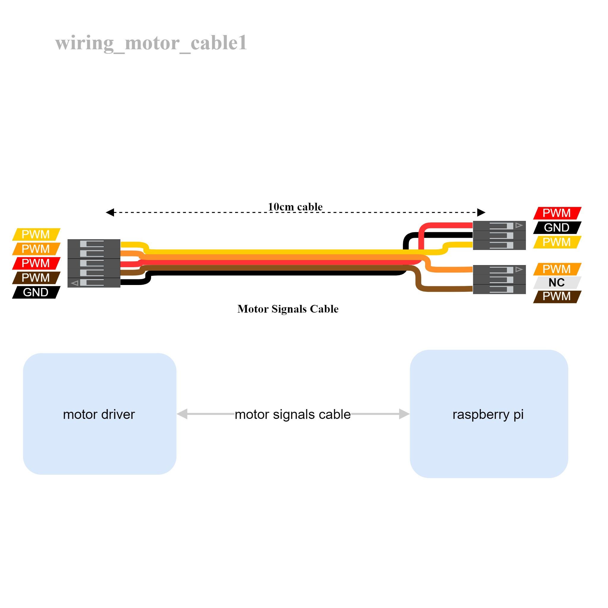
- 

 
## Addons

> This section to include popular addons such as RPLIDAR, ultrasonic sensor, and more.
> It will contain circuitry-related information for planning power and signals to your actuators.

---

# Templates
_template for diagrams_
We're publishing an open source diagrams packet so you can access the working files and use them for your project!  This includes wiring diagrams, cable diagrams, routing diagrams, and more!  Access these examples and you can use the .drawio files relating to your project to make great documentation.  The packet ranges from 2023-2025 and many individual diagrams are unfinished or not yet up to standard.  But it's certainly enough to get you some good examples.
* [download PDF packet](https://github.com/dmalawey/ScuttleTechGuide/blob/d6f4d6101141f5ecef1b5c2f7ace48e645213b4a/docs/wiring_pack_2025.12.zip)
 * Last updated 2025.12.17
 * Contains 8 diagram.drawio files and notes 
* [download .drawio files](https://github.com/dmalawey/ScuttleTechGuide/blob/06d364108e8cc1c2e09686d637b52af152cc41cd/docs/2025.12_SCTLwiringPacket.zip) (6Mb zip file with .drawio files)

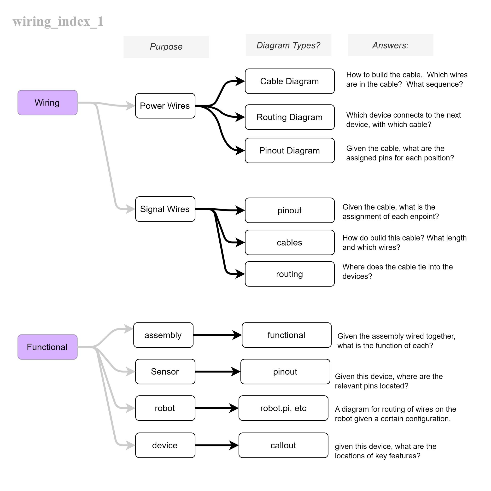

# Standards

We chose the colors to make good use of any pack of wires.  When you add sensors and actuators, try to stay consistent.  If you explore the .drawio templates above, you can learn a lot about our standards because they're noted right inside of the actual diagrams. For some highlights, see below:

| Function | Preferred Color |
| -------- | ----------------- |
| Ground | Black, Brown, Green |
| Power, 3.3v | Red, Purple |
| PWM signals | Orange, Yellow |
| CLOCK (i2C | Gray |
| SIGNAL (i2C) | White |

| Function | Spec |
| -------- | ---- |
| Power (cable) | 18AWG, paired, silicone |
| Signals (cables) | 22 AWG, ribbon style |
| Power (general) | plain ferrule |
| Power (frequent connection) | Anderson red/black connector |
| Signals (connector) | Dupont 4 pin, 6pin, 8pin connectors |

See the following exported images for the standard diagrams in our wires.  We aim to keep alignment of graphics including wire colors, scale of diagram parts, to have diagram colors that match real life, and use connector graphics that show the configuration of orientations and terminals arrangement.  Years of projects went into the decisions of how to layout graphics to make the actual engineering and building easier.  And it pays off.  You're encouraged to take these templates, make your design documents shine and make everything modifiable from the ground up.

- 
- 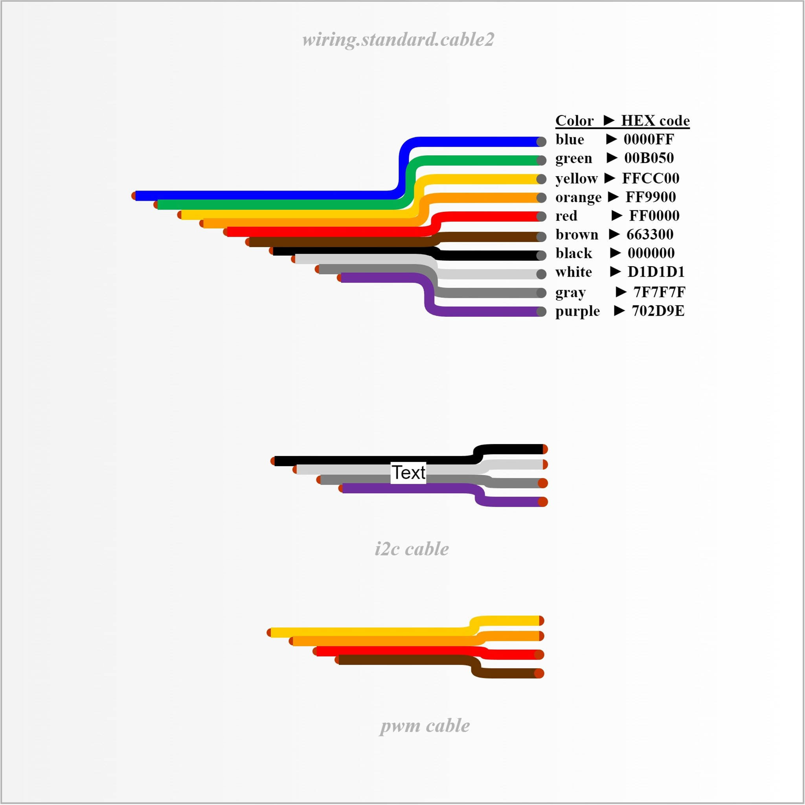
- 

The next diagrams have the famous 40-pin header found on raspberry Pi and many other microcontrollers.  We found that successfully implementing a team project that adds a sensor is repeatedly dependent on clear plans for the hookup of the terminals.  There is one stage where we simply "find a pin that works" but when designing, there is much higher discretion.  Can we connect the cables without overlaping existing connections, and together in a way that fits in one dupont housing?  These graphics become a designer's toolkit so the design is enhanced by the documentation during the work.  Use your wiring diagram in realtime to survey the pin locations and find the right spot for your next connection.

- 
- 
- 
