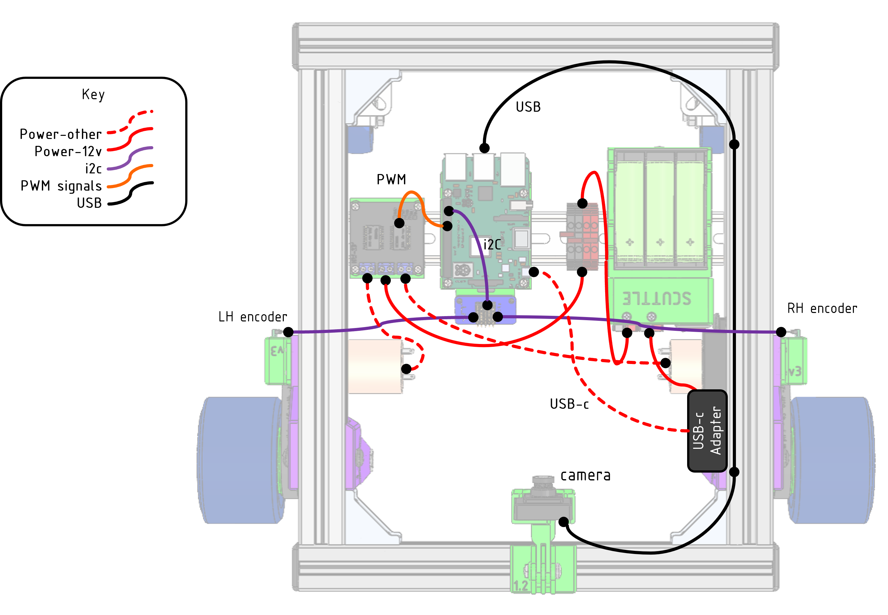
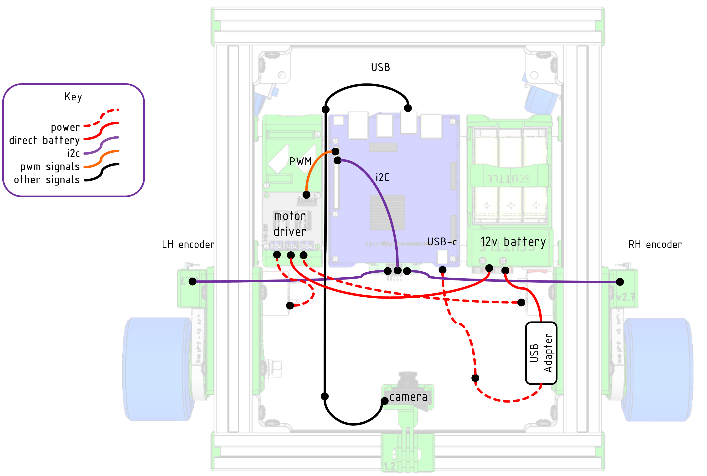
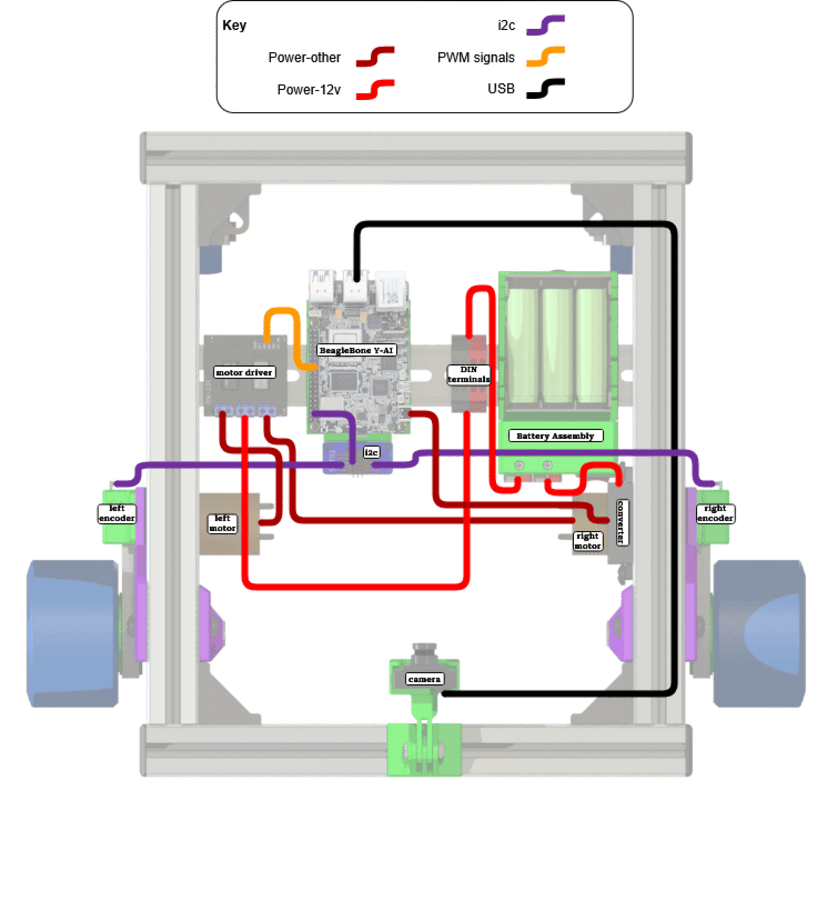
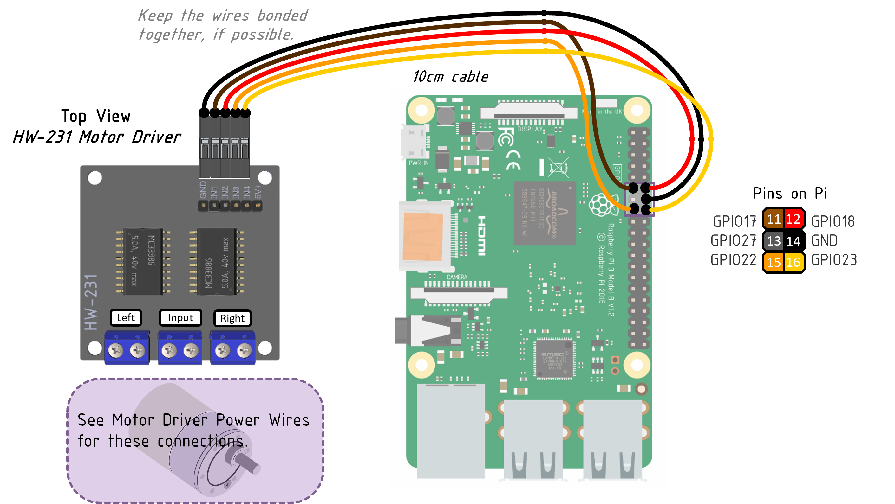

# Wiring Guide

>
> All about the wiring of electronics for your robot.
> This page is divided into signal wires & power wires.
>

Here's a preview of the wiring for the Pi and TI configurations.  Proceed to the subsections for details.

| Pi Wiring Thumbnail | TI wiring thumbnail | BeagleY-AI Thumbnail |
| ------------------- | ------------------- | -------------------- |
|  |  |  |

## Signals

Signal wires perform the communication on your robot, between sensors, CPU, and actuators.  Several wires make up a cable, and the cables get plugged in when you build your robot.
All signals on SCUTTLE can be made with regular off-the-shelf Dupont-style terminals, all female.  Lengths are 10cm and 20cm as shown.

> ⚠️Please do not peel the wires apart! Keep them bonded for strong connections.

> Colors Selection

We chose the colors to make good use of any pack of wires.  When you add sensors and actuators, try to stay consistent.

| Function | Preferred Color |
| ------ | ----------------- |
| Ground | Black, Brown, Green |
| Power, 3.3v | Red, Purple |
| PWM signals | Orange, Yellow |
| CLOCK (i2C | Gray |
| SIGNAL (i2C) | White |

### Cables

This section covers cables you can DIY.

  
Cable Diagrams

To build signal cables, use these diagrams.

_Figure: cables for left encoder_

  

_Figure: cables for right encoder_

  

[grab the diagram](https://viewer.diagrams.net/?tags=%7B%7D&highlight=0000ff&edit=_blank&layers=1&nav=1&title=diagram1.drawio#Uhttps%3A%2F%2Fdrive.google.com%2Fuc%3Fid%3D1yAXCKNeVdJE7FfkX81iIosMF-5VFMIfJ%26export%3Ddownload)

_Figure: cables for motor_

  

_Figure: cables for i2c_

## Power

### Power Routing

The overview for power cables on SCUTTLE v3

_Figure: power overview_

Here are the cables to power the motors from the motor driver.

_Figure: motor leads_

### Actuator: Motor Driver

The cables to power the motor driver from 12v.

_Figure: motor driver wiring_

|The motor wires to communicate from CPU to the motor driver| BeagleY-AI Connectivity|
|--------------| -------------- |
|| |

_Figure: motor signal cable_

### Source: Battery

_Figure: battery components_

## Addons

> This section to include popular addons such as RPLIDAR, ultrasonic sensor, and more.
> It will contain circuitry-related information for planning power and signals to your actuators.

---
