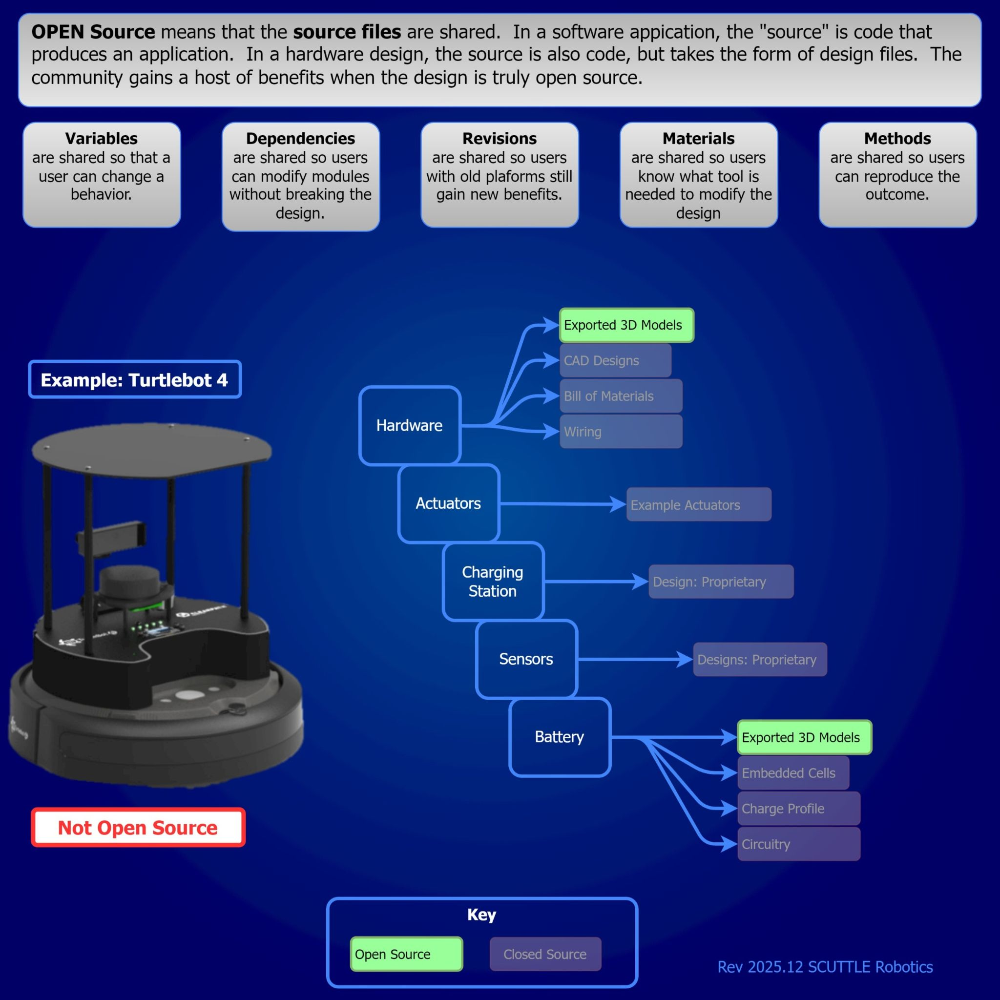
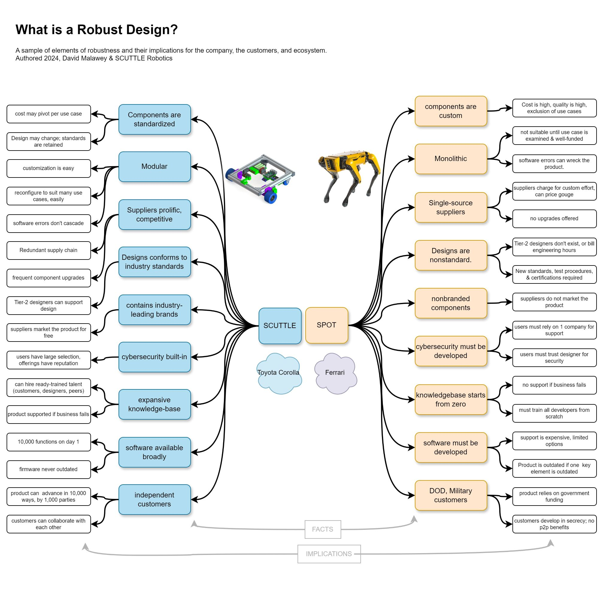

This page is for designers, planners, leaders; all who wish to know more about designing for robotics, open-source, communities, scaling, manufacturing, and more.

## Robustness
We have our own definition of robustness since this term reaches into engineering design in several ways.  The chart written into a PDF here tells how our design goals differ from other respectable designs from the commercial space, such as the spot robot.
* download [Robust Design PDF](docs/outreach/2024.02_RobustDesign.pdf)

## OSH
True open source hardware (OSH) is hard to find as of 2025, and we want to change that. It matters, because we engineers who want to build multidisciplinary outcomes have far too many hats to wear - between integrating hardware, software, CAD models, wiring, fabrication, and more.  The only way for small teams to be successful with robotics projects is by having a foundation of engineering data for the designs in our hands.  That's easy to achieve if the engineers share their efforts that brought us to the present.  We have seen that world-class PhD researchers and high schoolers alike are able to build robotics outcomes when we exchange our engineering efforts by publishing the SOURCE of the so-called open-source design.

We challenge all companies who use the term "open-source hardware" to match the standard we are setting.  We publish the source information for the designs.  We publish the full spectrum.  Electrical schematics, native CAD models, and so forth.  Let's push for companies with robotics offerings to be fully honest about their designs, so that users don't get trapped reworking the same designs over and over.  

Below, see an infographic for the most popular present-day open source robot.  We noted the details of the designs available, and its far from complete.  We hope other engineers also push for higher standards so we can form ecosystems that help developers build, learn, and advance.

Robustness is every engineer's goal, and it needs a definition in the context of open source hardware.  Since we couldn't find any examples in existing publications, we made this diagram to express key factors of robustness in terms of engineering choices for SCUTTLE.  If your goals are like our goals, then you may define robustness in the same way that we do, and you might find the pairing of SCUTTLE and SPOT to be a great example of contrasting robustness.  In most cases, other experts can see the value of using standardized high-volume parts to be integrated in a robot.  But for the average person, simple familiar parts looks a lot like cutting costs.  So, this graphic is a breakout diagram of the choices in the design for robustness and their downstream impacts.  This deserves more discussion but for now let's just get it posted.  2025.12 -DM

