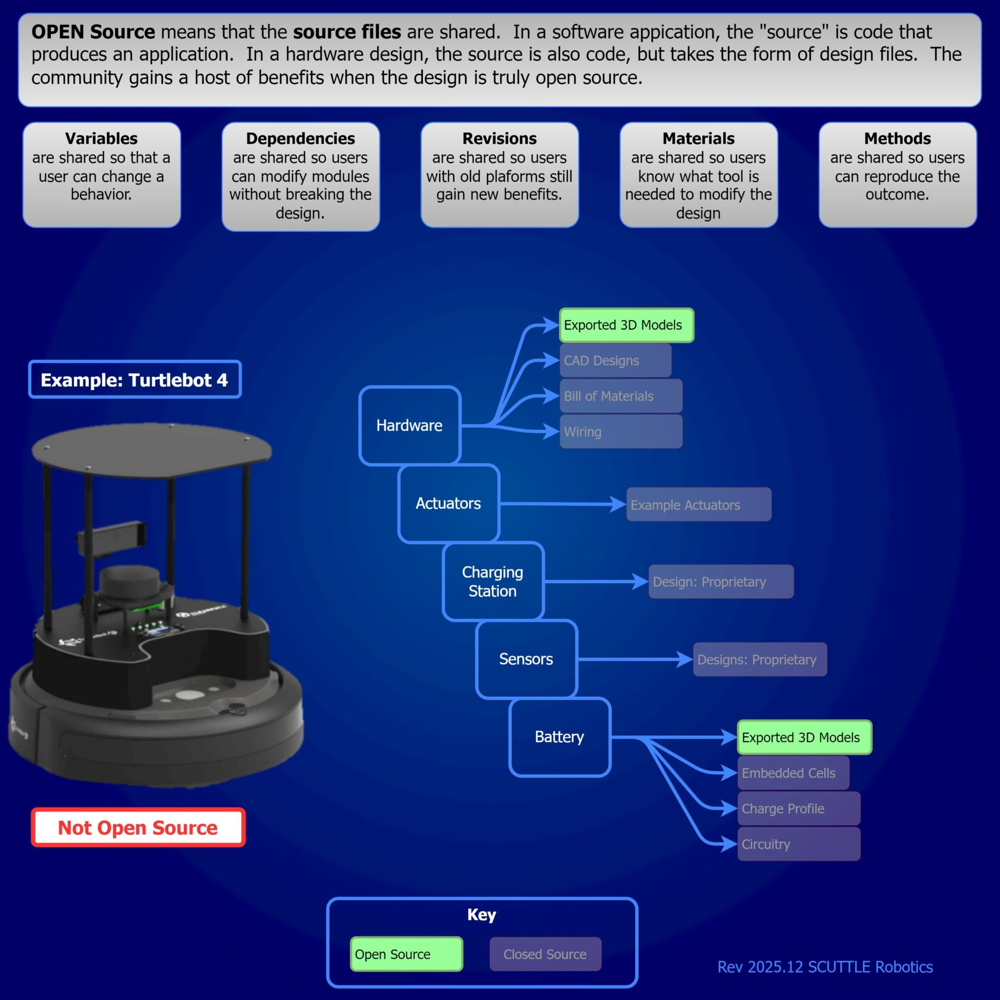
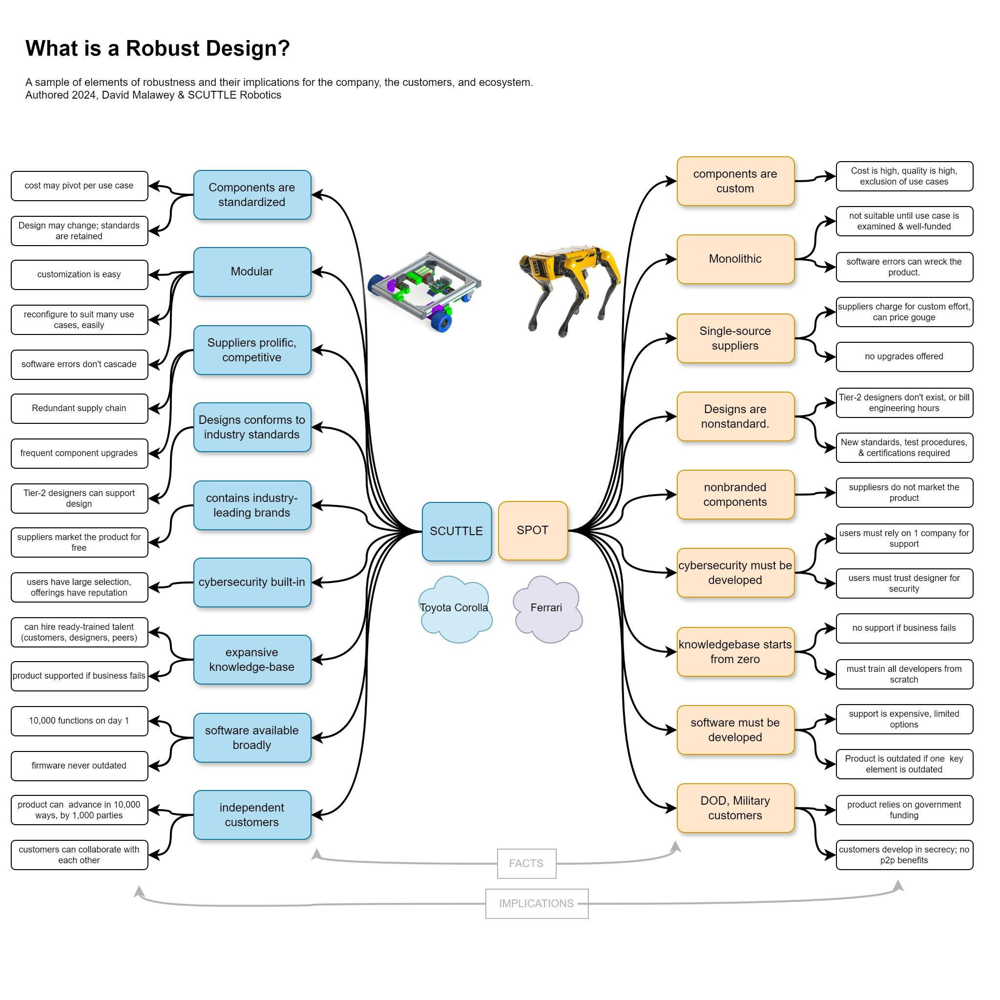
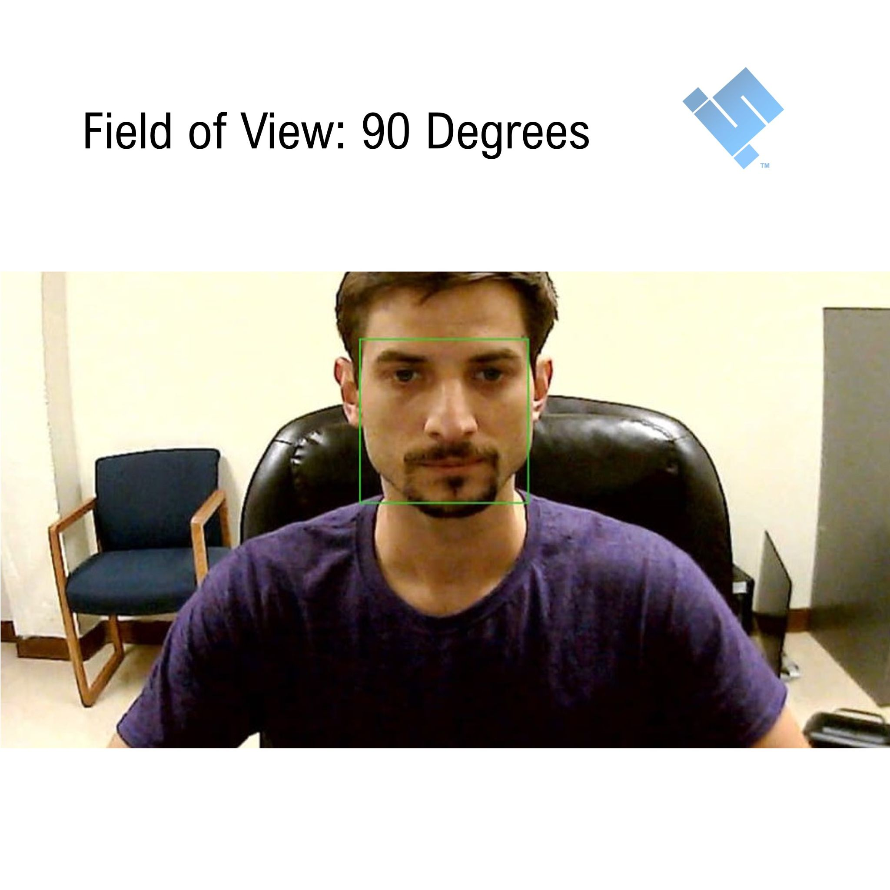
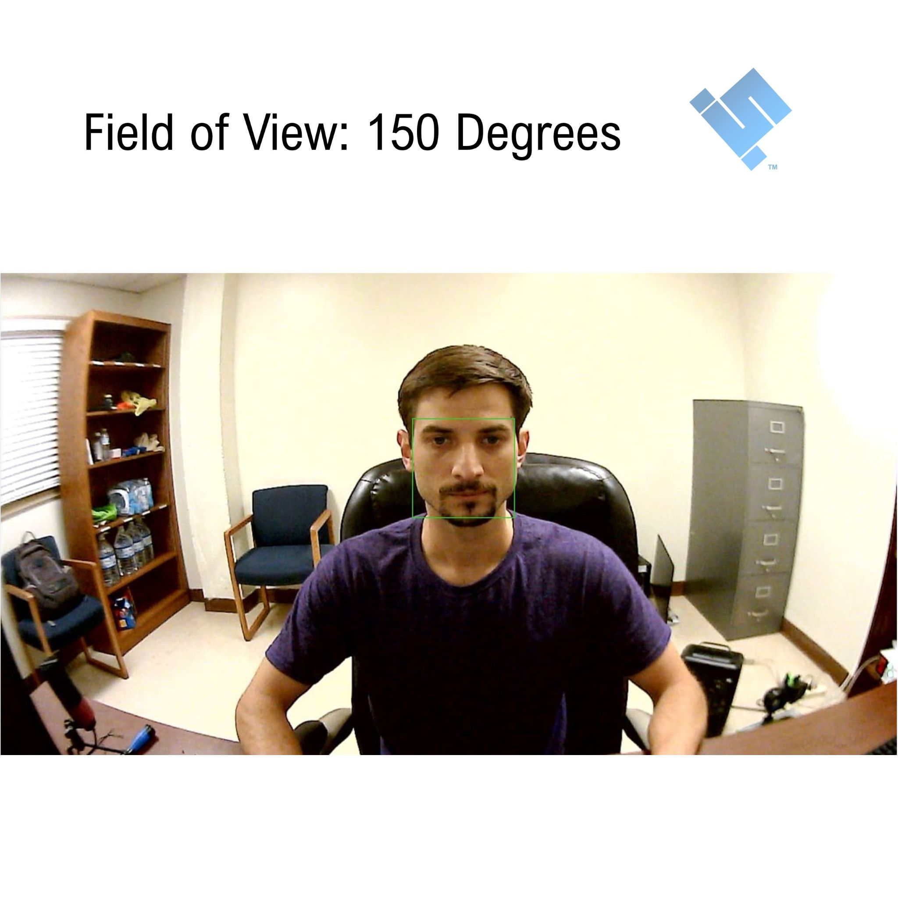

This page is for designers, planners, leaders; all who wish to know more about designing for robotics, open-source, communities, scaling, manufacturing, and more.

## Robustness
We have our own definition of robustness since this term reaches into engineering design in several ways.  The chart written into a PDF here tells how our design goals differ from other respectable designs from the commercial space, such as the spot robot.
* download [Robust Design PDF](docs/outreach/2024.02_RobustDesign.pdf)

## OSH
True open source hardware (OSH) is hard to find as of 2025, and we want to change that. It matters, because we engineers who want to build multidisciplinary outcomes have far too many hats to wear - between integrating hardware, software, CAD models, wiring, fabrication, and more.  The only way for small teams to be successful with robotics projects is by having a foundation of engineering data for the designs in our hands.  That's easy to achieve if the engineers share their efforts that brought us to the present.  We have seen that world-class PhD researchers and high schoolers alike are able to build robotics outcomes when we exchange our engineering efforts by publishing the SOURCE of the so-called open-source design.

We challenge all companies who use the term "open-source hardware" to match the standard we are setting.  We publish the source information for the designs.  We publish the full spectrum.  Electrical schematics, native CAD models, and so forth.  Let's push for companies with robotics offerings to be fully honest about their designs, so that users don't get trapped reworking the same designs over and over.  

Below, see an infographic for the most popular present-day open source robot.  We noted the details of the designs available, and its far from complete.  We hope other engineers also push for higher standards so we can form ecosystems that help developers build, learn, and advance.

Robustness is every engineer's goal, and it needs a definition in the context of open source hardware.  Since we couldn't find any examples in existing publications, we made this diagram to express key factors of robustness in terms of engineering choices for SCUTTLE.  If your goals are like our goals, then you may define robustness in the same way that we do, and you might find the pairing of SCUTTLE and SPOT to be a great example of contrasting robustness.  In most cases, other experts can see the value of using standardized high-volume parts to be integrated in a robot.  But for the average person, simple familiar parts looks a lot like cutting costs.  So, this graphic is a breakout diagram of the choices in the design for robustness and their downstream impacts.  This deserves more discussion but for now let's just get it posted.  2025.12 -DM

## Machine Vision

Choosing a camera for Machine Vision? This topic is a small writeup about camera selection. Below, find a Q&A between a developer and SCUTTLE team member.  In the next two images, look at how much information we can see depending on the lens field of view.  Onboard the robot, we have tested many USB cameras like logitech and microsoft webcams and there is always a need for more peripheral vision.  For discovery of obstacles, we want to know what appears to the left and right of the robot's path and this is the main driver for our standardization of 150 degrees for the camera Field of View (FOV).  So if you shop for your own camera, try to find a lens which has this nice wide range.  Also note that 150 degrees is still less than what is often called a "fisheye lens" which are closer to 180 degrees and larger.  When we increase FOV into the fisheye territory, the warping of geometry is excessive and our computer-vision software cannot make good sense of the geometries in the room from the pixels returned by the camera.

- 
- 
- 

In order to find compatible cameras, you might include the term "ELP" in your search. ELP is a brand name but it has seemingly formed into a descriptor for many other brands of camera with the industrial square shape and compact size, often with interchangeable lenses.  From Gemini 2026, _"An ELP camera is a brand of professional, high-definition USB camera modules specialized for industrial, machine vision, and security applications. These plug-and-play, compact cameras are widely used in robotics, ATM security, 3D printing, and kiosks, offering features like zoom lenses, global shutters, and night vision, compatible with Windows, Linux, Android, and Raspberry Pi."_  Depending on your level of proficiency, you can likely gain benefits by adopting one of the variations of new cameras on the market.  Since Raspberry Pi and Texas Instruments include some chips onboard their SBC for camera processing, it is possible to omit the USB cable, source a camera that feeds data directly to the computer, and perform modern image processing algorithms with extremely high speed and a ribbon cable, all with camera components that are based on ELP camera devices.

>
> Q) Are you currently using the camera for more than teleoperation and basic object recognition?   I am wondering about resolution, fps, and shutter type (if it matters).
> 
> A) 🎥 My experience: 🎥 across many trials & activities I found no benefits above 720P and 10FPS, sometimes cutting down pixels to 256 in width to gain processing speed.
> 
> **FRAME RATE**
> 
> Ten frames per second proves to be healthy for most applications.  10 FPS is roughly my minimum for autonomous driving. In autonomous driving, consider the camera is an obstacle-detection-sensor or target-path-sensor.  Below 10 leaves insufficient time for downstream control computation.  Above 10 gives diminishing returns. 10FPS is also my minimum for remote driving with a human seeing video feed.  Below 10 is difficult to control.  above 10 costs data bandwidth and sometimes causes lost frames and freezes. Collecting 20 FPS means only  50ms for the CPU to process each image.  Leaving time for a control algorithm, call it 25ms.  RPi3 cannot process fast enough.
>
> **RESOLUTION**
> 
> Resolution has 3 big impacts - wireless bandwidth, local computing, and information-per-image. The resolutions above 720p usually cannot fit in our common network paths at a frame rate above 10FPS. (They can fit but often stumble and lack consistency). 20 FPS is really a minimum for "nice looking" video feed for a human.  Those paths include A) going all the way to the cloud, inter-state or globally, and to a far away computer.  or B) device-to-device in one room with a router.  Path B can handle more data bandwidth, but then we face limitations where the Edge device (pi3 or pi4) stumbles to multitask and drops frames.
>
> The best local computing (my experience is from non-AI, custom scripts for simple image processes) seems to give good results with less pixels.  For example following the basketball runs great with only 256 pixels wide images.  When the CPU can compute 20 FPS and the vision is crude (256p), the overall performance is better than computing 5 FPS with high resolution (1080p) by a large margin. My personal takeaway is a feeling that information-per-image is the lowest priority.  Of course focus and lighting is still high priority so the pixels have a good level of truth.
>
> 
